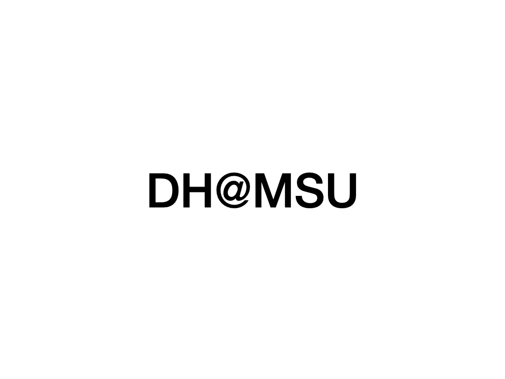
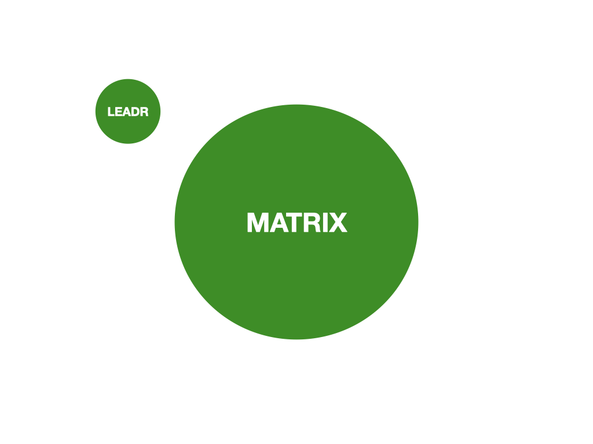
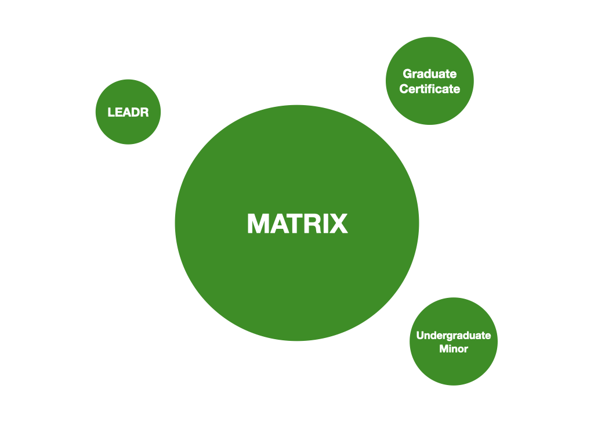
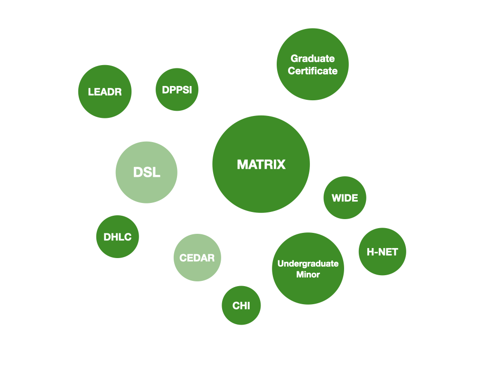
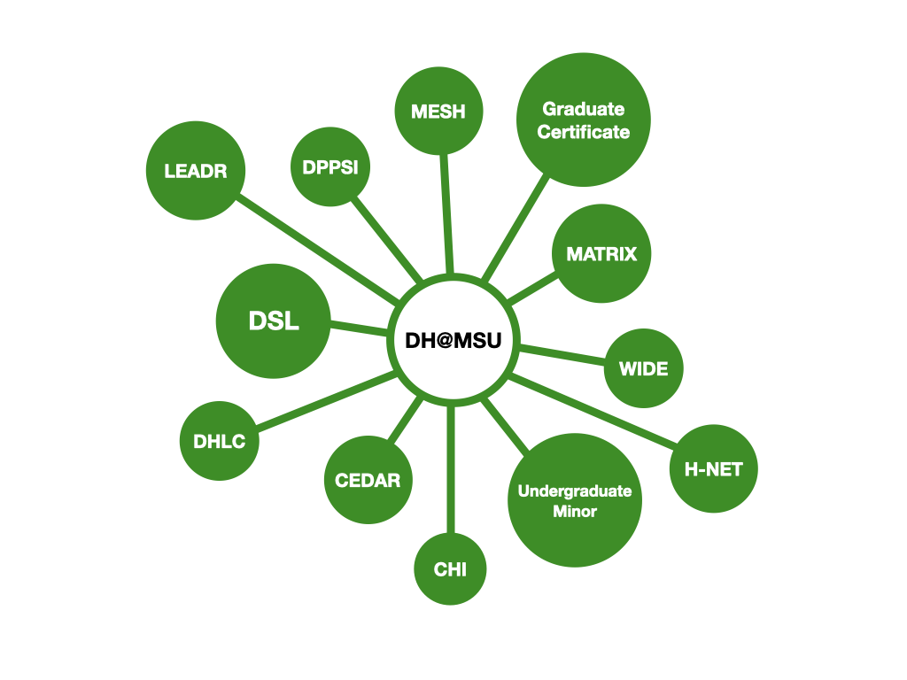
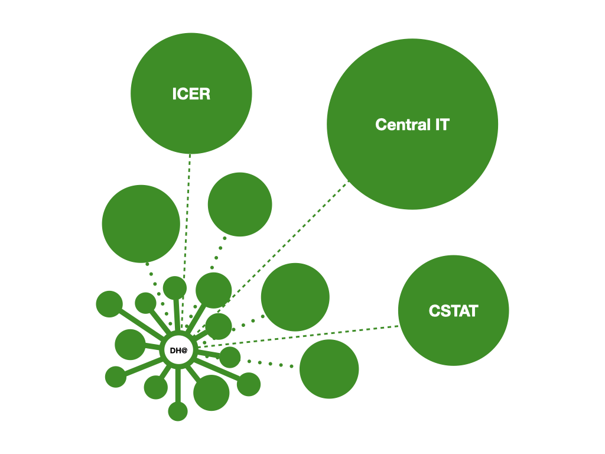

## No Carrots No Sticks
---
#### Creating a Digital Humanities Consortium on a Shoestring
---
<smaller>Kathleen Fitzpatrick // @kfitz // kfitz@msu.edu  
Ohio State University Digital Humanities Network 
29 November 2021</smaller>

Note: Thanks so much for having me join you today, and for asking me to talk a bit about how we established DH@MSU and the kinds of work we're doing here. So much of what's possible within the academy is highly local and institutionally specific, and so while I hope that what I'm going to share is of value to your thinking about how to move digital humanities forward at OSU, the question of its effectiveness comes with a big "your mileage may vary."

Note: Perhaps the first thing to note about DH@MSU is that while it's a relatively new structure, what's going on under the hood is far from new. The digital humanities has a very long history at Michigan State, but for most of that history, it developed in idiosyncratic, non-institutional, and often personality-driven ways. I was brought to MSU in 2017 as the first official "Director of Digital Humanities" -- at least sort of; I'll backtrack on that in a little while. In any case, what I was asked to do was to raise the profile of digital humanities both within the university and on the national scene, not least by creating a sense of structure around it. But walking into a new institution where DH work has been done the way it has been done for more than 30 years and saying "I'm here to direct things!" is risky business, to say the least -- especially when the role of director comes with neither immediately available carrots nor any apparent sticks.

Note: Backing up a bit: I came to this role from having been the associate executive director of the Modern Language Association (the largest scholarly society in the humanities), as well as the organization's first director of scholarly communication. I was hired into that role to help the organization think about the ways it might transform its publishing practices for an increasingly digital environment. And this is I guess the first true-confessions part of this talk: I had precious little idea how to do that. I had no real experience working in publishing (which I recognize may have been a bit of a benefit, if you're being brought in to transform established practices), and perhaps more importantly, I had no real experience managing people within an organizational structure. In my prior position, I'd directed a small interdisciplinary program at a small liberal arts college, and I'd worked to elevate that program to departmental status, and to make it not just interdisciplinary but intercollegiate. And in that vein I'd led the efforts to make the intercollegiate group into a functioning unit, bringing together in a productive way the disparate goals and perspectives of highly opinionated colleagues on five campuses with radically different cultures. So, leadership, sure. But management? Actually being the boss of people? Was a very different thing indeed.

It's been an enormous benefit to me in my current role to have experienced up close the difference between management and leadership, and I have a lot more to say about that if you're interested. But the key thing to note here is that while good management focuses on bringing out the best in people in order to help a team optimize its processes and achieve organizational goals, changing those processes and goals and getting people on board with moving in a new direction requires a different set of skills. Management, after all, comes with both carrots, in the form of merit raises, and sticks, in the form of disciplinary action. Transformational roles within the academy very often come with neither. And I would be willing to bet that the number of faculty members anywhere who consider themselves to have a "manager" is vanishingly small. So convincing a bunch of free agents to work together in a focused way toward some kind of vision of change requires an entirely different kind of authority, one built on trust, on relationships, and on listening.

When I was in the process of making the transition to MSU, a friend and I were talking about the new role I was going to take on. I described what I knew of it -- that I'd be the director of digital humanities, and that the dean who hired me was hoping that I could help increase the visibility of our DH program both within the university and on the national level. And my friend nodded a bit, and then said, "yes, but do you know what your job is?" I had to admit that, just as when I was starting at the MLA, I had only the most tenuous grasp on what it was I was being asked to do, and how exactly I would go about it. What does it mean to increase a program's visibility? What's required to make that happen?

The one thing that I knew was that I needed a much deeper understanding of the institutional and interpersonal environment that I was entering, not least because, prior to interviewing for this position, this is what I knew about MSU's DH environment: 

Note: MATRIX, one of the oldest and most successful DH centers in the US, and LEADR, a lab that I knew had some kind of relationship with MATRIX, sort of, and that was mostly student-facing. As I moved into the interview process, I did enough research to figure out that 

Note: there was also an academic program in DH, offering both an undergraduate minor and a graduate certificate, but there was so much more I needed to know. 

Note: There were projects that I'd known for a long time, like H-NET, but had no idea they were housed at MSU. There were labs like the DHLC that I knew were there but didn't really understand and hadn't connected to the overall DH picture, and labs like WIDE that I hadn't known about. And there were new spaces and projects coming into being, including the Library's DSL and the College of Arts and Letters's CEDAR collaborative. And amidst this alphabet soup (which I'll unpack in a bit), the relationships among these units was not at all visible to me.

My running joke for the first several months in the position was that my job consisted mostly of having coffee. I reached out to everyone that I could think of within the DH scene at MSU -- present and former directors and associate directors of these labs and centers, faculty with digital projects, administrators, and so on -- and set up time to chat. I asked each of them to tell me the story of the digital humanities at MSU -- how their center or lab or project came to be, how it fit in (or did not fit in) with the other such entities on campus, how it had evolved over time. I asked them what they felt was necessary to creating a more holistic environment for DH within the institution, and where they felt the chief roadblocks to such interconnection and collaboration lay. I also asked them who else I should be talking to, and then talked to them. And in the process worked with my brilliant assistant director, Kristen Mapes, to gather a list of everyone involved in digital humanities at MSU in order to call a meeting.

Note: Ah, but wait! A little backtracking is again in order, as you may have noticed in that last sentence that I, as a brand new director of DH, and as in some senses at least the first director of DH, already had an assistant director. That wasn't her title yet -- she was officially "coordinator" of DH, if I recall correctly -- but Kristen Mapes had come to MSU three years earlier, in 2014, and had been working both to administer the academic program and to create community around DH. In that vein, she had been collaborating with a number of colleagues, both in the library and elsewhere on campus, to offer a wide range of workshops on digital methods and topics, and had been working with the previous directors to establish the goals and structures for the undergraduate minor and the graduate certificate program.

Okay, but hang on -- if I was the first "director of DH," how were there previous directors? As it turns out, the academic program in digital humanities has its origins in early work done by Danielle DeVoss, a faculty member in (and now chair of) the department of writing, rhetoric, and American culture, and Scott Schopieray, then the director of academic technology and now the assistant dean for academic and research technology in the College of Arts & Letters. Danielle and Scott worked together beginning in 2008 to plan what was then called an undergraduate "specialization" in Humanities Technology, and Danielle brought together a larger group of faculty in 2011 to develop a graduate specialization in what was now being called Digital Humanities. An academic program needs a director, and Danielle took on that role from 2012 to 2015, creating much of the institutional structure around DH (including promoting the specializations to take on the status of an undergraduate minor and a graduate certificate program, shepherding the DH course code through the various bureaucratic processes, and establishing a minimal budget to support the program). In Fall 2015, however, Danielle began a year-long distinguished visiting position away from MSU, and so was succeeded for that year by Sean Pue; in Fall 2016, Sean began a two-year fellowship leave, and so was succeeded by Stephen Rachman. Each of these three directors took on the role as a service responsibility on top of their more usual workload, and each was compensated with a small administrative salary increment. During 2016-17, however, the dean of the college determined that DH needed a more stable directorate, one with administration as its primary focus, in order to develop a vision for bringing together the academic program with the extraordinary research being done across the university, with the goal of producing something perhaps a bit larger than the sum of its parts.

And so, in August 2017, I arrived on campus and starting having a lot of coffee. And I read through whatever documents I was able to get my hands on, all with an eye toward understanding and appreciating the work that had gone into making DH at MSU what it had become, as well as the institutional and interpersonal challenges involved in making it something more. Those two things -- the institutional and interpersonal -- were deeply entwined, not least because while I'd been asked to get the existing labs and centers and projects and programs at MSU to cooperate and collaborate, I'd been given neither carrots nor sticks to make that happen. I couldn't offer tantalizing new resources that would make such collaboration appealing, nor did I have any authority to force the issue. I needed to get everybody on board without them having any particular reason to do so.

This work of people-wrangling reminds me of the crucial argument made by Stephen Ramsay in his essay "Centers of Attention," originally published in the volume *Hacking the Academy,* which I've recently gotten to re-read in an expanded and revised form. In this essay, Steve begins from the conclusion that "centers are people," and encourages those who are longing for a center to coordinate and facilitate their work to begin there. 

<smallish>"I don't want to say that everything magically falls into place once you have formed the basic community of people and ideas, but it's staggering how all of the decisions that so obsess people trying to build a center follow logically and inexorably from the evolving needs and expanding vision of more-or-less informal gatherings of like-minded enthusiasts."</smallish>

<smallish>——Stephen Ramsay, "Centers of Attention"</smallish>

Note: As Steve would readily acknowledge, there's a lot of labor hidden between the phrases in this sentence, not least in "form(ing) the basic community of people and ideas" and in elucidating their "evolving needs and expanding vision." My round of coffees was one component in that process, but that mostly created one-to-one connections between me and my new colleagues. Forming a community required something different. So in September, I invited everyone that Kristen and I could think of to a community meeting to discuss the future directions for DH and to see what we might want to do together. If I'm remembering correctly, around 25 colleagues came to that meeting and discussed paths forward. In the course of all of those conversations it became clear that while lots of prior work had been done, there wasn't yet a connective structure within which this large group of people could make the potential for collaboration a part of their ongoing institutional lives, nor was there an institutional structure that could help facilitate the process of making those potential collaborations actual. So we collectively decided that one of our first orders of business should be developing a set of bylaws to define the parameters of our work together. Four volunteers came together with me over the course of a semester to draft a set of bylaws defining DH@MSU and the structures that would support and facilitate our community.

Note: Bylaws give every appearance of being the the least idealistic genre in which one can write, all legalese and densely numbered sections and sub-sections preparing them to be cited in an array of procedures you should hope you never have to participate in. But they have the potential to be wildly idealistic as well, defining the best possibilities for our work together. In an orientation session for new academic administrators on campus, our then VP of Academic HR said of academic misconduct that "the worst behavior you are willing to accept is the best behavior you can expect" -- meaning that if you're willing to compromise your ethics or values in one situation, those standards remain compromised for others that follow. I believe the same about bylaws: they have to be written to define us at our best, because they set the standard for a lot of ensuing activity, and they define both who we are and how we want to work together.

So the first, and perhaps most important task in our bylaws was that work of definition. We had the opportunity to define our community and our work as inclusively as possible, and in the process to create the best possible sense of who and what we wanted to be. And so our bylaws open by noting that

> <smallish>DH@MSU is both a research center and a program, based in the College of Arts and Letters but working across the colleges and units of the university.</smallish>

Note: READ SLIDE. This clause creates the possibility for collaboration outside the usual institutional silos, a necessary possibility given the next clause, defining the participating units in DH@MSU:

> <small>DH@MSU brings together the many programs, centers, labs, and other units working on digital humanities related projects and curricula. These units include but may not be limited to Digital Humanities within the College of Arts & Letters (CAL-DH), which houses an undergraduate minor and a graduate certificate program; the Critical Diversity in a Digital Age initiative (CEDAR); MATRIX; the Lab for the Education and Advancement in Digital Research (LEADR); Writing, Information, and Digital Experience (WIDE); H-NET; the Digital Publishing Lab (DPL); the Cultural Heritage Informatics program (CHI); the Digital Heritage and Literary Cognition lab (DHLC); the Digital Scholarship Lab; the Museums; the Libraries; and programs and departments across the College of Arts and Letters, the College of Social Sciences, the College of Communication Arts and Sciences, the College of Education, Lyman Briggs College, and the Residential College in the Arts and Humanities. These units retain their distinctive and independent governance structures and documents and come together voluntarily as DH@MSU.</small>

Note: A few things to note here: the DH minor and certificate programs are here defined as one of the units within the larger DH@MSU superstructure, thus placing that program alongside a wide range of other initiatives. We also explicitly name the range of colleges within which something that looks like "digital humanities" might be done, as well as the wide range of entities that were at that time doing it. These entities include of course centers like MATRIX and labs like LEADR (which supports digital research among undergraduate students in history and anthropology), but also projects like H-NET and the Cultural Heritage Informatics program, institutional spaces like the Libraries and the Museums, and more. More such entities have sprung up since these bylaws were approved, including my own research and development unit, MESH, and some of these entities have dissolved or changed their names, but with minor tweaks this paragraph remains an expansive vision of what DH@MSU encompasses.

Even more important, however, is *who* DH@MSU includes. In section 2.1.1, we define our "core faculty" as

> <smallish>all persons holding the rank of professor, associate professor, assistant professor, instructor, librarian, specialist, or staff at MSU who have formal assignments or academic appointments in Digital Humanities</smallish>

Note: READ SLIDE. and in section 2.1.2, we include 

> <smallish>other persons holding the above listed ranks, who maintain a research and/or teaching focus in the area of Digital Humanities, who participate in DH@MSU activities, and who request affiliation with DH@MSU</smallish>

Note: All of which is to say that (1) we understand the notion of "faculty" as broadly as possible, and we include colleagues whose primary roles differ from the usual teaching-and-research structure of those with titles like "professor," and (2) we welcome both those faculty whose positions have been written to include DH and those who have come to DH through other paths.

Note: Having defined who we are, our bylaws go on to define how we'll work together, establishing our governance structures -- including our advisory, curriculum, research, and outreach and engagement committees -- as well as the composition and election of those committees and their spheres of responsibility. We also define the appointment, role, and review of the director of DH, as well as any assistant or associate director.

There are some spots in which the process of reviewing the bylaws in order to present them to you has made me realize that we're not quite living up to them. For instance, we claim within the bylaws that a formal meeting of the core faculty is to be held once per semester, and we haven't held one of those in a few years, as there hasn't seemed much of anything that the faculty needs to discuss. We do, however, hold several events annually that are intended to bring the entire community together, including our THATCamps in August and January and our end-of-semester celebrations in December and April. But this moment of return to our governing document has encouraged me to wonder what initiatives we might press forward with if we were to meet more formally as a faculty.

The key problem, of course, is time: especially now, after nearly two years of COVID, we're all overstretched, and the idea of adding one. more. meeting. is just more than most of us can bear. We're already facing a bit of fray in our governance fabric, as it is: all of our core faculty have primary appointments elsewhere, and the time they give us is an extra bit of labor. That they give it demonstrates their real commitment to DH@MSU and what it can do, but that commitment of necessity comes at the end of a long list of other commitments. And if I'm being honest, something similar is true of me: though my appointment is 40% administration, that 40% can only be spread so thin. As a result, most of our initiatives have been slower to develop than I'd like, but we're inching toward them. Key among those initiatives is developing a map of sorts for DH@MSU. 

Note: When we first created the structures within which we now operate, DH@MSU looked something like this -- we'd recently added three new units to our confederation: the DSL, or Digital Scholarship Lab, a fantastic space in the main library dedicated to the support of digital scholarship across the curriculum; CEDAR, a not-quite-acronym for the Consortium for Critical Diversity in a Digital Age Research, a group of faculty who joined the College of Arts & Letters as part of a cluster hire and are working collaboratively on critically engaged digital research; and my own R&D unit, MESH, which is not an acronym at all but is meant instead to be a complement to MATRIX, focusing on the future of digital scholarly communication. All of these projects and spaces were created in order to fill gaps in the DH landscape at MSU, to provide more support for more kinds of work being done across the field. But there are still institutional puzzles to be solved, especially for relative newcomers. For instance, if I have a project and I want to hire a student or two to work on it with me, where might I find funding for that? And how do I hire that student? If I need a higher level of developer support, is there a group of developers somewhere that I can work with? It's these kinds of questions that often drive the desire for formal centers, but as you can see we've got a pile of centers and still can't fully meet the need. Some of these centers, like MATRIX and the DHLC, are focused on internally generated grant-funded projects and aren't able to support projects that are brought to them. Some, like the DSL, have constituencies that are so broad that they cannot go deep on many projects. And all of them face similar questions about the full lifecycle of projects: How are they incubated? How do they get past the incubation stage and into full development? How can their teams obtain not just the funding but also the training they need to be self-sufficient? How are projects hosted and maintained over the long-term? And once those projects are no longer viable, what provisions can we make for flattening and archiving them?

Note: In order to answer these questions, and more, we're currently working on two fronts: first, to map all of the resources within MSU that the DH community should know about -- the funding sources, the training opportunities, the support services, and more. And second, we're working to pull together the research units within DH@MSU with the other units on campus -- like EDLI, the Enhanced Digital Learning Initiative -- that have some of the same questions. We're hoping to build out additional layers of consortium, first, within the humanities and social sciences via what we're currently calling the Consortium for Digital Scholarship and Practice, and second, 

Note: across the university via the Research Facilitation Network, bringing together related groups in quantitative fields, in the bench sciences, and in university-level enterprise computing.

Note: Okay, so we've now zoomed out from the constellation that is DH@MSU to the galaxy that is the Research Facilitation Network. And I've told you a whole lot about my journey along the way. But I'm guessing you might like me to boil this down into a few actionable ideas as you move forward with your own work here. So:

1. Remember Steve Ramsay's claim -- centers are people -- but focus on the connections among those people.

Note: READ SLIDE. Getting DH@MSU to where it is, and pushing it along to where it needs to be, is all about building relationships among the different folks with a stake in the collaborations that we hope to facilitate. Along which lines:

2. Informal relationships are a great place to begin, but formal structures for those relationships can make them institutionally durable.

Note: READ SLIDE. How can you define connections among independent units and projects that allow them to maintain their independence while leveraging their combined strength? This is especially important when you're trying to do the work of creating something coherent without a substantial budget or a top-down administrative mandate. And finally:

3. Networks might facilitate the development of new, spontaneous connections in ways that centers cannot.

Note: READ SLIDE. Networks can both harness the power of informal relationships and allow their impact to extend outward, drawing strength from the combination of resources and knowledge that all of their participants bring to bear. Networks are also more flexible than centers, in that they can accommodate new developments, shifts of direction, and so on in ways that solid structures cannot.

## thank you
---
 <smaller>Kathleen Fitzpatrick // @kfitz // kfitz@msu.edu</smaller>

Note: So: that's pretty much all the advice I've got right now, and I'm sure I've opened up way more questions than I've answered, so why don't we turn to your thoughts at this point? Thanks again for having me here.
