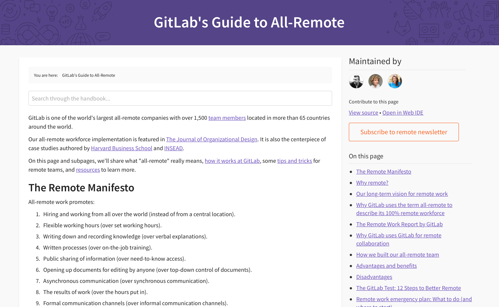
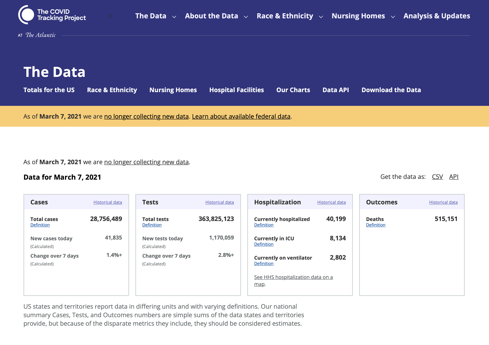
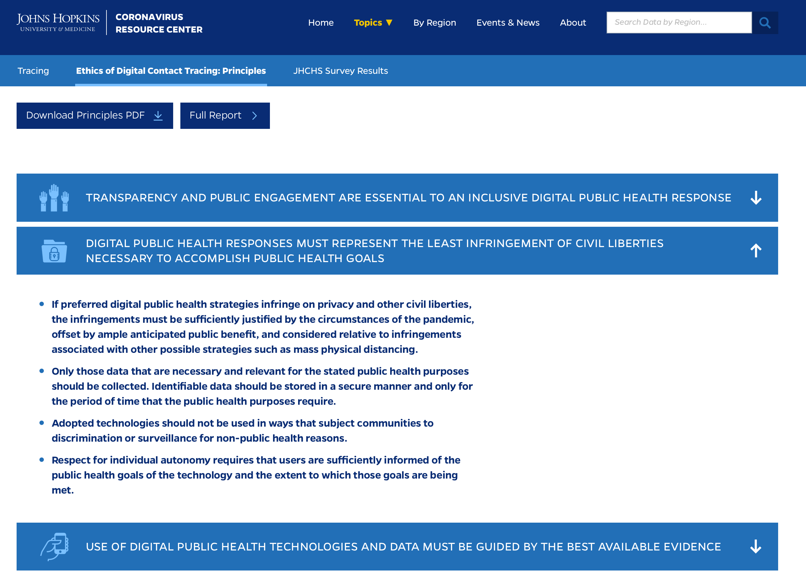
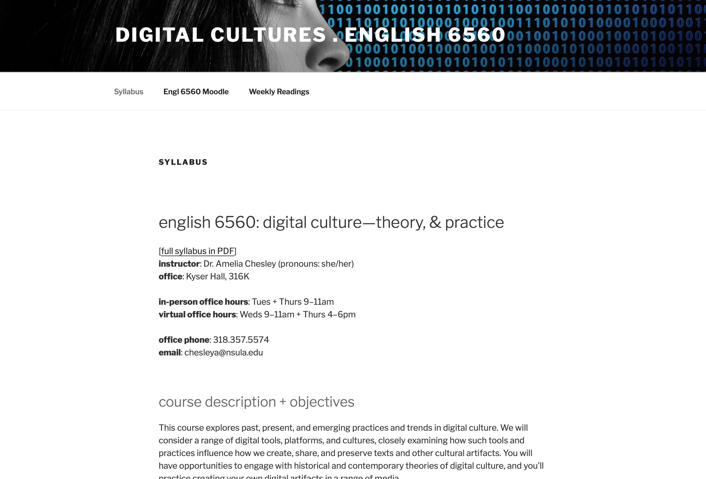

## Digital Platforms and Possibilities
---
### What We've Learned from COVID-19
---
<smaller>Kathleen Fitzpatrick // @kfitz // kfitz@msu.edu</smaller> 

Note: Thank you so much. I'm delighted to have the opportunity to talk with you a bit today, and while I'd of course prefer to be there with you in Paris, I'm very glad that the conference organizers and the technologies they're using have made it possible for me to join you remotely. 

My focus today is on the things we've learned about digital communication from the pandemic, and the ways that we might continue experimenting and learning in order to better engage our students and colleagues. My original title as listed in the program calls out "digital pedagogy" in particular, but as I wrote I felt the need to bracket that a bit: I am not a scholar of teaching and learning, and those who are will no doubt have very different lessons to share from the last two years. I am, however, very much a digital scholar, focused on developing platforms and communities that might help us improve scholarly communication for both research and teaching. And so the thoughts I'm going to share with you today have to do with the ways that better use of better digital tools might help us connect with our students, with our subject matter, and with one another. I don't have easy answers or perfect solutions -- in fact, as you'll hear, I have some real concerns -- but I also have a few ideas that I hope we can carry with us as we think about what higher education might look like in the future. 

1. Digital platforms can connect and include.

Note: The very existence of this talk makes evident the first of the things that we've learned since the onset of COVID-19: that we can do a lot of things at a distance that we previously had to travel for, and in the process we can include many more people in our discussions who might otherwise have been unable to participate. Platforms like Zoom, like Slack, like Miro, like GitHub, all present important possibilities for collaboration at a distance. They've made it possible for us to work closely with others not just under lockdown conditions, but in a more normal day-to-day with team members who are in different cities or countries. My own team, who are working on building and sustaining Humanities Commons, has become increasingly distributed during the pandemic; we've hired four new team members in the last two years, at least two of whom will be permanently remote, and our use of shared calendars, video conferencing, online project management tools, and team chat has enabled us to ensure that we all stay connected, informed, and engaged in our shared projects.

We similarly have the potential to reach students who can't join us in person, students who are tied to a particular location but want nevertheless to study with us, students who have temporary or chronic illnesses and disabilities that restrict their movements, students whose work schedules or family circumstances impose requirements on their time. This digital engagement can be primarily synchronous, focusing on the kinds of discussions we can best have when we're all connected at once, or we can open the possibilities for students to engage in more asynchronous ways, chatting with one another and sharing their work at whatever hour they can. And these platforms can be used as an alternative to regular face-to-face classroom meetings, or they can supplement those meetings. If we deploy them well, we have the potential to use the networked platforms and systems that are proliferating around us to make connections with our students, and among our students, in ways that can enable more of them to connect and participate.

2. Technologies can divide and exclude.

Note: However, these platforms are not a panacea, and in fact they can create new barriers to our work together if we're not careful. Our students do not have equal access to computers or to high-speed internet, and they have not received equal levels of preparation for the use of the technologies their educations may require. We all also -- students and faculty alike -- have different levels of tolerance for screen time; for some of us, the video aspect of Zoom enables a sense of connection, but for others of us it's purely exhausting. We might turn away from the screen, or turn off the camera, in order to protect ourselves from that exhaustion -- and yet we might simultaneously experience a loss when others do the same, when we find ourselves talking to a bunch of black boxes. We might be relieved to have a means of making something like contact with one another, at the very same time that we feel our distance from one another all the more acutely. We might be glad to Zoom into one kind of meeting but not another. We might wish we could have more intimate conversations with one another and yet flinch every time a meeting organizer says "breakout rooms."

The ways our engagements with one another are mediated by online platforms for connection are complex, and using them in ways that are more inclusive and more likely to produce connection requires an ongoing willingness to experiment. The Humanities Commons team is part of a larger lab that I direct, called MESH Research; right now we have two primary projects with two separate teams, and once a month we have a Zoom meeting with the whole lab as a means of trying to keep everyone informed about both projects and to keep a sense of connection across the team as a whole. Those calls haven't been terrifically effective, however, and I often feel as though we're having a meeting in order to have a meeting, which is just awful. So we've been experimenting with some other modes of connection in order to tease out what kinds of interaction might best support our needs. A few months ago, we decided to have an "asynchronous" meeting, asking everyone to dip in and out of a chat in Teams over the course of a few hours one afternoon. I opened us up with a few questions, and the chat just FLEW. We got more members of the lab actively involved and contributing than we've ever had in a video call. In our conversations afterward, we surfaced a couple of reasons why. One was novelty; it was an interesting experiment and everyone was eager to see how it would go. But our ostensibly asynchronous chat -- which really turned out to be pretty synchronous because everyone was there and active at the same time -- also made it possible for everyone to contribute ideas as they had them, rather than needing to wait for the floor or feeling as though the moment for that idea had passed. Everyone felt free to add thoughts, to open new questions, or to just +1 things to indicate connection. We haven't had another such chat-based meeting yet, but it's opened up some key ways of thinking about how we might better use our chat platforms, and about what video calls are best used for.

<small>https://about.gitlab.com/company/culture/all-remote/guide/</small>

Note: (Incidentally, one of the best resources I've found for thinking about how to create inclusive remote workplaces is [GitLab's Guide to All-Remote](https://about.gitlab.com/company/culture/all-remote/guide/#). The site is a bit overwhelming at first, but dipping in a little at a time reveals several key principles that we could all bear to learn from, such as documenting everything in writing and creating a handbook-first approach to that documentation so that there's a single location in which everyone knows that the answers to questions can be found. There's a lot more in that site that I think can provide some ideas for creating better engagement using digital platforms.)

3. Technologies can intrude.

Note: Among the worst recent developments in technologies for remote work, however, is the overflow of monitoring software, which reveals a whole lot about both the worst tendencies in contemporary tech development and the worst tendencies in contemporary management. Early on in the pandemic, we saw a lot of articles that suggested that businesses might be able to let go of their expensive office space because the sudden requirement that everyone work remotely made clear that everyone *could* work remotely and still get things done. For the moment I'll bracket the challenges that many of us faced in the process -- such as the lack of sufficient, comfortable workspaces for everyone in the home and the need to handle the demands of work and home life simultaneously -- but will note that these challenges demonstrated the extent to which a techno-utopian vision of remote work relied on the kind of frictionless universe that hardly any of us experience.

Following quickly on the heels of that flush of "let's just work from home forever!" came a welter of concerns, however, many of which revealed the deep insecurities of many, many managers. Because if the role of the manager in the workplace is to require accountability and make sure that their direct reports are actually working, how can they do so if they cannot *see* that you are *at your desk*? The answer from the tech industry, of course, was "you can see what your employees are doing, even at a distance!" And voila, monitoring software. In the business world, this software can spy on your every computer-based move, watching what programs you're actively using, whether you're typing or using your mouse, and more. In the virtual classroom, monitoring software can track "attention" by insisting that students keep the relevant program in focus and prevent "cheating" by observing what else students are doing during class. And we've all seen the gross violations of privacy and basic human dignity that have resulted from the use of such monitoring programs: employees who are reprimanded because their children ask them questions during the work day; students who are required to allow their cameras to scan their bodies and their surroundings and track their movements during testing.

But there are hundreds of other less visible intrusions that the technologies we use for remote work inflict on us, ways that our communications and actions are tracked and consumed by the platforms we're using. One small example: Among the communication platforms provided to my team by our host institution, Michigan State University, is Microsoft Teams. Teams provides both chat-based communication like that of Slack and video-based communication like Zoom, and it integrates (mostly well) with the other Office 365 applications that MSU offers. Not long ago, my colleagues and I realized that whenever we'd hold a scheduled meeting via Teams, the meeting organizer would get an attendance report at the end of the session. Because our Teams instance has been optimized for instructors to use for holding classes, this is no doubt intended to be a benefit; you don't have to worry about the awkwardness of taking attendance each day, because we can handle it for you! But when I schedule a meeting with my colleagues, do I really need a report that includes what time each of us connected and disconnected from the call? Even more importantly, perhaps, when that report gets generated, who else has access to it? Almost certainly my colleagues in central IT. And of course it's also generated by and served from a farm of Microsoft servers. Does anyone but me care about that information? Would anyone look at it? Probably not in any detail, but in the aggregate? And how long does that information live on university and/or corporate servers? And what kinds of research is being done, or could in the future be done, with it?

4. Big data can help us answer big questions.

Note: This question takes us into the terrain of "big data," which as we've been told can enable research that can help us answer previously unanswerable questions. The potential is really exciting; within the literary studies areas of the digital humanities, for instance, we can explore questions at a never-before-possible scale. Rather than making an argument about literary genres or periods based on evidence found in reading a few dozen books, we can instead ingest and process thousands of texts to see whether our hypotheses hold. So scholars like Ted Underwood at Illinois and Richard So at McGill bring the methods of data science to bear on large-scale text corpora in order to ask big questions about genre, about culture, about race, and more. 

<!-- .element height="85%" width="85%" --> 
<small>https://covidtracking.com</small>

Note: Throughout the pandemic we have seen the importance of projects that seek to gather, manage, and preserve data, like the volunteer-run [COVID Tracking Project](https://covidtracking.com), which for one year gathered, rectified, and confirmed information from across the United States on testing, patient outcomes, and more, and proved a far more reliable source of data than our own governments, such that the project's data were cited in more than 1000 journal articles, over 7000 news stories, and much more. The bigness of this big data enabled research into, for instance, the disproportionate effects of COVID-19 on Black, Indigenous, Latinx, and other communities of color within the United States, as well as into racial inequities in access to treatment. But this project only worked as long as the data kept flowing; within the US context, at least, as soon as state and local authorities slowed the tracking of testing data, the public perception that the pandemic was "over" grew, and attention to the real dangers faced by some individuals and communities withered.

5. Big data can create big problems.

Note: Big data projects like this are also beset -- or should be beset -- by a host of ethical concerns, as the Johns Hopkins University's COVID Dashboard's exploration of [the ethics of digital contact tracing](https://coronavirus.jhu.edu/contact-tracing/principles) indicates. 

<!-- .element height="85%" width="85%" --> 
<small>https://coronavirus.jhu.edu/contact-tracing/principles</small>

Note: Their principles include statements noting that "only those data that are necessary and relevant for the stated public health purposes should be collected," that "identifiable data should be stored in a secure manner and only for the period of time that the public health purposes require," and that "adopted technologies should not be used in ways that subject communities to discrimination or surveillance for non-public health reasons." These principles indicate an awareness that big datasets are not necessarily neutral, and that where individuals or communities are identifiable within the data they can be subject to severe consequences. As Cathy O'Neil in *Weapons of Math Destruction* and Virginia Eubanks in *Automating Inequality* have demonstrated, the kinds of data that powerful tech companies and government agencies are drawn to gather and the algorithms in which those data are used work to exacerbate inequities across contemporary culture.

What does this mean for the kinds of technologies that we're deploying in higher education, the platforms that we have widely adopted and used in our teaching over the last couple of years? First, we need to know much more than most of us currently do about what becomes of the data that our use of those platforms generates -- what is gathered, what is stored, who has access, and for what purposes. This is particularly true of those venture capital funded platforms that provide free access to end users: we need to ensure that the path to profit for those platforms doesn't lead to selling user data for advertising or other commercial purposes.

In the case of Teams and that "attendance report," I know that my university has negotiated an enterprise agreement with Microsoft that provides for compliance with two U.S. policies, HIPAA and FERPA, that require certain protections for health care data and education data, respectively. As part of that agreement, according to our IT Services unit, Microsoft has committed not to "mine individual data and will only access that data for troubleshooting needs or malware prevention." That gives me a level of confidence that other platforms don't, or won't. But it's just one small step in developing the ethical platforms that higher education needs.

6. Technologies aren't neutral.

Note: The key is remembering that technologies are not neutral. The argument that they are neutral derives from a long history of work on digital media that swung between wild techno-optimism, in which new networks and platforms were going to revolutionize all our lives and render discrimination and injustice and even the nation-state obsolete, to deep technophobia, in which the very same networks and platforms were going to make all of us stupid and render us compliant subjects of totalitarianism. If those arguments were thesis and antithesis, the apparent synthesis was to say "hey, now, technologies in and of themselves are neither good nor bad; it's all a matter of how we use them!" Except that the development of each and every one of the networks and platforms that now connect us was conceived of and executed by humans, with human biases and human goals. And because of that, while we might not want to say that Technology with a capital T is good or bad, we nevertheless have to acknowledge that particular technologies are abusive, and intrusive, and encourage the worst in human behavior, precisely because they have been designed and operated that way.

7. But there are alternatives.

Note: Now. I imagine that the folks who invited me to give this keynote, who wanted me to talk about the exciting possibilities for real engagement with digital tools for teaching and research, have spent at least the last few minutes thinking "THIS IS NOT WHAT WE MEANT." And I'll acknowledge that the last several years have sorely challenged my usual tendency toward optimism. But this is the point at which I attempt to turn it all around, and get back to the idea I started with -- that digital networks and platforms can enable more participation by more people than ever before -- and think about how we can do that ethically.

Because we can do it ethically, if we carefully consider which technologies we're using and why -- and that means both which technologies our institutions are investing scarce financial resources in, and which technologies we're investing our time, energy, and ideas in. We need to focus in on the potential for higher education to help create a better world -- but in order to do so, we need collectively to rethink the systems through which we develop and share knowledge with one another, with our students, and with the world, ensuring that we keep our eyes on the larger project of collective understanding that is at the heart of the academic mission. This mission requires us to find ways to treat knowledge not as what economists would call a club good, whose access is restricted to those on the inside, but instead as a public good, created for all, available to all.

Note: This reclamation of higher education as a public good is at the heart of what I have called "generous thinking": using our collective knowledge and the technologies that connect us in ways that demonstrate our deep responsibility for the world around us. We are, after all, educating the "leaders of tomorrow" not just in the conventionally understood political and business realms, but in the kinds of engagement that will help their communities grow from the grassroots up. Doing that generous work demands a values-first approach to higher education, as well as an ongoing examination of how those values are instantiated in institutional structures and systems, and especially in the infrastructure that we use for our teaching and research. Our campuses have become dependent on a wide range of platforms that deliver our core services -- learning management systems, student information systems, publishing and communication systems, research information management systems -- but by and large these are platforms over which we have little control. They are vendor-owned, corporation-controlled, and as such far more responsible to their shareholders than they are to us, or to our students. These platforms appear to serve needs we cannot fill ourselves, and yet there is no sense of "service" in their relationship to our institutions. Only extraction. They take in our content, they take in our metrics, they take in our vast and growing annual fees, and they leave us dependent, privatized, beholden to economic forces that do not serve the public good.

<small>https://hcommons.org</small>

Notes: This is just one of the reasons that my colleagues and I have been working to develop an open-source, open-access, non-profit, academy-owned and governed alternative to such extractive corporate platforms. Humanities Commons instantiates several key principles. First, that higher education will benefit from all of us doing more of our work in connected ways, on open platforms that enable more people to participate, where the publics that we need to support our institutions can see the significance of what we do. And second, that those of us who work in institutions of higher education must do everything we can to resist and reverse the privatization and data extraction that has overtaken them. Where our institutions are buying into extractive technologies, we need to protest, and press for alternatives. And where we and our colleagues are using extractive and abusive platforms for collaboration, we need to find alternatives there as well. We need to move our scholarly conversations away from platforms like Facebook that we *know* are not only selling user data but actively contributing to the spread of misinformation and the rise of authoritarianism. We likewise need to move researcher profiles and datasharing away from platforms like Academia.edu that may have less global consequences but nonetheless engage in abusive email practices, tracking user behavior, and mining user-contributed content.

If we instead focus our efforts and our support on platforms in which we can have some measure of confidence -- platforms with transparent financial reporting, ethical privacy policies, and open governance processes -- we have the potential to build new kinds of collaborations and new kinds of communities, and to open the work that we do on campus to more people than ever before. In this way, we can restore service to the public good not just to our institutions' mission statements, but to the work they do in the world. But doing so will require us to reserve our investments, and our labor, for systems and platforms and infrastructures whose missions genuinely align with our own, whose values mirror our own, and to whose governance we can contribute.

Note: And this is where Humanities Commons comes in. A bit of background, for those of you who may not be fully familiar with the platform. Humanities Commons was originally developed as a project of the Modern Language Association. The MLA is the largest scholarly society in the humanities, representing scholars across North America and around the world who teach and study a very wide range of languages, literatures, and cultures. In 2013, with support from the Mellon Foundation, the MLA launched its own social network, MLA Commons, which was intended to provide members with a platform for communication and collaboration. Within about 30 seconds of launching the platform, however, we began to hear from our members about their desire to connect with colleagues in other areas in the humanities, so we started looking for ways to support those connections across fields. 

With further support from Mellon, we first undertook a planning process and developed a pilot project designed to connect multiple proprietary Commons instances, each serving the membership of a scholarly society. Humanities Commons went live in December 2016, linking MLA Commons with Commons spaces developed for the members of three other scholarly societies. But beyond providing space for those partner organizations, we wanted to provide a central hub where any researcher or practitioner in the humanities could create an account and share their work. As a result, we made the decision to open the network's hub to anyone who wants to join -- across the disciplines, around the world, regardless of institutional affiliation or organizational membership. 

Note: All Humanities Commons members can take advantage of all of the network's features. They can create rich professional profiles, participate in public or private group discussions, create websites, and they can deposit and share their work in the network's open-access repository. 

<!-- .element height="85%" width="85%" --> 
<small>https://engl6560.hcommons.org</small>

Note: Over the years since, several instructors have hosted classes using the Commons, engaging their students through our discussion groups and websites. And in March 2020, our colleagues at the MLA offered Commons users a new site theme called Learning Space, which was designed to allow instructors to move their courses online fast, creating course schedules, assignments, lessons, and discussions.

Building open platforms and keeping them functioning is not something that any of our scholarly societies or institutions can do alone. But it is something that we can do together: we can build and share and maintain the infrastructure that will allow all of us to open education, to make the knowledge we develop for and with our students a public good. Humanities Commons is working to provide that infrastructure, encouraging organizations and institutions to invest in a shared network, to support it in an ongoing way, and to take an active role in shaping its future. 

<!-- .element height="90%" width="90%" --> 
<small>https://sustaining.hcommons.org</small>

Note: In order to ensure that the platform continues to operate with academic values front and center, we have not only developed a governance model that provides both institutions and end users that ability to guide the platform's development, but we have also launched a site, [Sustaining the Commons](https://sustaining.hcommons.org), on which we regularly post our financial reports, the minutes of our governance meetings, our technical roadmap, and more. We have also created a privacy policy that is clear that the content you share within the network belongs to you, that we will not sell it under any circumstances, and that we will only study non-personally-identifiable-information in the aggregate in order to ensure that we are serving our community's needs and living up to our values of openness, equity, and transparency.

Note: Humanities Commons today has over 30,000 members from across our fields and around the world, many of whom are actively using the network to share their work, to collaborate with their colleagues, and to engage their students. It's a learning community in the best possible sense: not only do we want our users to learn from one another, but we want to learn from them as well. We hope that Humanities Commons might demonstrate some of the possibilities for ethically developed and operated digital platforms, and we hope that you'll join us. And in particular, that you'll join me in the hands-on session to follow, in which I'll walk you through the process of setting up an account and getting started in the network.

## thank you
---
<smaller>Kathleen Fitzpatrick // @kfitz // kfitz@msu.edu</smaller>

Note: Many thanks.
