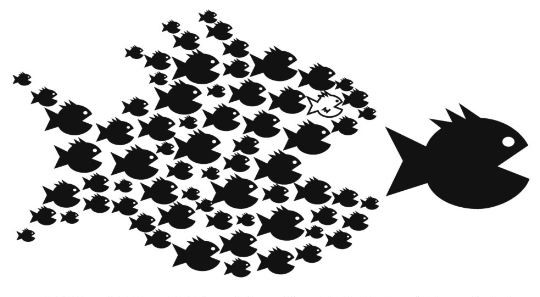

## Sustainable Scholarly Collaborations
---
### Collective Action and the Common Good
---
 <smaller>Kathleen Fitzpatrick // @kfitz // kfitz@msu.edu</smaller> 
<small>http://kfitz.info/presentations/btaa.html</small>

Note: I want to start today by thanking Maurice and the BIG Collection team for inviting me to talk with you today. 

Note: Much of what I have to say today stems from the work I did in _Generous Thinking: A Radical Approach to Saving the University_. The book overall makes the argument that rebuilding a relationship of trust between the university and the public that it ostensibly serves requires regrounding our institutions and the work that we do in them in a mode of what I refer to as "generous thinking," focusing our practices and our modes of communicating around building community and solidarity both on campus and across the campus borders. And a key component of that work lies in recovering the public nature of our work by rejecting the privatization that has overtaken our campuses -- not least through the information systems that we invest in and deploy.

## radical approach

Note: The 'radical approach' part of my book's subtitle grows out of my sense that the necessary changes in front of us are HUGE, that they can't be made incrementally, that they instead require  -- as Chris Newfield notes in the conclusion of _The Great Mistake_ -- a paradigm shift, because there is no route, no approach, no tool that can take us from where we are today to where we need to be. As Tressie McMillan Cottom has noted of the crisis that she has seen growing in higher education today,

> This is not a problem for technological innovation or a market product. This requires politics.   
--Tressie McMillan Cottom

Note: "This is not a problem for technological innovation or a market product. This requires politics." The problem for the university, after all, begins with politics: the institutions that not too long ago served as a highly accessible engine of social mobility, making a rich liberal-arts based education broadly available, today face not just the drastic reduction in that institution's affordability but an increasing threat to its very public orientation, as rampant privatization not only shifts the burden of paying for higher education from the state to individual students and families, but also turns the work of the institution from the creation of a shared social good -- a broadly educated public -- to the production of market-oriented individual benefit.

## the public good

Note: And the impact of individualism across our culture has similarly undermined the possibilities for collective action. In _Generous Thinking_, I ask the university as an institution to undergo a fairly radical transformation, by returning its attention to the publics, and the public good, that it is intended to serve. And though I'm certain I'm preaching to the choir in much of this talk, I'm focused on that same message here today. Because however committed you as individuals are to the collective project that something like the BIG Collection represents, most of you still work in institutions whose actual priorities and reward structures may not align with such collective goals. 

# competition

Note: In fact, in most cases, those priorities and reward structures privilege the competition in which our culture is mired. As currently structured, the entire system of higher education is engineered -- from individual institutions to accrediting agencies, funding bodies, and the higher education press -- to promote a form of competitiveness that relies on prestige. What Chris Newfield has described as the mandate to "compete all the time" forecloses a whole range of opportunities for our institutions, making it impossible for them to take any other approach.

Note: _Generous Thinking_ explores this problem from a number of different angles, asking all of us who care about the future of higher education to reorient our thinking about the work of the university from the creation of individual benefit, grounded in all of the competition that structures every aspect of life in contemporary institutions of higher education, to instead open the gates and focus on the university's role in building collectivity.

Note: But my colleagues and I have also been trying to think through this problem in a more pragmatic, applied for through _Humanities Commons_, a non-profit, academy-owned and governed network serving scholars and organizations from across the humanities and around the world. Humanities Commons attempts to instantiate several key principles: first, that higher education will benefit from all of us doing more of our work in public, where the publics that we need to support our institutions can begin to see the significance of what we do; and second, that institutions of higher education must do everything they can to resist and reverse the privatization that has overtaken them, restoring service to the public good not just to their mission statements but to the heart of their actual missions.

## community-supported infrastructure

Note: And part of resisting privatization involves turning away from some of the externally developed and deployed systems on which we have become dependent, and instead reserving our investments, and our labor, for systems and platforms and infrastructures whose missions genuinely align with our own, whose values mirror our own, and to whose governance we can contribute. This is true of a wide range of systems and platforms on which higher education relies, but perhaps nowhere has it become more pressing than in thinking about libraries and scholarly communication, both because these are the systems through which the work of the academy is made public and because these are the systems that have been most deeply privatized at the direct expense of the academy. We -- libraries, publishers, and scholars -- need collectively to turn our attention to developing the shared, publicly oriented systems that we can count on to support us as we develop new modes of open knowledge sharing, modes that might help higher education re-engage with the public good. 

<small>http://knowledgegap.org/index.php/sub-projects/rent-seeking-and-financialization-of-the-academic-publishing-industry/preliminary-findings/</small>

Note: We need to think about these platforms precisely because of the extent to which the entirety of the research workflow, from discovery, data gathering and analysis, through writing, submission, and publishing, to dissemination, evaluation, and reporting, is increasingly concentrated in a very limited number of corporate hands.

Note: But developing the collaborative, community-supported infrastructure that can create the paradigm shift we need will require some careful thinking about the work that will be necessary to make it sustainable. And that includes not just financial and technical sustainability -- the forms of sustainability that we most often consider in this context.

Note: We need, rather, to focus in on social sustainability, on the relationships required to build and maintain our shared infrastructure. Thinking about those relationships under the rubric of social sustainability directs our attention not just to the determination of a group of people to support a particular project, but to the determination of those people to understand and support their groupness; not just to their commitment to the thing they're doing together, but to their commitment to the concept of "together" in the first place.

Note: Collective action requires a kind of solidarity, in other words, a readiness to put the needs of the whole ahead of local demands, a determination to stand together in support of projects that may not necessarily seem to be our own top priority. And this form of solidarity, I am increasingly convinced, is a necessary prerequisite for successful, sustainable development of non-profit, open-source, community-owned networks and platforms.

Note: Sustainability and solidarity connect through the work of Elinor Ostrom, whose work focused on common-pool resource management; she argued fiercely against the conventional wisdom that the so-called tragedy of the commons was an inevitability, insisting that community-based systems and structures for ensuring those resources' sustainability were possible, provided the right modes of self-organization and self-governance were in place. Relationships, in other words.

Note: To backtrack for a second: Resources are generally understood by economists to fall into one of four categories, based on whether they are excludable -- whether individuals can be prevented from using them -- and whether they are rivalrous -- whether one individual's use precludes another's. Public goods are those resources that are both nonexcludable and nonrivalrous, meaning that no one can be prevented from using them and that no one's use reduces its availability for use by others. By contrast, private goods are both excludable and rivalrous; they can be restricted for use by paying customers, and their consumption by one customer can diminish its availability to another. These private goods are market-based products, typically produced and distributed for profit. Club goods are those that are excludable but nonrivalrous, those that are restricted to paying customers but not diminished by any one customer's use. And finally, goods that are nonexcludable but rivalrous are often described as common-pool resources: it is these goods to which the "tragedy of the commons" -- the overuse of shared natural resources -- can apply.

## the "free rider" problem

Note: At the root of the tragedy of the commons lies the "free-rider problem," which derives from the assumption that when individuals cannot be prevented from using commonly-held resources, but also cannot be compelled to contribute to their upkeep, some number of individuals will avail themselves of the resources without supporting them. As the number of free riders grows, the resources become prone to overuse and eventually become unsustainable. The only means imagined to help prevent the tragedy of the commons, before Ostrom, was external regulation, whether through privatization or nationalization of the resources involved.

 <!-- .element height="40%" width="40%" -->

Note: But as Ostrom argued in her 1990 book _Governing the Commons: The Evolution of Institutions for Collective Action_, this model -- like other such economic models as the prisoner's dilemma -- was based on a particular, and particularly pessimistic, view of human possibility, one that could not escape from its own metaphor.

> <smaller>"What makes these models so dangerous -- when they are used metaphorically as the foundation for policy -- is that the constraints that are assumed to be fixed for the purpose of analysis are taken on faith as being fixed in empirical settings, unless external authorities change them.... I would rather address the question of how to enhance the capabilities of those involved to change the constraining rules of the game to lead to outcomes other than remorseless tragedies."    -- Elinor Ostrom</smaller>

Note: READ SLIDE; Ostrom's work thus explored ways of organizing collective action that might ensure the sustainability of commonly-held resources. And while Ostrom focused on natural resources, such as fisheries, the problems she described, and the potential solutions she explored, have some important things in common with institutions of higher education and the non-profit, community-developed, academy-owned software projects on which they should be able to rely.

Note: There are lots of potential examples of free and open digital scholarly platforms and projects like these, all of which face a common problem: there is often sufficient support available for building and implementing such systems, but there aren't funding programs designed to ensure that they can be maintained. And as a result, the tools and platforms often accrue technical debt that becomes increasingly difficult to manage, rapidly making the projects appear unsustainable and thus leaving them in real danger of obsolescence.

Note: Some argue that the best means of ensuring the sustainability of such projects is economic: eliminating the free-rider problem by enclosing the commons, requiring individuals or institutions to pay in order to access them. But this privatization is, in many cases, the very problem that community-developed projects were developed in order to solve. So as with Ostrom's fishing communities, it's incumbent on us to find the right modes of self-organization and self-governance that can keep the projects open and thriving.

Note: Cross-institutional collaborations are required in order to keep open-source software projects sustainable, and those collaborations demand that the staff participating in them not only be credited and paid appropriately for their labor but -- most challengingly -- that they be supported in dedicating some portion of their labor to the collective good, rather than strictly to local requirements. Which is to say that individual institutions of higher education must understand themselves as part of a community of such institutions, and they need accordingly to act locally in solidarity with that community. And this is why I argue that sustainability in open-source development has solidarity as a prerequisite, a recognition that the interests of the group require commitment from its members to that group, at times over and above their own individual interests. What I'm interested in thinking about is how we foster that commitment: how, in fact, we understand that commitment itself as a crucial form of social sustainability.

Note: After all, getting institutions to stop competing with one another and start recognizing that they have more to gain from collaboration than they stand to lose in the rankings is no easy task. The privatization that has gradually overtaken them since the Reagan era has resulted in a fundamentally market-oriented, competition-based approach to everything the institution does. Making the argument that this approach must be set aside is a huge part of what the BIG Collection is working toward, and a huge part of what we're trying to instantiate in Humanities Commons.

Note: Our original business model focused on asking scholarly societies to work together to support a shared platform for communication with and among their members. However, we wanted to make it possible for anyone interested to join the network, without facing restrictions based on institutional affiliation, membership, or other credentials. The good news is that four years in we have over 26,000 registered users from across the humanities and around the world. But our partner organizations have tended to see the value in paying to support the network's services as lying in an exclusive benefit that they can provide to their members. It's understandable, as they need to provide such benefits in order to keep their members paying dues. But their focus on the network as a club good leads them to understand its openness as diminishing its value, rather than recognizing that the network effects of a larger, more open community will ultimately serve their long-term interests.

Note: So we've been working to develop a model that will encourage organizations and institutions to invest in the network, to support it in an ongoing way, to recognize that not only do they belong to the network, but that the network belongs to them, and its future depends on them. Making that case requires not just a workable revenue model but, far more importantly, a compelling governance model, one that gives member organizations and institutions, as well as individual members, both a voice in the network's future and a stake in its outcomes. As Ostrom argues, a path to sustainability for a common-pool resource like Humanities Commons requires us to ensure that building the network's community and enabling it to become self-governing is a precondition for its success.

Note: So the future of Humanities Commons, like the future of a host of open-source software and community-supported infrastructure projects, requires its participants to act in the interest of the collective, even where those interests do not immediately appear to be local. Solidarity in the form of collective action is where real sustainability for academy-owned infrastructure -- and for the academy itself -- lies. And it's at the heart of the BIG Collection: your institutions of course have different structures, different requirements, different needs. And yet you share the same goals: the development, distribution, and preservation of new forms of knowledge. That you are all here together, looking for ways to meet your shared goals despite your different local needs gives me hope.

# generosity

Note: It's a key form of generosity, and one that more units on our campuses, and more institutions in their engagements with one another need to embrace. Because the bottom line is that the real threat to institutions of higher education today is not _other institutions of higher education_, not our place in the rankings that order us. Rather, it is the creeping forces of privatization that continue to undermine our public mission. If we are to reclaim that mission, to reclaim control of the work produced in and by the university, we're going to have to do together, acting not just in solidarity with but with generosity toward the other units within our institutions, toward the other institutions to which we are inevitably connected, and toward the public that we all jointly serve. If we are going to develop and sustain community-supported infrastructure, we have to genuinely become, and act as, a community.

## thank you
---
<smaller>Kathleen Fitzpatrick // @kfitz // kfitz@msu.edu  
http://presentations.kfitz.info/btaa.html</smaller>

Note: I'm honored to have had this chance to talk with you today as you continue the work of building that community. Thanks so much.
