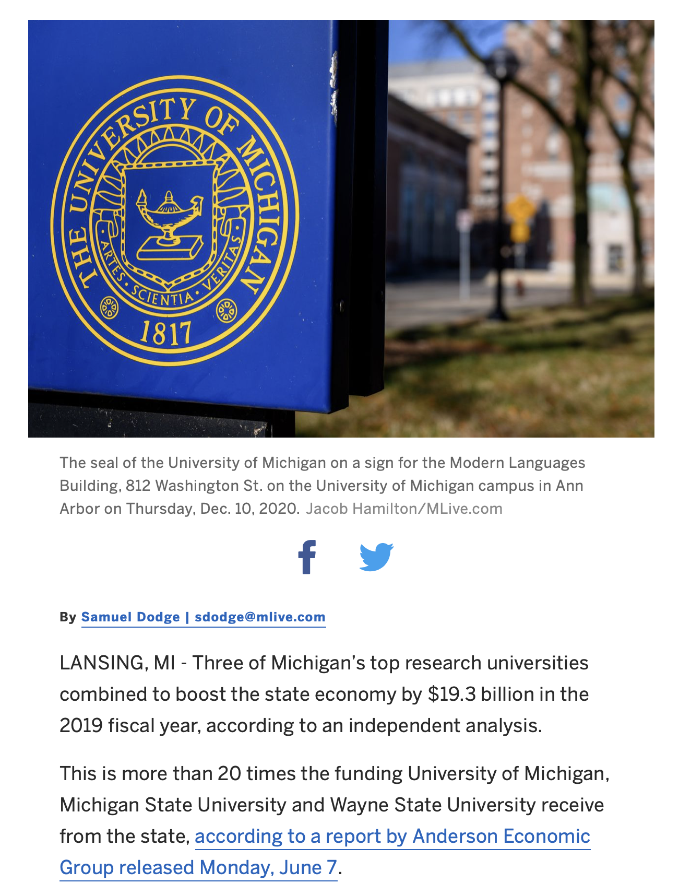
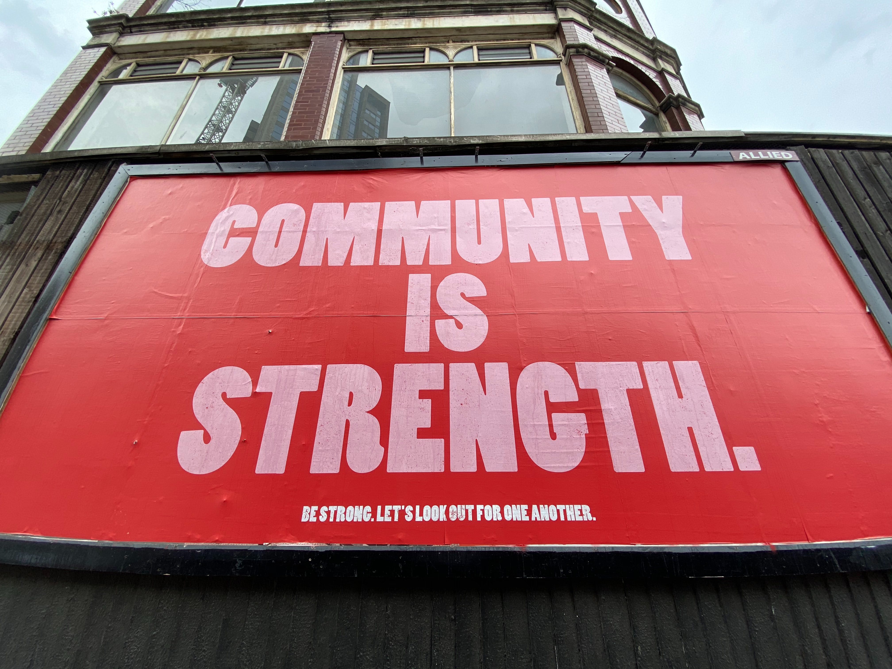

## Higher Education as a Social Good
---
 <smaller>Kathleen Fitzpatrick // @kfitz // kfitz@msu.edu</smaller> 
<small>http://kfitz.info/presntations/cece.html</small>

Note: Thanks for that introduction, and for having me here today! I'm happy to have the opportunity to talk with you a bit about some of the ideas that originated in *Generous Thinking* and how they might relate to the concerns that you share on the Commission on Economic and Community Engagement.

 <!-- .element height="45%" width="45%" --> 
<smaller>mlive.com</smaller>

Note: Last week, an independent economic group released a report indicating that the University of Michigan, Michigan State University, and Wayne State University together boosted the state economy by $19.3 billion in 2019 -- a figure that they went on to note is *more than 20 times* the funding provided to them by the state. 
This is an extraordinary report, which confirms what we all know: public research universities are crucial contributors to the economic well-being of their communities. Our universities not only conduct the research and development that leads to new business opportunities in the state, but also build an educated workforce ready to take on the challenges our communities face now and into the future.

It's great news, and it's particularly great to have numbers that can be used in arguments about the value of public investment in institutions of higher education, especially at a moment when relationships between legislatures and universities are strained. But I want to spend a bit of time today talking about why reports like this make me nervous. It may sound odd, but frankly it's because they do *too good a job* of tying the public vision of the value of the university to its economic impact, and in the process they inadvertently run the risk of undermining the other equally important areas and modes in which the public research university contributes to the well-being of the publics that it serves.

<!-- .element height="90%" width="90%" --> 
<smaller>unsplash.com/@m_b_m</smaller>

Note: That is to say, the danger of a report like this one, as positive as its results are, is that it speaks to a particular mindset in American culture that is primed to hear it, with the result that it completely overshadows all of the good that the university does in areas other than the economic. That focus on economic impact may be fine in good times, when taxpayers and legislators feel like they can afford to invest in a broad range of kinds of exploration and education on campus. But in bad times, when budgets are tight and jobs are scarce, many begin to look at those kinds of exploration that don't have obvious or direct economic benefits as "luxuries," as frivolous, as extraneous to the institution's mission -- precisely because the institution's mission, and the public good that it serves, have come to be wholly associated with the economic.

There is, in other words, a deeply ingrained mindset in American culture that lends itself to the assumption that economic development is the primary good that the university can and should serve. This is a mindset that I would love to see us work on changing. It has its underpinnings in our faith in the extraordinary creative potential generated by capitalism, but it leads to the assumption that all of the problems in the contemporary world can and should be approached through market-based solutions.

# #neoliberalism

Note: This tight focus on the market as the telos of contemporary life is often discussed under the umbrella of "neoliberalism" on campus. "Neoliberalism" is admittedly one of those terms that has been so relentlessly misunderstood and misused that it's become a kind of caricature, an empty critique with all the force that "bourgeois" had in the early 1970s, or "postmodern" in the early 2000s, or, from the other side of the aisle today, "critical race theory." It's the kind of term that causes a lot of us just to stop listening, because we know that what's coming is (a) profoundly ideological, and (b) likely not to mean exactly what its speaker thinks it means.

But neoliberalism is nonetheless an important concept, and one that can tell us a lot about what's happened within American culture since the early 1980s -- the forces that have encouraged the public to question the value of institutions of higher education, as well as the other forms of public investment in the public good. In fact, it's part of what's surfaced the question of whether there even *is* such a thing as the public good. Just as Margaret Thatcher argued in the 1980s that there was no such thing as "society," but instead only individuals and families that needed to look out for themselves, so we find today a predominant political perspective in this country that holds that all goods are and should be private rather than public, individual rather than social.

<!-- .element height="90%" width="90%" --> 
<smaller>unsplash.com/@stri_khedonia</smaller>

Note: The effects of this conviction on our culture today have been corrosive. We have experienced over the last four decades a dramatic increase in inequality, both economic and social, as those who already *have* benefit from an environment in which rewards accrue to the individuals who are already most equipped to pursue them. We have also seen a radical decline in our cultural sense of shared obligations to or even basic care and respect for others. Broadly speaking, we've lost our collective grip on the notions that our individual actions affect others, that we should act with those others in mind, that we share common concerns, and that we are collectively responsible for ensuring that we provide a viable future for all of us. Without those understandings, without a recognition that the global crises we face today require responsible social engagement and collective action, poverty will continue to increase, structural racism will continue to grow, and the very prospect of a livable planet is thrown into serious question.

<!-- .element height="90%" width="90%" --> 
<smaller>unsplash.com/@edrecestansberry</smaller>

Note: So. I want to pause here and acknowledge that this all no doubt sounds alarmist, that I've managed to get in a very few minutes from a highly encouraging report on the economic impact of public research universities to the question of whether the future will be a livable one, and that there are several links along the way that I haven't yet fully explored -- not to mention all kinds of alternative paths that we have available to consider. So let's backtrack a bit. If, as I am arguing here, our overdetermined focus on the economic good that universities provide has the potential to undermine the other kinds of goods that our institutions serve, what are those goods, how are they undermined, what do we lose if we lose them, and how might we begin to ensure that they remain a crucial part of the public vision of what the university is for?

Note: In order to explore the university's purpose in serving the public good, and the ways that the neoliberal understanding of the university's function have weakened it almost beyond recognition, we might begin by thinking through the distinctions drawn in economics among the four primary types of goods, and the ways they are defined, first, through their "excludability" -- or whether non-paying customers can be prevented from using them -- and second, through their "rivalrousness" -- or whether their use uses them up. Public goods are nonexcludable and nonrivalrous, meaning that no one can be excluded from their use and no one's use uses them up for others. Private goods are typically both excludable and rivalrous, and are typically market-based as a result. Goods that are non-excludable but rivalrous are thought of as common-pool resources, which were assumed for a long time to be subject to the "tragedy of the commons" until the work of Elinor Ostrom demonstrated the potential for shared governance in ensuring their sustainability (a set of ideas that I unfortunately don't have time to dig into today, but that have deep implications for our understanding of how we can create a sense of shared responsibility for shared resources like the public university). Finally, club goods are those that are excludable but non-rivalrous -- goods that are not diminished through use, but that people can be prevented from using unless they pay for them.

Note: The question, then, is what kind of goods higher education and the knowledge that it provides and creates are and should be. Knowledge is certainly nonrivalrous; if I have it, and I share it with you, I do not have less of it as a result. The question lies in excludability: where once knowledge and the higher education that fosters it might have been seen as striving to be nonexcludable, making itself available to anyone desiring it, it has since the 1960s increasingly become excludable, restricted to those who can pay. Access to knowledge is today a club good, in other words, rather than the public good that was once imagined to best serve our society: supported by all for the benefit of all. 

Those ideals regarding public education were always flawed, even at their most promising moments: our system of land-grant universities was founded on the appropriation of land from indigenous nations, and the GI Bill supported rather than undermined racial inequities. But their underlying ideals were based in an understanding that the university's purpose is the broad education of the public. And that broad education has always been understood to have benefits beyond the directly economic. The Morrill Act of 1862, which established the system of land-grant colleges and universities, designated funds to the states for 

> <smallish>"the endowment, support, and maintenance of at least one college where the leading object shall be, without excluding other scientific and classical studies and including military tactics, to teach such branches of learning as are related to agriculture and the mechanic arts, in such manner as the legislatures of the States may respectively prescribe, in order to promote the liberal and practical education of the industrial classes in the several pursuits and professions in life." (7 U.S. Code § 304)</smallish>

Note: (READ SLIDE.) Liberal *and* practical. Pursuits *and* professions. There are clearly economic goals embedded in this sense of what it is to improve the lot of the industrial classes, but there is also clearly expressed here a desire to create a world that is not just more prosperous but *better* in a much deeper sense. 

<!-- .element height="80%" width="80%" --> 
<smaller>unsplash.com/@thirdserving</smaller>

Note: The wide array of research done on our campuses in pursuit of that *better* has a range of important social impacts that may not be directly economic. This includes basic research in the bench sciences, as well as a panoply of projects in the social sciences, humanities, and arts. These projects help further our shared understanding of how the world works, how it should work, and how it could work. They examine the material world and our interactions with it, as well as the world of ideas and institutions and cultures, enabling us to know more about who we are, about the forces that structure our lives, and about the potential for creating something new. When we focus too narrowly on economic impact, research into gene regulation in fruit flies, or ethics in food distribution and consumption, or migration patterns in the African diaspora, or the history of patronage in early eighteenth-century music, all run the risk of being seen as extraneous, and therefore unworthy of funding, when in fact they extend our understandings of who we are and how we relate to one another in crucial ways. Even more, these projects are not ends in themselves, but the basis for future work in their fields, and that ability to develop and share knowledge in service to a larger project of collective understanding is at the heart of the academic mission.

<!-- .element height="90%" width="90%" --> 
<smaller>unsplash.com/@skyjlen</smaller>

Note: The challenge, of course, is that our communities off-campus often aren't privy to the reasons why we work on the projects we've selected, or what the importance of those projects might be, and so it winds up appearing that researchers on campus are engaged in the contemporary equivalent of investigations into the numbers of angels that can dance on the head of a pin, wrapping ourselves up in issues that don't matter -- or worse, that aren't real -- rather than those that will have a direct, material impact on the world. On campus, we know that what we do matters enormously, but we too often fail to communicate that significance in ways that connect with the publics around us. And this divide points to a significant structural problem with the ways that scholarly work on campus gets done: ensuring the visibility and the viability of our fields requires us to communicate our work in public-facing ways -- and yet what we're individually rewarded for, both on campus and within our broader fields, is overwhelmingly our inward-facing communication: the articles and books we write with other experts as our imagined audience. Which raises a key question: how can we begin to shift our reward structures on campus such that faculty are encouraged to communicate not just with one another but with the broader world?

<!-- .element height="85%" width="85%" --> 
<smaller>unsplash.com/@sbk202</smaller>

Note: Of course, one of the most important ways that we communicate with the broader world is through our students. Unfortunately, our students have increasingly been raised in a culture that tells them that the purpose of a college degree is developing the skill set that will lead directly to a lucrative career -- and given how much they and their families are paying, and indeed going into debt, for that degree, it's understandable that they gravitate (or are pushed) toward practical, pre-professional majors. Preparing students to enter the workforce is not a bad thing, and I'm not arguing at all that we should wave that aside. But the goal of the university should be producing graduates who are not just successful economic actors, but who are well-rounded humans, who are able to think creatively about the complex conditions in which we live today, and who are willing to contribute not just materially but socially, ethically, even morally to the improvement of the world around them, not just for themselves but for others. 

<!-- .element height="90%" width="90%" --> 
<smaller>jhupbooks.press.jhu.edu/title/generous-thinking</smaller>

Note: This is generous thinking: finding ways to use our collective knowledge for the public good, demonstrating our deep connections to -- indeed, our responsibility for -- the world around us. The university's educational mission -- one we need to claim ferociously, loudly, publicly -- is cultivating that generous thinking, preparing our students not just for the professions that might lead to wealth production but for the "several pursuits" in life. We are educating the "leaders of tomorrow" not just in the conventionally understood political and business realms, but in the kinds of engagement that will help their communities grow from the grassroots up. And that mission demands that we focus on what is required to make a better world, both on campus and off. It requires that we think about our institutions' often unspoken structural biases, including that toward "economic impact"; it requires us to focus not just on making it possible for more kinds of people to achieve conventionally coded success, but on examining what constitutes success, how it is measured, and why. And that requires a values-first approach to higher education, and an ongoing examination of the ways that those values are instantiated in institutional structures and processes.

<!-- .element height="80%" width="80%" --> 
<smaller>unsplash.com/@john_cameron</smaller>

Note: So: what if we understood the well-being of communities to lie not just in the individual economic prosperity that can result but in terms of individuals' ability to work together -- to engage in collective action -- toward a wide range of common goals? What areas of the university might we find value in if the kinds of leadership we educate for were focused less on individual professional success and more on connection and collaboration?

<!-- .element height="90%" width="90%" --> 
<smaller>unsplash.com/@edulauton</smaller>
  
Note: We'd probably want to start by ensuring that every student on campus receives a deep education in ethics, in creative thinking, and in individual and collaborative expression. These are, as it turns out, the skills and qualities that many employers are looking for today, and that too many of our pre-professional graduates don't have the opportunity to develop, as they've been led to understand the liberal pursuits -- the study of literature, of art, of philosophy, of history -- as extraneous to their goal of beginning a remunerative career.

<!-- .element height="90%" width="90%" --> 
<smaller>unsplash.com/@goian</smaller>

Note: We'd also want to think about the kinds of studies and stories that we would use to highlight the contribution of universities to a more richly understood social good. Those studies and stories may not have the dramatic numbers that we can point to as evidence of the university's economic impact, but they can play a key role in surfacing the significance of a broad range of work on campus for the publics whom we serve. Producing those stories will require deep faculty involvement, and will thus ask the university to think about how such public-facing work can be understood to "count" in the structures of faculty evaluation and reward. And that public-facing, community engaged work must count, precisely because it can help us communicate the impact of everything that the university does -- not just its economic impact, and not just the benefits that it provides for individuals, but our deeper social and cultural impact, and the benefits we provide for communities and for society as a whole.

## thank you
---
<smaller>Kathleen Fitzpatrick // @kfitz // kfitz@msu.edu</smaller>  
<small>http://presentations.kfitz.info/cece.html</small>

Note: I'm honored to have had this chance to talk with you today as you continue that work of telling the stories of engagement between our universities and our communities. Thanks so much.
