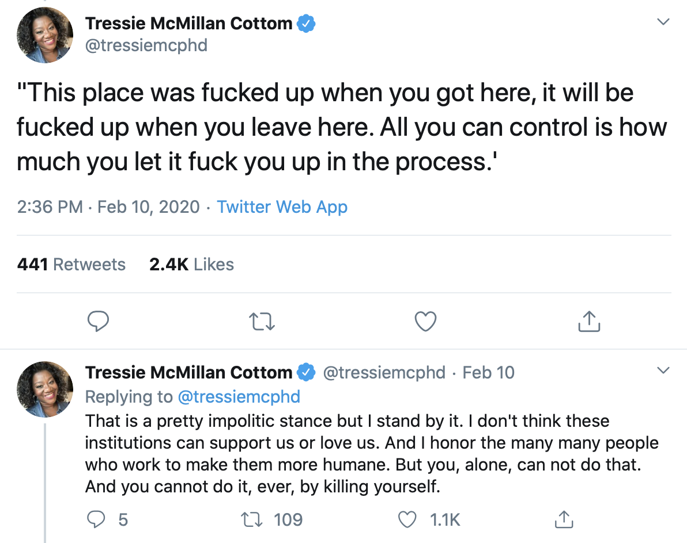
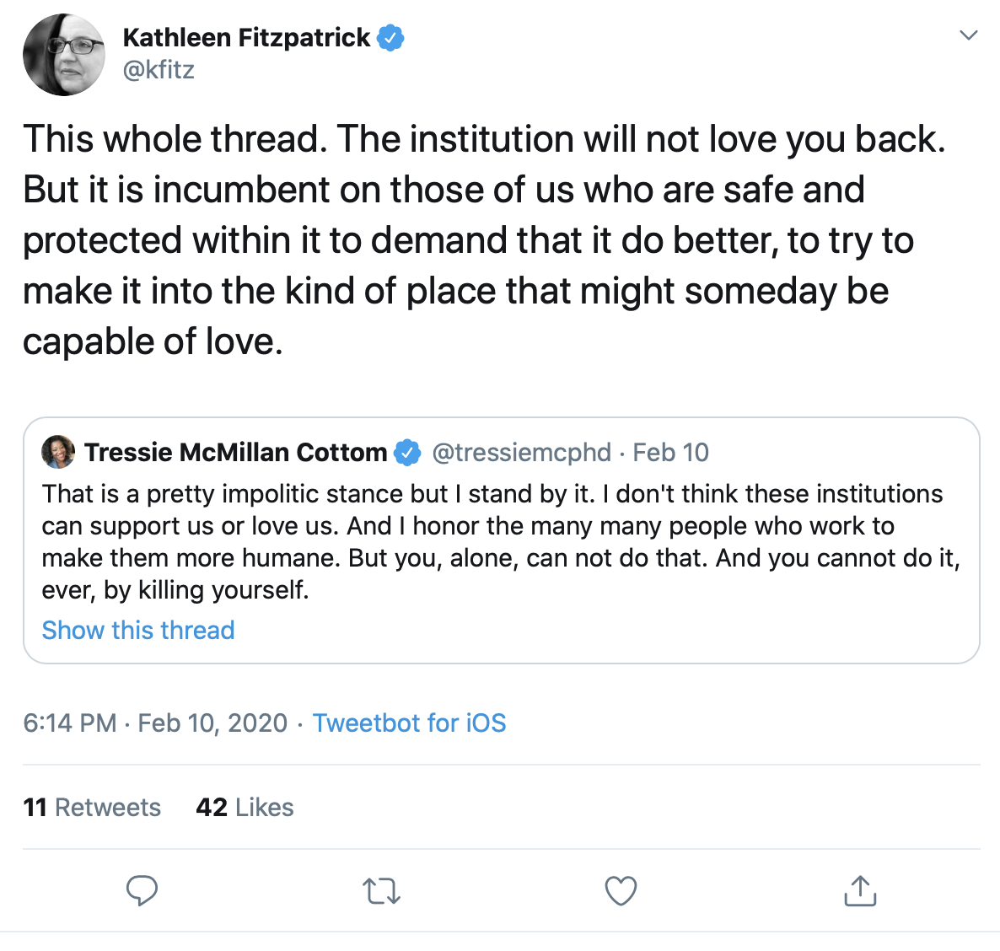

## Toward a More Generous University
---
##### Kathleen Fitzpatrick // @kfitz // kfitz@msu.edu

Note: Thanks; happy to be here.

Note: Earlier this week, sociologist Tressie McMillan Cottom posted a thread on Twitter thinking through the things she tells the Black scholars who seek her advice about surviving the academy. And these two tweets in particular caught my attention. (READ TWEETS)

Note: These tweets prompted me to respond, saying (READ TWEET). This may be utterly quixotic on my part, but it's something I've been thinking about for a while: what would it be if we could remake the university -- or build a new one -- that was structurally capable of living up to its duty of care for all of its members?

Note: Much of this thinking derives from the arguments in my recent book, _Generous Thinking: A Radical Approach to Saving the University_. The 'saving the university' part of the book's subtitle has to do with my growing conviction that the survival of institutions of higher education -- and especially _public_ institutions of higher education -- is going to require us to change our approach to the work we do within them, and the ways we use that work to connect the campus to the publics that it serves.

## "radical approach"

Note: The 'radical approach' part grows out of my increasing sense that the necessary change is a HUGE one, that it can't be made incrementally, that instead it requires -- as Chris Newfield notes in the conclusion of _The Great Mistake_ -- a paradigm shift, because there is no route, no approach, no tool that can take us from where we are today to where we need to be. As Cottom has noted in her book _Lower Ed_ of the crisis that she has seen growing in higher education today,

> "This is not a problem for technological innovation or a market product. This requires politics."    --Tressie McMillan Cottom, _Lower Ed_

Note: "This is not a problem for technological innovation or a market product. This requires politics." The problem, after all, begins with politics: the American public university that not too long ago served as a highly accessible engine of social mobility, making a rich liberal-arts based education broadly available, has been utterly undone. We are facing today not just the drastic reduction in that institution's affordability but an increasing threat to its very public orientation, as rampant privatization not only shifts the burden of paying for higher education from the state to individual students and families, but also turns the work of the institution from the creation of a shared social good -- a broadly educated public -- to the production of market-oriented individual benefit.

Note: And all the while, we are also facing what Inside Higher Ed has described as "a larger than typical decline in confidence in an American institution in a relatively short time period." And this falling confidence cannot be simply dismissed as evidence of an increasingly entrenched anti-intellectualism in American life -- though of course, without doubt, that too. Rather we need to consider the possibility that, as I argue in the last chapter of _Generous Thinking_, the paradigm under which higher education has operated in the United States is failing, and failing fast, and if our institutions are to survive we must find a new way of articulating and living out the value of the university in the contemporary world. And this is true not least because this shift in public opinion didn't just happen by itself; it was made to happen as part of a program of discrediting and privatizing public services across the nation.

##### http://chronicle.com

Note: However: from time to time we are confronted with undeniable evidence that many of our institutions -- even those institutions that most profess their commitment to public service -- have utterly betrayed the trust that public has placed in them. Which is to say that the decline in confidence in the university is not just caused by the public failing to understand the importance of what we do; it's also that we have, in many ways, failed: failed to make that importance clear, failed to protect our communities both on-campus and off, failed to build institutions that are genuinely, structurally capable of living out the values they profess. What I'm asking for is a tall order -- in many ways swimming against the current of the neoliberal institution. But a large part of what I'm after is to press for new ways of understanding our institutions _as_ communities, as well as _in interaction with_ communities, asking us to take a closer look at the ways that we communicate both with one another and with a range of broader publics about and around our work. And some focused thinking about that mode of public engagement is in order, I would suggest, because our institutions are facing a panoply of crises that we cannot resolve on our own.

# crisis

Note: These crises don't always give the impression of approaching the kind or degree of the highly volatile political, economic, and environmental situation we are currently living through. And yet the decline in public support for higher education is of a piece with these other crises, part of a series of national and international transformations in assumptions about the responsibility of governments for the public good -- the very notion, in fact, that there _can be_ such a thing as the public good -- and the consequences of those transformations are indeed life or death in many cases. So while my argument about the importance of generosity for the future of the university might appear self-indulgent, a head-in-the-sand retreat into philosophizing and a refusal of real political action, I hope, in the book, to have put together a case for why this is not so -- why, in fact, the particular modes of generous thinking that I am asking us to undertake within and around our institutions of higher education have the potential to help us navigate the present crises. Many of our fields, after all, are already focused on pressing public issues, and many of us are already working in publicly engaged ways. We need to generalize that engagement, and to think about the ways that it might, if permitted, transform the institution and the ways that we all work within it. That is to say, the best of what the university has to offer -- what matters most -- may lie less in its power to advance knowledge in any of its particular fields than in our ability to be a model and a support for generous thinking as a way of being in and with the world.

# "we"

Note: But first: who is this "we" I keep referring to, what is it that we do, and why does it matter? Much of what I have written focuses on the university's permanent faculty, partially because that faculty is my community of practice and partially because of the extent to which the work done by the faculty is higher education: research and teaching are the primary purposes and visible outputs of our institutions. Moreover, the principles of shared governance under which we operate -- at least in theory -- suggest that tenured and tenure-track faculty members have a significant responsibility for shaping the future of the university. But it's important to be careful in deploying this "we"; as Helen Small has pointed out,

> "The first person plural is the regularly preferred point of view for much writing about the academic profession for the academic profession. It is a rhetorical sleight of hand by which the concerns of the profession can be made to seem entirely congruent with those of the democratic polity as a whole."  -- Helen Small

Note: "The first person plural is... a rhetorical sleight of hand by which the concerns of the profession can be made to seem entirely congruent with those of the democratic polity as a whole." While I hope that my argument has something important to say to folks who work on university campuses but are not faculty, or who do not work on university campuses at all, that connection can't be assumed. It would be great if we could make it possible for the "we" I focus on here to refer to all of us, on campus and off, who want to strengthen both our systems of higher education and our ways of engaging with one another in order to help us all build stronger communities, to ensure that all of us count -- but that's part of the work ahead.

# "them"

Note: So it's important to be careful about how we define "us," precisely because every "us" implies a "them," and the ways we define and conceive of that "them" points to one of the primary problems of the contemporary university, and especially public universities in the US. These institutions were founded explicitly in service to the people of their states or regions or communities, and thus those publics should be understood as part of "us." And yet, the borders of the campus have done more than define a space; they determine a sense of belonging as well, transforming everything off-campus into "them," a generalized other. Granted, sometimes "they" are imagined to be the audience for our performances, a passive group that benefits from and takes in information we provide. But what might it mean if we understood ourselves, and our institutions, as embedded in and responsible to the complex collection of communities by which we are surrounded?  How might we develop a richer sense not just of "them" but of the "us" that we together form?

# "community"

Note: We talk a lot, after all, about community on campus, both about community engagement and about the institution itself as a community, but we don't often talk about what it is we mean when we invoke the concept. Miranda Joseph explores the ways in which "community" gets mythologized, romanticized, and so comes to serve what she calls a supplementary role with respect to capitalism, filling its gaps and smoothing over its flaws in ways that permit it to function without real opposition. Additionally, "community" in the singular -- "the community" -- runs the risk of becoming a disciplinary force, a declaration of groupness that is designed to produce the "us" that inevitably suggests a "them." 

# solidarity

Note: If we understand community instead as multiple and diverse, as shifting entities that serve strategic purposes, we might be able to embrace community not as a declaration but as an activity, a practice of solidarity, a process of coalition-building. It is a way of rethinking who counts, of adding others to our numbers, and adding ourselves to theirs. This call for solidarity between the university and the communities outside its walls is part of higher education's recent history, the subject of the student-led calls for institutional change that spanned the 1960s and 1970s. As Roderick Ferguson has detailed, however, those calls were met with deep resistance, not only within the institution but in the governmental and corporate environment that oversaw it, leading to the political shifts whose apotheosis we are living today. In reaction, our institutions, rather than tearing down their walls, instead turned inward, become self-protective, looked away from the possibility of building solidarity with the publics that the university was meant to serve. Community in this strategic sense is and has been the university's weakness, when it should have been its strength. If we are to save our institutions from the relentless economic and political forces that today threaten to undo them, we must begin to understand our campus as a site where new kinds of communities, and new kinds of solidarities, can and must be built.

# liberal education

Note: However, in building those relationships, we have to contend with the fact that what faculty members actually _do_ on our campuses is often a mystery, and indeed a site of profound misunderstanding, for people outside the academic profession, and even at times for one another. One of the key areas of misunderstanding, and one that most needs opening up, is the fundamental purpose of higher education. Public figures such as politicians increasingly discuss colleges and universities as sites of workforce preparation, making it seem as if the provision of career-enhancing credentials were the sole purpose for which our institutions exist, and as if everything else they do that does not lead directly to economic growth were a misappropriation of funds. Those of us who work on campus, by and large, understand our institutions not as credentialing agencies but as sites of broad-based education: a "liberal" education in the original sense of the term. Of course the very term "liberal education," so natural to those of us steeped in it, has itself become profoundly politicized, as if the liberal aspect of higher education were not its breadth but its ideological bent. So we see, for instance, the state of Colorado stripping the term out of official university documents. But even where the concept of liberal education isn't imagined to be a cover for some revolution we're fomenting on campus, there's a widespread misconception about it that's almost worse: it is a mode of education in which we waste taxpayer resources by developing, disseminating, and filling our students' heads with useless knowledge that will not lead to a productive career path.

# humanities

Note: And nowhere is this misconception more focused than on the humanities. The portrait I'm about to sketch of the humanities today could be extended to many other areas within the curriculum -- for example, the sciences' focus on "basic science," or science without direct industry applicability, is often imagined to be just as frivolous. But the humanities -- the study of literature, history, art, philosophy, and other forms of culture -- are in certain ways both the core and the limit case of the liberal arts. The humanities cultivate an inquisitive mindset, they teach key skills of reading and interpretation, and they focus on writing in ways that can prepare a student to learn absolutely anything else over the course of their lives -- and yet they are the fields around which no end of hilarious jokes about what a student might actually do with that degree have been constructed. (The answer, of course: absolutely anything. As a recent report from the American Academy of Arts and Sciences makes clear, not only do humanities majors wind up gainfully employed, but they also wind up happy in their choices. But I digress.) The key thing to note is that the humanities serve as a bellwether of sorts: what has been happening to them is happening to higher education in general, if a little more slowly. So while I'm focused here on the kinds of arguments that are being made about the humanities in our culture today, it doesn't take too much of a stretch to imagine them being made about sociology, or about physics, or about any other field on campus that isn't named after a specific, well-paying career.

# marginalization

Note: The humanities, in any case, have long been lauded as providing students with a rich set of interpretive, critical, and ethical skills with which they can engage the world around them. These skills are increasingly necessary in today's hypermediated, globalized, conflict-filled world -- and yet many humanities departments find themselves increasingly marginalized within their own institutions. This marginalization is related, if not directly attributable, to the degree to which students, parents, administrators, trustees, politicians, the media, and the public at large have been led in a self-reinforcing cycle to believe that the skills these fields provide are useless in the current economic environment. Someone particularly visible makes a publicly disparaging remark about all those English majors working at Starbucks; commentators reinforce the sense that humanities majors are worth less than pre-professional degrees; parents strongly encourage their students to turn toward pragmatic fields that seem somehow to describe a job; administrators note a decline in humanities majors and cut budgets and positions; the jobs crisis for humanities PhDs worsens; someone particularly visible makes a publicly disparaging remark about what all those adjuncts were planning on doing with that humanities PhD anyhow; and the whole thing intensifies. In many institutions, this draining away of majors and faculty and resources has reduced the humanities to a means of ensuring that students studying to become engineers and bankers are reminded of the human ends of their work. This is not a terrible thing in and of itself, but it is not a sufficient ground on which humanities fields can do their best work for the institution, or for the world.

# spreading

Note: And while this kind of cyclical crisis has not manifested to anything like the same extent in the sciences, there are early indications that it may be spreading in that direction. Where once the world at large seemed mostly to understand that scientific research, and the kinds of study that support it, are crucial to the general advancement of knowledge, recent shifts in funder policies and priorities suggest a growing scrutiny of that work's economic rather than educational impact, as well as a growing restriction on research areas that have been heavily politicized. The humanities, again, may well be the canary in the higher education coal mine, and for that reason, it's crucial that we pay close attention to what's happened in those fields, and particularly to the things that haven't worked as the humanities have attempted to remedy the situation.

# defense

Note: One of the key things that hasn't worked is the impassioned plea on behalf of humanities fields: a welter of defenses of the humanities from both inside and outside the academy have been published in recent years, each of which has seemed slightly more defensive than the last, and none of which have had the desired impact. Calls to save the humanities issued by public figures have frequently left scholars annoyed, as they often begin with a somewhat retrograde sense of what we do and why, and thus frequently give the sense of trying to save our fields from us. (One might see, for instance, a column published in 2016 by the former chairman of the NEH, Bruce Cole, entitled "What's Wrong with the Humanities?", which begins memorably:

> "Let's face it: Too many humanities scholars are alienating students and the public with their opacity, triviality, and irrelevance."  -- Bruce Cole

Note: "Let's face it: Too many humanities scholars are alienating students and the public with their opacity, triviality, and irrelevance.") But perhaps even worse is the degree to which humanities professors themselves -- those one would think best positioned to make the case -- have failed to find traction with their arguments. As the unsuccessful defenses proliferate, the public view of the humanities becomes all the worse,

> "Whatever things the humanities do well, it is beginning to look as if promoting themselves is not among them."  -- Simon During

Note: leading Simon During to grumble that "Whatever things the humanities do well, it is beginning to look as if promoting themselves is not among them." And maybe we like it that way, as we are often those who take issue with our own defenses, bitterly disagreeing as we frequently do about the purposes and practices of our fields.

# definition

Note: Perhaps this is a good moment for us to stop and consider what it is that the humanities do do well, what the humanities are for. I will start with a basic definition of the humanities as a cluster of fields that focus on the careful study and analysis of cultures and their many modes of thought and forms of representation -- writing, music, art, media, and so on -- as they have developed and moved through time and across geographical boundaries, growing out of and adding to our senses of who we are as individuals, as groups, and as nations. The humanities are interested, then, in the ways that representations work, in the relationships between representations and social structures, in all the ways that human ideas and their expression shape and are shaped by human culture. In this definition we might begin to see the possibility that studying literature or history or art or film or philosophy might not be solely about the object itself, but instead about a way of engaging with the world: in the process we develop the ability to read and interpret what we see and hear, the insight to understand the multiple layers of what is being communicated and why, and the capacity to put together for ourselves an appropriate, thoughtful contribution to our culture.

# disagreement

Note: Now, the first thing to note about this definition is that I am certain that many humanities scholars who hear it will disagree with it -- they will have nuances and correctives to offer -- and it is important to understand that this disagreement does not necessarily mean that my definition is wrong. Nor, however, do I mean to suggest that the nuances and correctives presented would be wrong. Rather, that form of disagreement is at the heart of how we do what we do: we hear one another's interpretations (of texts, of performances, of historical events) and we push back against them. We advance the work in our field through disagreement and revision. This agonistic approach, however, is both a strength of the humanities -- and by extension of the university in general -- and its Achilles' heel, a thought to which I'll return shortly.

# sermonizing

Note: For the moment, though, back to Simon During and his sense that the humanities are terrible at self-promotion. During's complaint, levied at the essays included in Peter Brooks and Hilary Jewitt's volume, _The Humanities and Public Life_, is largely that, in the act of self-defense, humanities scholars leave behind doing what they do and instead turn to "sermonizing" (his word) about the value of what they do. He argues that part of the problem is the assumption that the humanities as we practice them ought to have a public life in the first place. He winds up suggesting that we should continue to ensure that there is sufficient state support for the humanities so that students who do not already occupy a position of financial comfort can study our fields, but that we should not stretch beyond that point by arguing for the public importance of studying the humanities, because that importance is primarily, overwhelmingly, private.

# privatization

Note: This sense that education in the humanities is of primarily private value is increasingly in today's popular discourse extended to higher education in general: the purpose, we are told, of a college degree is some form of personal enrichment, whether financial or otherwise, rather than a social good. This privatization of higher education's benefits -- part of the general privatization that Chris Newfield has referred to as the academy's "great mistake" -- has been accompanied by a related shift in its costs from the state to individual families and students, resulting in the downward spiral in funding and other forms of public support in which our institutions and our fields are caught, as well as the astronomically increasing debt load faced by students and their families. As long as a university education is assumed to have a predominantly personal rather than social benefit, it will be argued that making such an education possible is a private rather than a public responsibility. And that mindset will of necessity lead to the devaluation of fields whose benefits are less immediately tangible, less material, less individual. If we are to correct course, if we are to restore public support for our institutions and our fields, we must find ways to make clear the public goals that our fields have, and the public good that our institutions serve.

# public good

Note: But what is that public good? We don't always do a terribly good job of articulating these things, of describing what we do and arguing on behalf of the values that sustain our work. That may be in part because it's hard to express our values without recourse to what feel to us like politically regressive, universalizing master narratives about the nature of the good that have long been used as means of solidifying and perpetuating the social order, with all its injustices and exclusions. And so instead of stating clearly and passionately the ethics and values and goals that we bring to our work, we critique. We protect ourselves with what Lisa Ruddick has described as "the game of academic cool": in order to avoid appearing naïve -- or worse, complicit -- we complicate; we argue; we read against the grain.

# critique

Note: One of the things that happens when we engage in this mode of critique is that we get accused of having primarily ideological ends; this is how our universities come to be accused of "brainwashing" their students, filling their heads with leftist rejections of the basic goodness of the dominant western culture. On campus, of course, we know that's not true; our classes in American history and in English literature may strive to teach the full range of that history and that literature, but western culture is far from being marginalized in the curriculum. And, in fact, even our most critical reading practices turn out to be perfectly compatible with the contemporary political landscape. In fact, in the larger project, I argue that our critiques of contemporary culture surface not just despite but because of the conservative-leaning systems and structures in which the university as a whole, and each of us as a result, is mired. Our tendency to read against the grain is part of our makeup precisely because of the ways that we are ourselves subject to politics rather than being able to stand outside and neutrally analyze the political. The politics we are subject to -- one that structures all institutions in the contemporary United States, and perhaps especially universities -- makes inevitable the critical, the negative, the rejection of everything that has gone before. It is a politics structured around competition, and what historian Winfried Fluck has referred to as the race for individual distinction.

# individualism

Note: However much we might reject individualism as part and parcel of the neoliberal mainstream, our working lives -- on campus and off -- are overdetermined by it. The entire academic enterprise serves to cultivate individualism, in fact. From college admissions through the entirety of our careers, those of us on campus are subject to selection. These processes present themselves as meritocratic: there are some metrics for quality against which we are measured, and the best -- whatever that might mean in a given context -- are rewarded. In actual practice, however, our metrics are never neutral, and what we are measured against is far more often than not one another. We are in constant competition: for positions, for resources, for acclaim. And the drive to compete that this mode of being instills in us can't ever be fully contained by these specific processes; it bleeds out into all areas of the ways we work, even when we're working together. Hence the danger of our agonistic modes of work: too often, that agon is turned on one another, discrediting competing theories rather than building on one another's work.

# competition

Note: This competitive individualism contradicts -- and in fact undermines -- all of the most important communal aspects of life within our institutions of higher education. Our principles of shared governance, for instance, are built on the notion that universities best operate as collectives, in which all members contribute to their direction and functioning, but in actual practice, our all-too-clear understanding that service to the institution will not count when faculty are evaluated and ranked for salary increases and promotions encourages us to avoid that labor, to reserve our time and energy for those aspects of our work that will enable our individual achievement. The results are not good for any of us: faculty disengage from their colleagues, from the functioning of the institution and the shared purposes that it serves, while university governance becomes increasingly managed by administrators, ostensibly freeing the faculty up to focus on the competitive work that will allow us as individuals and our universities as institutions to climb the rankings. This is no way to run a collective. It's also no way to build solidarity among academic units, or across categories of academic employment, or between the academy and the communities with which it engages.

# the point

Note: And perhaps that's the point. Perhaps we are locked into this endless competition with one another in order to keep us distracted from the work that we might do if we were truly joined together. The requirement that we continually compare ourselves with one another, that we take on only the work that will lead to our own individual achievement, is inseparable from the privatization that Newfield describes as the political unconscious of the contemporary university. Competition and the race for individual distinction structure the growing conviction that not only the benefits of higher education but also all of our categories of success can only ever be personal, private, individual rather than social.

# so

Note: So how do we step off of this treadmill? How do we begin to insist upon living our academic lives another way? How do we return to the collective, the social, the communal potential that higher education should enable?

# generous thinking

Note: This, at last, is where I get to bring in generous thinking, a way of being that I propose as an alternative to the competitive thinking in which the academy is steeped. Generous thinking is not intended to be opposed to critical thinking -- in fact, I argue strongly that the best of our critical thinking is always steeped in generosity. Rather, generous thinking involves the whole-hearted embrace of the deepest values of the humanities -- among them, attention, care, and equity -- in order to create communities that think critically together, both on campus and across the campus borders.

# generosity

Note: What is it I mean when I talk about generosity in this context? The book obviously spends much more time exploring this question, but for the moment: I think of generosity as a practice, something to which we have to return again and again. It's an approach to engagement that focuses first and foremost on developing a generosity of mind, an openness to possibility. That openness begins for me by trying to develop a listening presence in the world, which is to say a conversational disposition that is not merely waiting for my next opportunity to speak but instead genuinely paying attention to what is being said. It means caring about the concerns of my interlocutor as much as I care about my own. It means beginning from the assumption that in any given exchange I likely have less to teach than I have to learn. Generous thinking also means working to think with rather than against the people and texts with whom I'm in dialogue. It means starting an encounter with an idea with _yes_ rather than _no_, with _and_ rather than _but_. _Yes, and_ creates the possibility for genuine dialogue, not only among academic colleagues but with our objects of study, our predecessors, and the many potential publics that surround us. _Yes, and_ asks us to step away from competition, from the race for professional distinction; when we allow ourselves to linger in _yes, and_, we create the possibility of working together to build something entirely new.

# together

Note: And it's through working together that we can begin to build the kinds of connections with the publics that might help turn the tide on the declining esteem our institutions, and higher education in general, are held in. This mode of generous thinking is already instantiated in a wide range of projects that focus on fostering public engagement in and through the work done in colleges and universities. Collaborations with the public can work to create a sense of collective ownership of and investment in the university, making the institution's relevance to contemporary communities abundantly clear.

# working in public

Note: But this mode of working in public asks a lot of us. It asks us to stop disseminating our work solely in the venues that give us the greatest chance at the forms of individual prestige for which we're rewarded and instead start looking for ways to make our work a gift to the world. It asks us to accept the risk involved in writing for audiences with whom we're less familiar than we are with our colleagues, finding ways to draw them into our concerns and to acquaint ourselves with theirs. It asks us not just to bring our knowledge to those audiences, but to open space for them to become interlocutors, bringing us their own knowledge in response.

# vulnerability

Note: It takes a lot of work -- difficult, scary, failure-filled work -- to allow ourselves to become open to this kind of engagement. We're prone as scholars to focus on conversations with those we already know well, and in forms we already know we do well, and there are times when our attempts to address public audiences go badly. It's possible that Simon During is onto something here, when he notes that humanities professors, in the act of public professing, turn away from "doing what they do" and toward "sermonizing" about our fields' value. But the problem isn't assuming that there's a public value in what we do, it's the mode of sermonizing: too much professional public address takes the form or tone of the edifying lecture, instructing the less privileged on better ways of being. If, contra During, we do believe that there is a public value to the work of the humanities, we must find ways to engage the public as equals, without sermonizing. We have to prepare for and accept the vulnerability involved in doing away with the hierarchy of teacher and learner, and find ways to engage in open-ended, multidirectional, generous conversation.

# possibility

Note: In that conversation lies the possibility of building solidarity with the concerns of the publics we hope to reach, as well as the possibility of encouraging understanding of our own concerns. In that conversation lies the possibility of creating another mode of being for the twenty-first century university and those who care about it, as well as the possibility of developing a new understanding of how expertise is structured and how it functions. In that conversation lies the possibility of a higher education whose ends are social rather than individual, aimed at community-building rather than personal achievement. In all of those conversations -- in which we engage perspectives other than our own, in which we value the productions and manifestations of our diverse culture, in which we encounter the other in all its irreducible otherness -- lie the best of what the humanities can bring to the university, and the university to the world.

## thank you
---
##### Kathleen Fitzpatrick // @kfitz // kfitz@msu.edu

