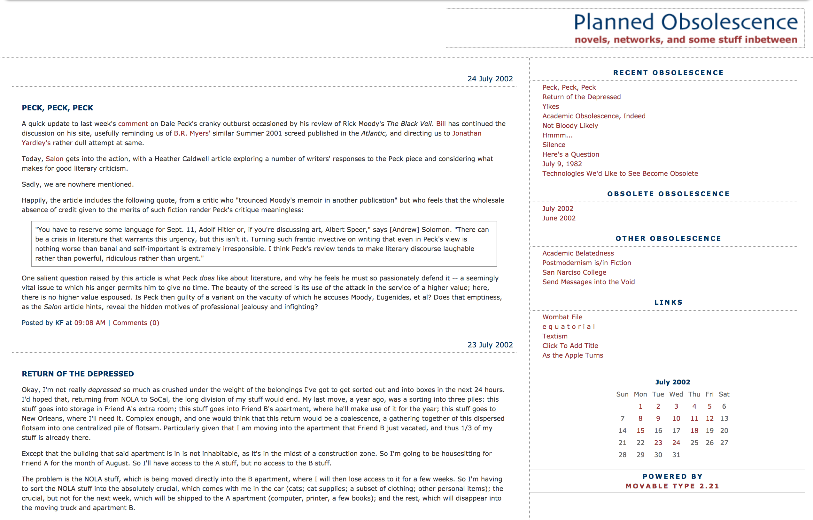
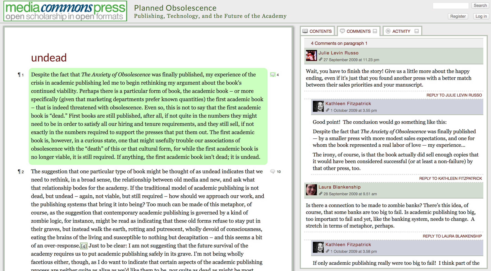
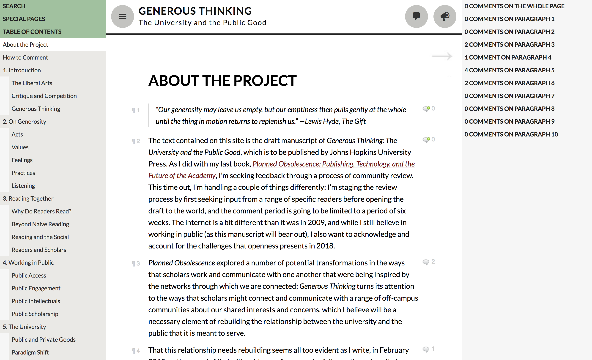
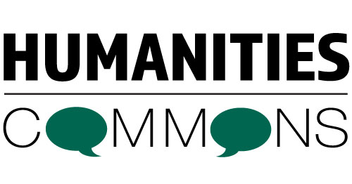

## Writing in Public
---
<smaller>Kathleen Fitzpatrick // @kfitz // kfitz@msu.edu</smaller> 
<small>http://kfitz.info/presentations/mla21.html</small>

Note: Thank you. I would like to begin with a collective acknowledgment that Michigan State University occupies the ancestral, traditional, and contemporary Lands of the Anishinaabeg – Three Fires Confederacy of Ojibwe, Odawa, and Potawatomi peoples. In particular, the University resides on Land ceded in the 1819 Treaty of Saginaw. I want to take a moment before I start here today to note that I wrote this talk before yesterday's events, and it's hard not to return to it today and feel the utter narcissism involved in focusing in on my own experiences with writing in public. My hope, though, is that by forging ahead and doing the work we'd originally planned for today, we might be able to open a conversation about the relationship between openness in scholarly communication and the work required to build a more just civil society for us all. So:

# limits

Note: Conversations about opening publishing to the public often get caught up in questions about the ontological or epistemological limits of what we consider scholarship: Do openly shared works, whether posted on personal websites or deposited in institutional or disciplinary repositories, "count" as publications? Can they be trusted to have the same integrity and authority as publications that have been through traditional editorial and peer review processes? How can we *know*?

# possibilities

Note: I want instead to turn to a set of questions about possibilities: What could scholarship become if we were to embrace the kinds of openness that websites and repositories offer? What kinds of work could that scholarship do -- for individual scholars, but also for the academy as a whole -- if such sharing became a default mode in which work circulates? 

# my story

Note: I'm going to begin the process of opening up these questions by unrolling a bit of my own story with respect to these practices. As I do, though, I want to note that I don't see my example as a model for new ways of working that can simply be applied to any scholar's situation; in fact, my own narrative is idiosyncratic enough that it might point the way toward an embrace of nimbleness, flexibility, and improvisation in exploring the possibilities that the always changing modes of working in public might offer.

# 2002

Note: So: I'm going to start the story in 2002, when I was an assistant professor in a tiny but highly privileged bubble on the eastern edge of the west coast. I'd spent the previous four years doing the thing I was supposed to do: revising my dissertation into a book manuscript and publishing a few journal articles along the way. I'd made contact with a few presses about the book manuscript during the revision process, and three of them had expressed a desire to see more when I was done. // And now, in 2002, I was done. I was beginning the process of getting the manuscript to a press, which would of course lead to a lot of waiting: waiting for the acquisitions editor's response, waiting for the peer reviews to come in, waiting for the editorial board's vote. It could be as long as two years before the book came out, I thought. (Incorrectly, as it turns out: it was over FOUR years before the thing was finally published, for a host of reasons I've written about elsewhere.) Anyhow, the main thing I felt in 2002 was *stifled*: I wanted so badly to be in communication with other scholars about this work, and it seemed entirely plausible that the thing might languish unread on my hard drive.

# "weblog"

Note: And so I found myself, on one of my procrastination-driven afternoons, googling -- did we google in 2002? -- googling old friends from grad school, to find out what they were up to now. And one of them, it turned out, had started this thing called a *weblog*, in which he posted more or less daily about the things he was reading, the questions that were cropping up around him, whatever happened to capture his attention. This friend was now working outside the academy, so there wasn't a scholarly project per se behind this blog, but there was a rich *intellectual* project there, a funny, erudite one that was actively drawing an audience into conversation with him. They left comments, they asked questions, they argued, they made jokes. They were reading and engaging with what he wrote, and they were writing in response. And I thought: holy moly, that's *it*.

<vsmall>(http://plannedobsolescence.net 2002)</vsmall>

Note: So I started a blog. I didn't originally have a sense of the thing as a scholarly project, though I did see it as an outgrowth of the book project, a place where all the stuff that didn't make it into the manuscript could go, as well as a place where the ideas from the manuscript could continue to develop. Mostly, the blog was for me an exercise in immediate gratification: I could ponder an idea and at least potentially get feedback on that idea right away. But getting that feedback required some work: even in those early days, a blog was not a *Field of Dreams* style if-you-build-it-they-will-come space; that work had to be brought to the attention of potential readers first. And, it turned out, the best way of doing that was to read and comment on the work being done by other bloggers, and especially other bloggers writing about similar kinds of issues, both in the comments on their blogs and in new posts on my own.

# discourse network

Note: On the scholarly level, what this post-and-comment engagement did was build a discourse network through which the circulation of ideas could lead to their advancement. 

# community

Note: But beyond that, on the human level, these connections produced a community, a group of writers and readers working together on their shared concerns. That community worked to build out the discourse network, developing a lot of the conventions that mark our systems of scholarly communication, including expectations of the relative stability of published texts (by marking revisions as they occur), of the use of citation (through links and hat-tips), and of peer review (though post-publication comment and response). But the community was more than just its publications and the rules for producing them; it was a network of support that enabled the development of its members and of the relationships among them. And it was an open network, one that defined a community of peers not through some set of pre-existing roles or credentials but instead through participation in and contribution to the community's processes.

# growth

Note: That said, all of this writing in public that began with the baldest desire to get someone, somewhere, to read and engage with something I wrote, wound up producing for me not just a group of deep and abiding friendships but also the first forms of conventional scholarly recognition of my career. My first citations, my first lecture invitations, my first solicited pieces of writing, all stemmed from work I was doing on the blog. Doing that work in public -- breaking away from the isolation-driven anxieties and doubts that had been so much a part of the academic thinking I'd been trained in, and focusing on the idea that scholarship was always intended to be part of an ongoing conversation within a community of practice -- helped my writing grow, helped my confidence grow, and helped my sense of scholarly community grow.

<vsmall>(http://mcpress.media-commons.org/plannedobsolescence/introduction/undead/)</vsmall>

Note: So in 2009, when I asked NYU Press to allow me to conduct an open review process with the manuscript of my second book, *Planned Obsolescence*, it was with both community and scholarly goals in mind. Posting the manuscript online for comment made sense to me, both as a means of getting feedback from the community of practice that I'd worked so closely with as I'd gathered the ideas and drafted the project, and as a means of creating a kind of accountability to its audience. 40ish readers left more than 350 comments on the manuscript, discussing its strengths and its flaws both with me and with one another, and creating a rich, broad sense of the revision path ahead of me.

<vsmall>(https://generousthinking.hcommons.org)</vsmall>

Note: I repeated that process in 2018 with the open review of *Generous Thinking*, and I've done something similar over the last few months with the serial release of a very early draft of the followup project, *Leading Generously*. These have all been enormously productive experiences overall, but they haven't been all rainbows and unicorns. 

# peer review

Note: One of the concerns commonly raised about open peer review processes is that the absence of anonymity and the visibility of the process might cause some reviewers to pull their punches, going easier on poor work than they should. I want to approach this concern, first, by noting that peer reviewers *should not be punching anyone*. The purpose of peer review is not just to determine whether a text is worthy of being published but in fact to help the author figure out what needs to be done in order to make it as strong as it can be -- and that process requires a kind of collegiality, a kind of generosity, that benefits from a direct, open, scholar-to-scholar connection between author and reviewer. And we all know how to do that work of presenting critical responses in a supportive way: we do it with our students every day.

# constructive

Note: And the colleagues who've contributed feedback to my projects online have done just that with me: they've found overwhelmingly constructive ways to push me forward, to get me to rethink, to encourage me to revise. Some of their comments have been stickier than others, and every once in a while one points out a flaw in my thinking that I might wish were a little bit less publicly visible. But one of my goals in doing so much of my writing in public has been precisely to accept my own vulnerability and put it aside in favor of the possibilities that making my sometimes messy early work visible presents.

# showing our work

Note: Those possibilities include allowing others to see inside what are otherwise black-boxed processes. Making the processes of review more transparent and dialogic benefits not only the author, who like me will have the opportunity to understand more about the contexts of the critiques brought to bear on the work, but also future scholars, who might be able to trace the lineage of the ideas contained in final publications, seeing how they arise out of the conversations between author and reviewers. Beyond that, however, making the processes of writing and revision more transparent presents enormous potential benefits for our students, who otherwise only ever get to see final products, and may well be left with the impression that our journal articles spring from our heads fully-formed. *Showing our work* will enable us to demonstrate to our students what we mean when we talk about revision, what it means to really revisit an argument in response to feedback on it.

<vsmall>GDJ (https://pixabay.com/vectors/social-media-connections-networking-3846597)</vsmall>

Note: And then there are the benefits for ourselves: writing in public can demonstrate to editors, for instance, our ability to build and connect with an audience. It can draw in potential collaborators working on similar or related questions. And it can help us develop a generous scholarly community -- indeed, a generous scholarly commons, where we all work together for the benefit of the whole.

 
<smaller>hcommons.org</smaller>

Note: And so, Humanities Commons. I worked with my colleagues at the MLA to launch the network, first as MLA Commons and then opening up our colleagues across the humanities in December 2016. Four years on, over 25,000 scholars and practitioners worldwide have joined us, building out their scholarly profiles, sharing their work via the repository, discussing that work in groups, and, of course, blogging. This is networked scholarly communication at its finest -- less focused on products than on processes, understanding publishing as one aspect of an ongoing, wide-ranging conversation. It's a scholar-governed, academy-owned platform that is committed to transparency, to equity, to openness, and to remaining not-for-profit. If you're not already working in public there, I hope you'll come join our community, and see for yourselves the ways that opening your conversations to broader publics might help the work we do reach beyond the academy and create the possibility of a better world.

# thank you
---
<smaller>Kathleen Fitzpatrick // @kfitz // kfitz@msu.edu</smaller> 
<small>http://presentations.kfitz.info/mla21.html</small>
