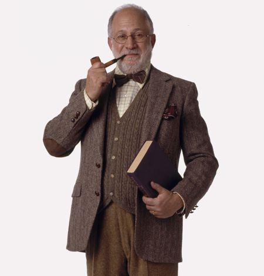
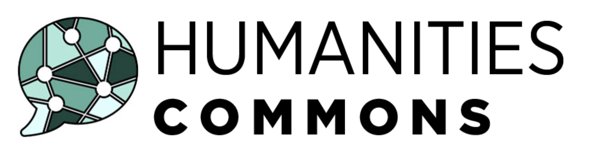
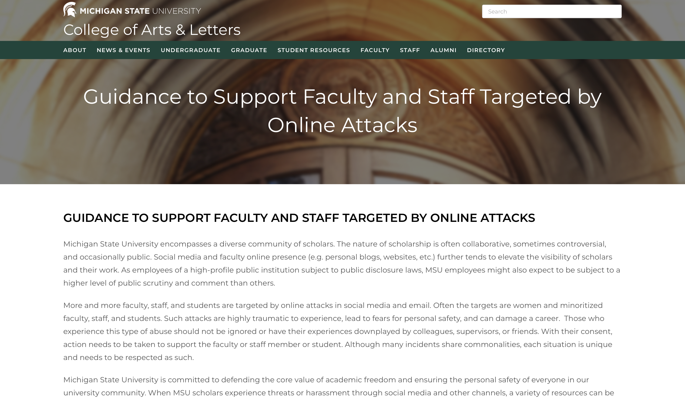
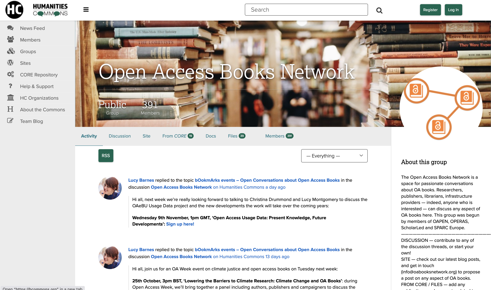

## The Humanities  the Commons
---
### and What We Have to Share
---
<smaller>Kathleen Fitzpatrick // @kfitz@hcommons.social</smaller> 

Note: Thank you so much for that introduction! I'm really grateful for the opportunity to talk with you about some of the work that we're doing at Humanities Commons, about the motivations for and implications of that work, and about what it all might mean for the history and future of the humanities.

Note: A bit of background as I begin: Humanities Commons was launched in late 2016 by the Modern Language Association, with support from the Mellon Foundation and the National Endowment for the Humanities, as a platform for interdisciplinary communication among scholars and practitioners across humanities fields. It extended the model established in 2013 by MLA Commons by adding proprietary instances for a small group of scholarly societies who served as pilot partners, and it connected those instances to a central hub that anyone could join, free of charge, all linked by a shared identity management system that allows users access to the parts of the network where they have active memberships.

# NSF FAIROS RCN

Note: A couple of months ago, the Commons team was awarded a significant grant from the National Science Foundation in order to further extend that model. We're part of the inaugural cohort of the NSF's FAIROS RCN grantees -- which is how I discovered that the NSF loooooooves acronyms even more than my institution does. This one is composed of three key parts: (CLICK) first, FAIR, which stands for "findable, accessible, interoperable, and reusable," a set of principles guiding data sharing; (CLICK) second, OS, or open science; (CLICK) and third, RCN, or research coordination networks. So the goal for this grant program is to foster networks that coordinate open research according to FAIR principles, all of which aligns quite well with the structures and goals of the Commons. What is especially unusual about this grant is that our team, which has "Humanities" right there in the name, was approached by a group of STEM education researchers who wanted to use our platform in order to build their RCN.

Note: There are at least a couple of things that make this surprising: first, that the usual narrative about innovation in scholarly communication is that it begins in the sciences and only gradually makes its way into the stodgy print-oriented humanities, where our elbow-patched blazers and dusty archives encourage us to resist everything technical. And second, that this particular group of STEM folks defied their own usual narrative about the sciences' technological superiority and empirical rationality in recognizing that we've figured out something that they can learn from -- that the values-based approach to building participatory communities we've taken with the Commons is what they need to make their work successful.

Note: The usual narratives have played themselves out time and again in scholarly communication. You might see the history of the open access movement, for instance, which began with the recognition among scientists of the damage that major corporate publishers and their exorbitant journal subscription rates were doing to the dissemination of knowledge. In an effort to create greater equity in access to scientific developments -- and, not at all incidentally, to increase the global impact of work being done in the sciences -- researchers began pressing for alternatives to traditional journal publishing models, such that folks without access to well-funded research libraries would still be able to learn from new publications.

The open-access movement has been driven since the beginning by an astonishingly utopian goal. As the signatories to the Budapest Open Access Initiative claimed in 2002, "Removing access barriers to (scientific and scholarly) literature will accelerate research, enrich education, share the learning of the rich with the poor and the poor with the rich, make this literature as useful as it can be, and lay the foundation for uniting humanity in a common intellectual conversation and quest for knowledge." The idealism that drove this initiative is deeply moving, and it's had a significant effect in changing the ways that scholarly communication operates. Especially in the sciences.

That it's had less impact, and far slower impact, in humanities fields is often read as a sign of our recalcitrance, our backwardness, our refusal to engage with new systems, our desire to keep our conversations exclusive, our grasping after prestige, our general irrelevance to public discourse. 

Note: While there may well be some elements of truth in some of those assessments, what they leave out is a rather stark economic reality: that by and large humanities scholars and humanities publications simply could not afford to take up the call to open access, at least not as it began to manifest itself in actual publications that sought to make work openly available. A huge percentage of those publications managed the transition to open access by shifting the costs from the consumer side, where they had long relied on library subscription fees, to the producer side, where they instead asked authors for article processing charges. This was arguably all well and good in the sciences, where researchers had long written publishing costs into their grants, and where nearly all research is not only grant-funded but funded by grants sizable enough to accommodate such costs. As we know all too well, the vast majority of research done in the humanities is done without grant-based support, and where grants do exist they're usually too tiny to accommodate publishing charges. And while some institutions are able to provide some support for APCs, that funding is neither universally available nor sufficient to accommodate all the researchers that might benefit from it.

Note: So the situation in the humanities, looked at just a little harder, reveals itself not to be exclusive to our fields at all. In fact, the rise of APC-driven business models in scholarly publishing has created new kinds of barriers, preventing many researchers at underfunded institutions, in underfunded areas of research, and in underfunded areas of the world, from contributing to the conversations that open access can foster. In other words, in shifting the costs of publishing from the consumer side to the producer side, the dominant model for open-access publishing didn't eliminate inequities but instead just shifted them, too, turning barriers to access to the products of scholarly research into barriers to participation. (Even more dismayingly, the corporate behemoths that the open access movement rose up against have only seen their profit margins increase during this time, as they've figured out that they can create hybrid journals for which they can *both* charge libraries subscription fees for the journal as a whole *and* charge authors with the ability to pay APCs to make their work openly available.) 

Note: Now, I don't want to suggest that we in the humanities, thanks to our highly developed powers of critical foresight, knew that this situation was coming, and thus that any resistance to open access publishing we might have put up was born out of a principled demand for equity and inclusion. But I will venture that the minimal availability of funding to support this shift to APCs, and thus the less-than-lucrative prospects for publishers who might have hoped to enact the same business model flip in our fields, encouraged those of us who want to promote open access scholarly communication in the humanities to begin thinking about workarounds -- and at least some of those workarounds are potentially more subversive to the business of scholarly communication altogether.

Note: This is where Humanities Commons came from: a desire to promote more open, more public, more universally accessible scholarly communication for everyone. I'll come back in a bit to talk more about the Commons and what it makes possible -- and why you should consider making active use of it -- but first I want to dig a bit further into what else we might learn from the economic situation of the humanities, both within the federal and foundation funding landscapes and within our institutions. After all, the dearth of financial resources available in the humanities is part and parcel of a set of problems we face, all of which might be collectively lumped in under the rubric of the ongoing "crisis in the humanities."

# crisis

Note: This sense of crisis is in many ways our constant companion, and has been for long enough that Paul Reitter and Chad Wellmon have traced the long history of its rhetoric back to the establishment of the German university system as we know it. In their book, *Permanent Crisis*, they argue in fact that the existence of the humanities is in the modern era dependent upon that sense of crisis:

> <smaller>“For nearly a century and a half, claims about a 'crisis of the humanities' have constituted a genre with remarkably consistent features: anxiety about modern agents of decay, the loss of authority and legitimacy, and invocations of 'the human' in the face of forces that dehumanize and alienate humans from themselves, one another, and the world. These claims typically lead to the same, rather paradoxical conclusion: modernity destroys the humanities, but only the humanities can redeem modernity, a circular story of salvation in which overcoming the crisis of modernity is the mission of the humanities. Without a sense of crisis, the humanities would have neither purpose nor direction.” (Reitter and Wellmon 132)</smaller>

Note: (READ SLIDE.) And perhaps it is true that we rely on our sense of crisis, our sense of marginalization within our institutions and of swimming against the larger cultural tides, to give us purpose. Much of the work that we do, after all, is structured by critique, and without our distance from the cultural and institutional center we can neither obtain the perspective nor sustain the motivation necessary to studying the ways that our world structures and is structured by its representations.

On the other hand. There are some particularities to the situation of the humanities today -- the threats that our colleges, our departments, our fields, and our researchers and instructors face -- that are not simply rhetorical, and it's worth paying some careful attention to the specifics of these crises, which include:

- the labor crisis 
- the economic crisis 
- the political crisis

Note: - (CLICK) **The labor crisis**. Over the last couple of decades, we've watched as more and more good positions -- with job security, adequate salaries, full benefits, and above all academic freedom -- have been sucked into the gig economy. This ongoing casualization of labor is happening across all fields on our campuses but is especially acute in humanities fields, and particularly in those fields, like writing studies, that are meant to prepare students for their academic careers. The effects of this labor crisis are manifold: as fewer and fewer faculty in humanities departments have the benefits of tenure, and thus the voice in campus governance required to have a real impact on the institution's directions, our fields continue to weaken, allowing our departments to appear decreasingly vibrant, drawing in diminishing numbers of students, and thus making the case for our apparent obsolescence.
- (CLICK) This of course works hand-in-hand with **the economic crisis** that institutions in the United States are mired in, and that has begun spreading to other national systems as well. One key turning point in this crisis was the decision made by Ronald Reagan as governor of California to institute fees, both as a means of minimizing public responsibility for higher education and as a means of controlling the student population by keeping "undesirable" elements out. As public funding in the United States has come to provide a smaller and smaller portion of university budgets, the costs of higher education have shifted radically from the state to individual students and their families. As those costs escalate, the pressure on students to think of higher education as a market exchange grows. If they're going to sink tens, or even hundreds, of thousands of dollars into the purchase of a four-year degree, it's not the least bit surprising that students would also face increasing pressure (whether internal, or from their families or communities or the media) to select a degree program that seems to promise an obvious career outcome. And thus majors that are named after jobs or industries grow, and those that aren't -- like the vast majority of our programs -- shrink, providing further evidence that new investments in humanities departments are a luxury that our institutions, like our students, cannot afford.
- (CLICK) And in the midst of all that, there is of course **the political crisis**, which has been brewing for decades but has taken a particularly acute turn in the last few years. The attacks that we've seen on critical race theory, the moves to ban books from libraries, the attempts to eradicate tenure in many states, the growing interference of trustees in the curriculum -- all provide evidence of a growing backlash against the critical functions that the humanities bring to bear.

In all of this, Reitter and Wellmon's sense that "modernity destroys the humanities, but only the humanities can redeem modernity" may well be "a circular story" of the "salvation" project that rests at the heart of the humanities' mission, but neither the threat nor the work we have ahead are rhetorical. They are instead very material, and they demand material responses. So what I'm arguing today is in part that we have at hand some of the means of responding to these crises, and that we can demonstrate through the ways that we do our work a better path for the future of the university at large. I do want to be cautious, of course, about one particular pitfall that Reitter and Wellmon point out,

> “the crisis discourse in the humanities has promoted overpromising -- the framing of the modern humanities as the redemptive solution to a larger crisis routinely referred to as modernity” (285)

Note: that “the crisis discourse in the humanities has promoted overpromising—the framing of the modern humanities as the redemptive solution to a larger crisis routinely referred to as modernity” (285). I do not mean to suggest that research in our fields can *by itself* be anything like redemptive in the face of climate change, of rising fascism, of deepening racial and religious hatred, or growing economic inequity. But I do want to say that our fields have provided us with some tools that can help us make change, if we're willing to use them.

# community-engaged research

Note: Included in this toolkit are the practices of public scholarship, which include several different modes of connection between the work that we do as scholars in the humanities and the publics that we might want to reach. We might, for instance, think about **community-engaged research**, which brings scholars into active collaboration with community groups in seeking solutions to shared problems and improvements in public life. In this category I might think about the work that my colleague Kristin Arola in MSU's department of Writing, Rhetoric, and American Cultures has done with colleagues at Michigan Technological University and with two Anishinaabe tribes in the Upper Peninsula, investigating the potential for developing renewable energy sovereignty for these communities. Or the work that my colleague Julian Chambliss has done in partnering with Black communities in central Florida to document and preserve their histories. Community-engaged research projects like these present the opportunity for building close collaborative relationships between a broad range of publics and university-based scholars, opening the door to deeper understandings among scholars of public concerns, as well as a deeper sense among members of the public about what the university can do in the world.

# public intellectuals

Note: In addition to community-engaged research, we might also think about the work of **public intellectuals**, who bring the ideas and the methods and the critical sensibilities of scholarly research to bear in writing for broader audiences. The public intellectual as a concept tends, on the one hand, to be stereotyped with the New-York-intelligentsia vibe (just as erudite and out of touch with middle America as scholars are, if with far better book sales figures) or, on the other hand, to be associated with the flighty superficiality of bloggers (compelled to publish ill-thought-through hot takes on every passing aspect of current affairs, regardless of how unimportant). But there are numerous well-trained, careful researchers who have begun publishing in online venues like *Public Books* and in book series like *Object Lessons*, or who are creating podcasts and other popular media forms. These modes of public discourse enable the arguments and ideas that might have an impact in contemporary culture to do that work in places and forms that facilitate engagement with broader publics.

# open access

Note: And then of course there's **open access** -- simply ensuring that the work that we do, in whatever form we currently do it, can be found and read by any potentially interested member of the public. I've already talked a bit about the financial reasons that open access publishing as it is most commonly practiced hasn't taken root in the humanities; few of us have the wherewithal to pay the APCs required to publish our journal articles in gold OA venues, much less our books. But of course there are other forms of open access beyond the pay-to-play platforms; there are a growing number of "platinum" or "diamond" OA venues that do not require author-side fees. And beyond that, there are many "green" routes to open access, including institutional and disciplinary repositories (including Humanities Commons, which I'll return to shortly).

But it's not just the economic aspect that stops many humanities scholars from opening up our work. Many of us shrug off the power of making our work publicly available, assuming that we're already reaching the audiences we want to reach through our journal articles and our university press books, and that we don't need our work to circulate any further. This is one of the modes of thinking that gets misinterpreted as a kind of elitism at the gnarled heart of the humanities -- that we want to keep our conversations exclusive and out of the reach of the hoi polloi. More often than not, though, we turn away from making our work more publicly available for other reasons:

1. because of the mistaken assumption that anyone in the field will have access to a research library  
2. because of the equally mistaken assumption that no one who isn't in the field could possibly want to read our work  
3. because of the fear that making our work more public will open it up to bad actors who only want to use it as ammunition in their attacks on us, our fields, and our institutions

Note: (READ SLIDE.) The fact is that there are many, many people in our fields -- faculty at regional state institutions and community colleges, program officers at many granting agencies, and a wide range of our former students who move out of the academy into what we might think of as the humanities workforce -- who do not have access to research libraries, and thus have great difficulty obtaining many of the publications that we produce. And even beyond those scholars, there are way more people than you think with the potential for interest in the work that we do -- but, of course, no one can be interested in it if they don't know it exists.

That third concern, however, is a real one. We've seen way too many instances of late of scholars being targeted by political agitators -- or even politicians -- because of their public-facing work. And I want to acknowledge that greater visibility is not without risks. But right now, we desperately need *more* scholars willing to take those risks, to face down the threats posed to academic freedom and to critical inquiry and say publicly the things that need to be said. That kind of risk-taking requires careful preparation, however, both at the personal and at the institutional level. After several of my MSU colleagues, notably those appointed in African American and African Studies, faced public harassment and even violent threats, 

Note: my dean's office developed a guidance document for supporting faculty and staff targeted by online attacks, including specific actions that administrators can take to support their colleagues. There are also steps that individual scholars can take, including ensuring that administrators know when publications that might generate attacks are forthcoming, that colleagues are ready to help monitor your social media accounts, and so forth. I point all of this out not to make you worry more about the potential risks involved in making your work public, but rather to point out that those risks can be managed, and to indicate the importance of doing so, because the work that all of us do, done publicly, has the potential to help us all fight back against one of the key crises that face the humanities right now: the assumption that our work is irrelevant in the contemporary world.

# credit

Note: But demonstrating our relevance going to require us to be willing to take risks, and to be more generous in sharing our ideas with the public rather than releasing them only in the forms for which we get credit. That last is significant; it's worth considering the recent outcry against certain well-placed political journalists who have withheld crucial information from the public about the activities of the previous administration in order keep those tidbits for publication in their books. These journalists, apparently more concerned about publishing bestsellers, have failed in their crucial duty of informing the public and making potential crimes known. Though the stakes of our work may be not be quite that extreme, we similarly fail in this duty all the time, by reserving our ideas for the kinds of publications that most readily slot into the annual review form. For us to do more public-facing work, however, will require us to change that form. That is, it will require us to think not just about how we need to change our approaches and attitudes, but also about how our institutions and their assumptions need to change in order to support our work. 

We not only need to transform the ways we value and reward public work, but we also need to create the policies that can help us account for and support public work, and we need to adopt the processes and platforms that can bring public work to life.

Note: (READ SLIDE) And all of this will require us to get active on campus, and to begin developing what I think of as a new model for academic leadership via collective action. For starters, making it possible for all of us to do the publicly-engaged work that can help shape a better world will require us to make significant changes to the reward structures that govern so much of our lives on campus. We have to press for real change in our processes for hiring, retention, tenure, promotion, and more, not just in order to support our own work done in public but to support that of our colleagues, allowing all of us to produce the engaged research that might help us have the greatest potential impact on the culture within which we work.

These personnel evaluation processes often feel out of our control, handed down from above and subject to the capriciousness of deans and provosts, but the faculty has far more influence over those processes than we think. The documents that define our departmental policies and processes can, with the consent of the faculty, be revised. My own department, a few years back, undertook a top-to-bottom revision of our bylaws, which included far-reaching changes to our definitions of things like "publication" and "peer review" in ways that established our support for the many different forms in which our colleagues today are working, as well as our recognition that our future colleagues will be working in ways that we cannot fully imagine. Our chair started this revision process by dividing the entire department into working groups tasked with taking on particular sections of the bylaws, and then those working groups brought their proposed revisions to the department as a whole for discussion and approval. As a result, the revisions involved all of us in a process in which we proposed and debated and ultimately assented to a set of collective values that have the potential to open up the department's work in exciting ways.

# academic leadership

Note: This is a model I would like to see more of us espouse for the future of **academic leadership**. Those of you who have been paying attention for the last couple of months to the higher education press coverage of things going on at my MSU might already have a sense of why I am somewhat less than sanguine about the transformative potential embodied in the folks we commonly describe as our leaders -- our upper administrations, our boards, and so on. In fact, I think referring to these folks as "leadership" is a profound misnomer. They are, more properly, "management," charged with keeping the institution running in accordance with the status quo. Leadership, by contrast, is a matter of creating change, and not only can that work be done anywhere within the org chart, it's in fact most effective when it emerges through a grass-roots process of coalition building rather than via top-down mandate. 

**"over-managed and under-led"**

Note: It's not for nothing that John Kotter has argued that most organizations today are **"over-managed and under-led,"** and academia is no exception. In fact, we have arguably been organized and disciplined into an inability to cope with -- and worse, an inability to create -- change.

Developing this facility for transformative change within our institutions and our profession at large has been at the heart of my last several projects. In my most recent book, ***Generous Thinking***, I tried to prepare the ground  for better connections among scholars on campus, as well as better connections with our broader communities, in order to create the kinds of caring mutual engagements that change requires. In my current project, tentatively entitled ***Leading Generously***, I'm working to think with folks on campus who want to change things about the values and qualities that leadership based in collective action requires. 

Note: And through **Humanities Commons**, my colleagues and I have been working to create a space in which new kinds of communities can form, and new kinds of collaborations can take shape. 

Note: Humanities Commons is built by and for scholars. It's a **values-enacted** project, meaning that, among other things, (1) we have put in place a participatory governance structure that enables users to have a voice in the project's future, (2) we have developed network policies that emphasize inclusion and openness, and (3) we are committed to transparency in our finances, and most importantly to remaining not-for-profit in perpetuity. Account creation is open to any interested user regardless of institutional affiliation, professional status, or organizational membership, and accounts are and will remain free of charge. More than 30,000 users across the humanities and around the world have created accounts and are using them to build professional profiles, to participate in group discussions, to develop and publish a wide range of web projects, and to deposit and share their work in our open-access repository.

Note: The Commons is designed, in other words, to facilitate **community-building**. Its emphasis on member-to-member connections and communication is a significant component of why our STEM education colleagues came to us, rather than selecting another platform on which they could build their research coordination network -- because while there are a ton of well-funded platforms that can host and preserve the data and publications that scientists produce, many of them are operated without academic values in mind, and none of them focus on the *people* doing the work, or on the ways that discussion and collaboration amongst those people might lead to transformative change.

# what the humanities have to share

Note: And this, more than anything, is what I think **the humanities have to share**. We have a wealth of research and inquiry that we should make more openly available, of course. We have field-based knowledge and ways of reading, writing, and thinking that contemporary culture light learn from, absolutely. But we also have access to other ways of working, ways of understanding and connecting with one another that our colleagues in other fields, our institutions, and the world beyond could benefit from. We're not all community organizers -- far from it. But the work we do can provide insight into the ways that communities come into being, the ways they  communicate, the ways they can connect and grow. And that, at this hour of the world, is something we desperately need.

**hcommons.org**

Note: So I'll conclude with an invitation to come join us at **hcommons.org**. Create an account, build a profile, join discussion groups or create new ones. Find new work in the repository, and deposit work of your own. Demonstrate what the humanities can do when we have the space and the support and the community we need.

## thank you
---
<smaller>Kathleen Fitzpatrick // @kfitz@hcommons.social</smaller>

Note: Many thanks.
