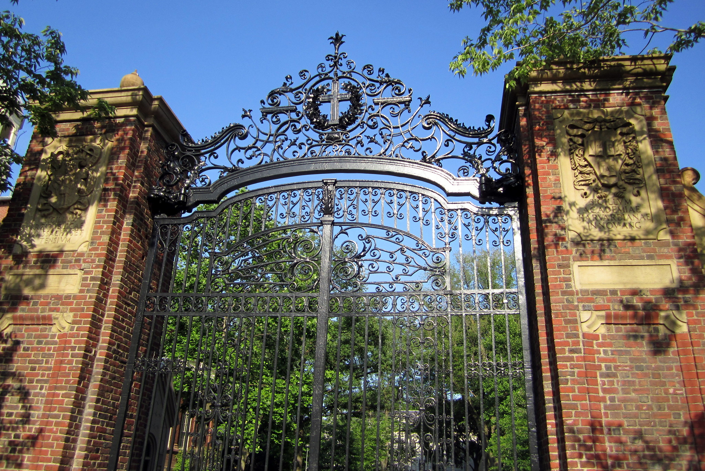
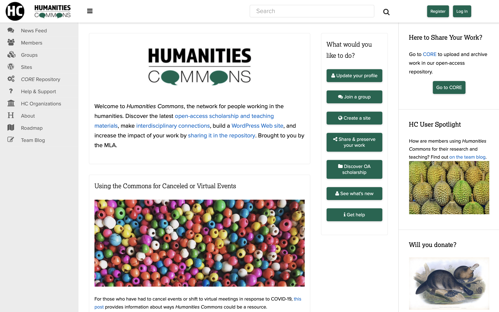
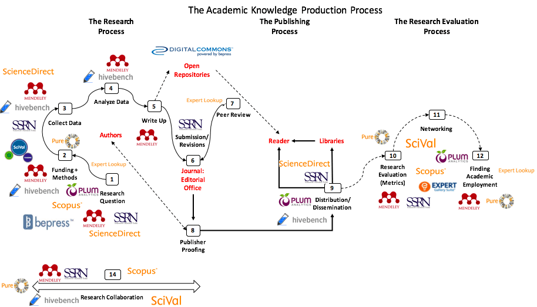
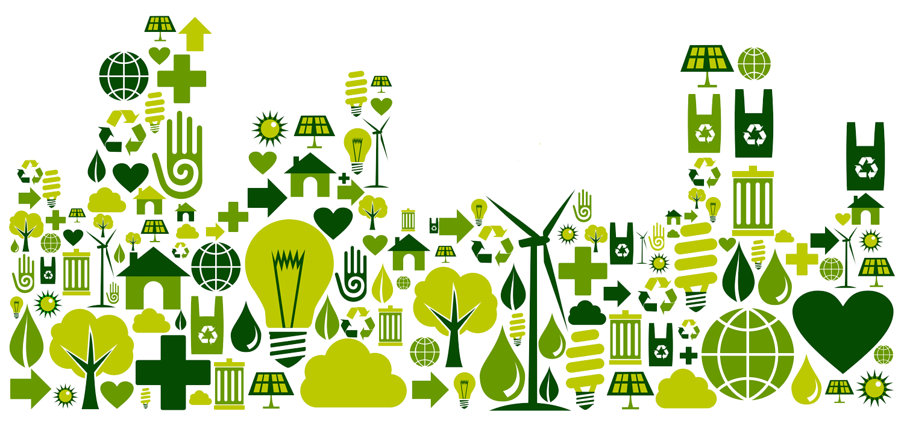
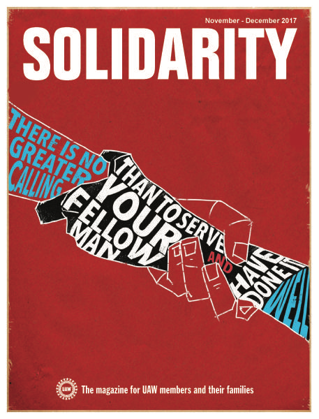
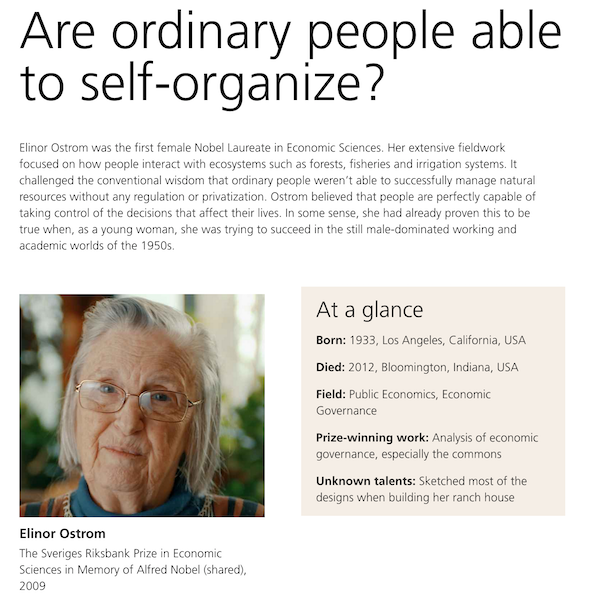
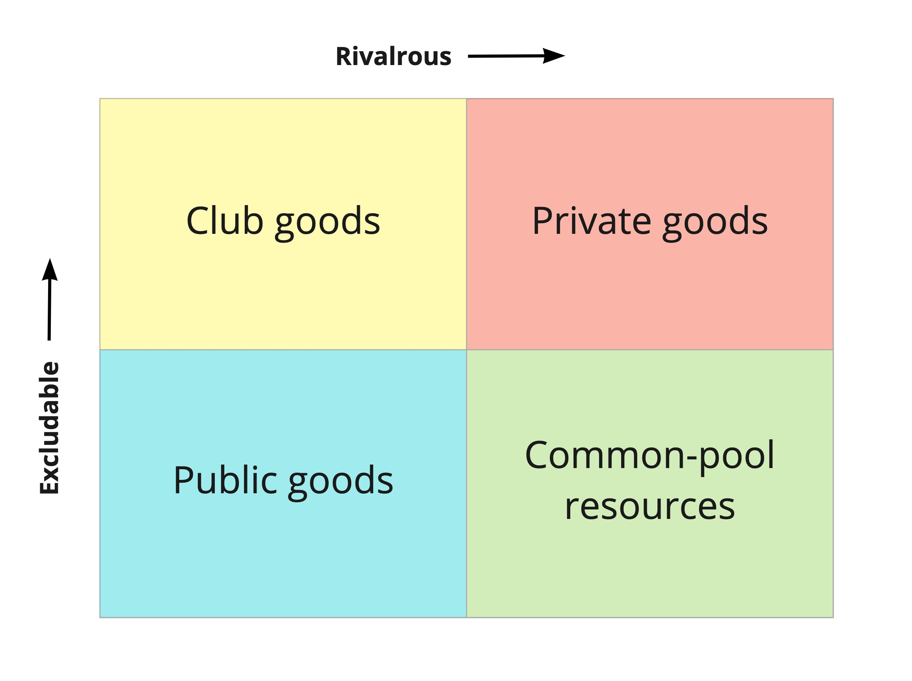
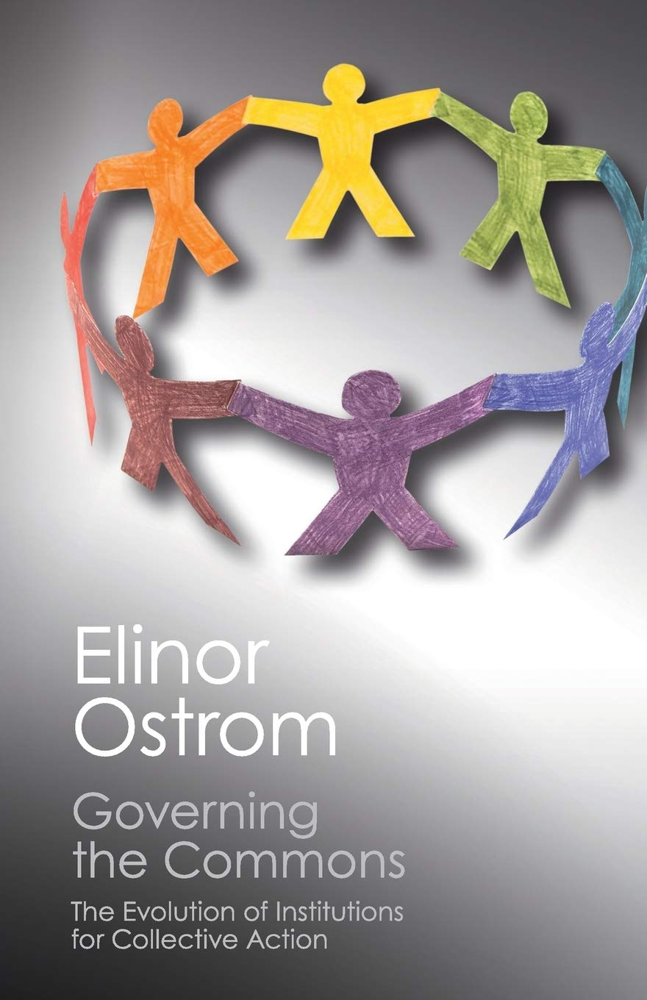
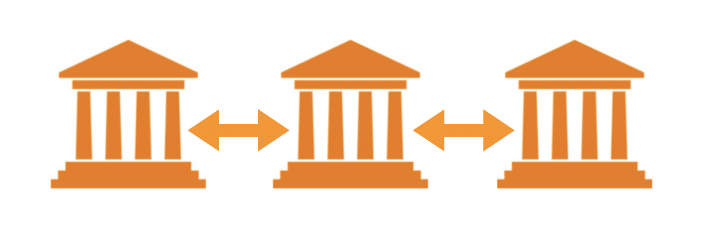
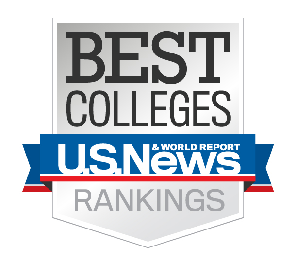

# Better
---
### Thoughts Toward a More Generous Future
---
 
<smaller>Kathleen Fitzpatrick // @kfitz // kfitz@msu.edu</smaller> 
<small>http://presentations.kfitz.info/muse.html</small>

Note: Thanks so much for that introduction, and thanks to Wendy and her team for inviting me to participate in this event. When we first began talking about this, before the pandemic, the plan was for an in-person gala celebration, but as with so many things over the last 14 months, we delayed and we adjusted, we made new uses of our networked tools, and we're here now with an event that's perhaps a bit shorter on champagne but that is able to draw many, many more people into conversation.

This is one of the things we've learned from the pandemic: that we can do a lot of things at a distance that we thought we had to travel for, and that we can include many more people in the process. There have been a lot of such lessons in all of our lives, some positive and some less so, but all of which I hope we can carry with us as we begin -- whenever we begin -- to emerge from our homes and return to campus. I want us to carry these things not least because returning to "normal," or seeking to create a "new normal," would be a costly mistake. We have an opportunity right now NOT to return to normal, and there are good reasons not to do so. But coming back better is going to require us to think pretty differently about the structures within which we work, and about how to change them to support the kind of world we want. (So that's my focus for today. A quick warning that there's a little bit of language coming up, in case you've got little ones around.)

So last year, just before everything began shutting down, sociologist Tressie McMillan Cottom posted a thread on Twitter in which she talked about the things she tells early career Black scholars who seek her advice on surviving in the academy. These two tweets in particular caught my attention:

Note: "This place was fucked up when you got here, it will be fucked up when you leave here. All you can control is how much you let it fuck you up in the process. That is a pretty impolitic stance but I stand by it. I don't think these institutions can support us or love us. And I honor the many many people who work to make them more humane. But you, alone, cannot do that. And you cannot do it, ever, by killing yourself."

<smaller>https://unsplash.com/@edrecestansberry</smaller>

Note: We have seen all kinds of evidence over the last year-plus of the horrifying accuracy of this perspective -- that no matter how much we might love and support them, our institutions do not, and cannot love us in return. These institutions have long been dedicated first and foremost to their own survival, and we've seen that priority play out in a wide range of decisions that privilege the security of the institution over the well-being of the people it comprises. I include in this category the choice to prioritize the flow of tuition dollars over the safety of students and staff by returning too hastily to in-person instruction; the choice to prioritize institutional reputation over individual safety and dignity by suppressing, ignoring, and dismissing complaints of sexual harassment and assault; the choice to respond to calls for racial justice with superficial statements and underfunded add-on measures; and the choice to deploy an increasingly militarized police presence in response to civil protest. All of these choices share the conviction that the institution and its ways of being are far more important than the people for whom it exists. And all of them have led me to ask what would be required for us to remake the university as an institution that is structurally capable of living up to its duty of care for all its members, rather than seeking in a moment of crisis to minimize its obligations and ensure that all of its relationships remain forever contingent?

## collective action

Note: One key thing that it would require is collective action. Because McMillan Cottom is right: you, alone, cannot change things. Together we might: but first we have to build that together, build the spaces and places of supporting that together, and find ways to ensure that our commitment to together supersedes and outlasts the pressures we experience as individuals.

Note: Much of the thinking that I'm going to unfold in what's ahead stems from the work I did in _Generous Thinking: A Radical Approach to Saving the University_. The book overall makes the argument that rebuilding a relationship of trust between the university and the public that it ostensibly serves requires regrounding our institutions and the work that we do in them in a mode of what I refer to as "generous thinking," focusing our practices and our modes of communicating around building community and solidarity both on campus and across the campus borders. And part of that work must include rethinking the nature of institutional responsibilities at a broad level, rethinking the relationship between institutional structures and institutional values, and rethinking the ways that we assess whether our institutions are meeting their missions.

## radical approach

Note: The 'radical approach' part of the book's subtitle grows out of my sense that the necessary changes in front of us are HUGE, that they can't be made incrementally, that they instead require  -- as Chris Newfield notes in the conclusion of _The Great Mistake_ -- a paradigm shift, because there is no simple path that can take us from where we are today to where we need to be. We cannot simply install new leaders atop the same hierarchies and expect anything to be different. Instead, we need to rethink the nature of leadership itself: leadership as a collective practice. This is a massive structural shift in how we understand our work together, but the failures of our current structures make the need clear. As McMillan Cottom noted in _Lower Ed_,

> This is not a problem for technological innovation or a market product. This requires politics.   
--Tressie McMillan Cottom

Note: "This is not a problem for technological innovation or a market product. This requires politics." The failures of our current structures, after all, begin with politics: the public colleges and universities that not too long ago served as highly accessible engines of social mobility, making a rich liberal-arts based education broadly available, today face not just a drastic reduction in basic affordability but an increasing threat to their very public orientation, as rampant privatization has not only shifted the burden of paying for higher education from the state to individual students and families, but has also turned the work of the institution from the creation of a shared social good -- a broadly educated public -- to the production of market-oriented individual benefit.

## the public good

Note: And the impact of that individualism across our culture has progressively and intentionally undermined our possibilities for collective action. In _Generous Thinking_, I asked the university as an institution to undergo a fairly significant transformation, by returning its attention to the publics, and the public good, that it is intended to serve. But that shift in perspective must be accompanied by a radical shift in understanding of where leadership lies in our organizations, how it should be fostered, and to what ends. And that's the key opportunity we have in front of us as we return to campus, if we're willing to commit ourselves to collective action: we can work together to ensure that the actual priorities and reward structures within our institutions are made to better align with our most important communal goals, precisely by acting with the collective at the forefront.

# competition

Note: The status quo, of course, is that those priorities and reward structures overwhelmingly foster the competition in which our culture is mired. As currently structured, the entire system of higher education is engineered -- from individual institutions to accrediting agencies, funding bodies, and the higher education press -- to promote a form of competitiveness that relies on prestige. What Newfield has described as the mandate to "compete all the time" forecloses a whole range of opportunities for our institutions, and for those who work within them, making it impossible for us to contemplate any other approach.

Note: _Generous Thinking_ explores this problem from a number of different angles, asking all of us who care about the future of higher education to reorient our thinking about the work of the university from the creation of individual benefit, grounded in all of the competition that structures every aspect of life in contemporary institutions of higher education, to instead open the gates and focus on the university's role in building and supporting an open knowledge commons.

Note: But my colleagues and I have also been trying to think through this problem in a more pragmatic, applied form through _Humanities Commons_, a non-profit, academy-owned and governed network serving scholars and organizations from across the humanities and around the world. It may seem a bit of a leap, to move from transforming our institutions such that they can live up to their missions of public service to the development of academy-owned infrastructure for scholarly communication, but these projects are tied together by a few of the key principles on which Humanities Commons operates: first, that higher education will benefit from all of us doing more of our work in public, where the publics that we need to support our institutions can not only see the significance of what we do but also participate in that work's development; and second, that institutions of higher education must do everything they can to resist and reverse the privatization that has overtaken them if they are to restore service to the public good not just to their mission statements but to the heart of their actual missions.

## community-supported infrastructure

Note: And part of resisting privatization involves turning away from some of the proprietary systems on which we have become dependent, and instead reserving our investments for systems and platforms and infrastructures whose missions align with our own, whose values mirror our own, and to whose governance we can contribute. This is true of a wide range of systems and platforms on which higher education relies, but perhaps nowhere has it become more pressing than in thinking about libraries and scholarly communication, both because these are the systems through which the work of the academy is made public and because these are the systems that have been most deeply privatized at the direct expense of the academy. We -- libraries, publishers, and scholars -- need collectively to turn our attention to developing the shared, publicly oriented systems that we can count on to support us as we develop new modes of open knowledge sharing, modes that might help higher education re-engage with the public good. 

<small>http://knowledgegap.org/index.php/sub-projects/rent-seeking-and-financialization-of-the-academic-publishing-industry/preliminary-findings/</small>

Note: We need to think about these platforms precisely because of the extent to which the entirety of the research workflow, from discovery, data gathering and analysis, through writing, submission, and publishing, to dissemination, evaluation, and reporting, is increasingly concentrated in a very limited number of corporate hands. (In case you don't recognize this graphic, it's a map of Elsevier's holdings circa 2017, as they acquired a range of tools that allow them to create a fully enclosed research ecosystem.)

Note: Countering this trend, and developing the collaborative, community-supported infrastructure that can support the paradigm shift we need will require some careful thinking about the work that will be necessary to make an open knowledge commons sustainable. And that includes not just financial and technical sustainability -- the forms of sustainability that we most often consider in this context.

Note: We need, rather, to focus in on social sustainability, on the relationships required to build and maintain our shared infrastructure. Thinking about those relationships under the rubric of social sustainability directs our attention not just to the determination of a group of people to support a particular project, but to the determination of those people to understand and support their groupness; not just to their commitment to the thing they're doing together, but to their commitment to the concept of "together" in the first place.

Note: Collective action in developing platforms, just as much as in transforming institutions, requires solidarity: a readiness to put the needs of the whole ahead of local demands, a determination to stand together in support of projects that may not necessarily seem to be our own top priority. This form of solidarity is a necessary prerequisite for the successful, sustainable development of non-profit, open-source, community-owned networks and platforms, the kinds of platforms than can transform the ways the academy works.

Note: Sustainability and solidarity connect in the work of Elinor Ostrom, whose research focused on common-pool resource management; she argued fiercely against the conventional wisdom that the so-called tragedy of the commons was an inevitability, insisting that community-based systems and structures for ensuring those resources' sustainability were possible, provided the right modes of self-organization and self-governance were in place. Relationships, in other words.

Note: A bit of background on her argument: Resources are generally understood by economists to fall into one of four categories, based on whether they are excludable -- whether individuals can be prevented from using them -- and whether they are rivalrous -- whether one individual's use precludes another's. Public goods are those resources that are both nonexcludable and nonrivalrous, meaning that no one can be prevented from using them and that no one's use reduces its availability for use by others. By contrast, private goods are both excludable and rivalrous; they can be restricted for use by paying customers, and their consumption by one customer can diminish its availability to another. These private goods are market-based products, typically produced and distributed for profit. Club goods, like cable service, are those that are excludable but nonrivalrous, those that are restricted to paying customers but not diminished by any one customer's use. And finally, goods that are nonexcludable but rivalrous -- that are capable of being "used up" but that are not fenced in -- are often described as common-pool resources: it is these goods to which the "tragedy of the commons" can apply.

## the free-rider problem

Note: At the root of the tragedy of the commons lies the "free-rider problem," which derives from the assumption that when individuals cannot be prevented from using commonly-held resources, but also cannot be compelled to contribute to their upkeep, some number of individuals will avail themselves of the resources without supporting them. As the number of free riders grows, the resources become prone to overuse and eventually become unsustainable. The only means imagined to help prevent the tragedy of the commons, before Ostrom, was external regulation, whether through privatization or nationalization of the resources involved.

 <!-- .element height="40%" width="40%" -->

Note: But as Ostrom argued in her 1990 book _Governing the Commons: The Evolution of Institutions for Collective Action_, the model of the tragedy of the commons -- like other such economic models as the prisoner's dilemma -- was based on a particular, and particularly pessimistic, view of human possibility, one that could not escape from its own metaphor.

> <smaller>"What makes these models so dangerous -- when they are used metaphorically as the foundation for policy -- is that the constraints that are assumed to be fixed for the purpose of analysis are taken on faith as being fixed in empirical settings, unless external authorities change them.... I would rather address the question of how to enhance the capabilities of those involved to change the constraining rules of the game to lead to outcomes other than remorseless tragedies."    -- Elinor Ostrom</smaller>

Note: READ SLIDE; Ostrom's work thus explored ways of organizing collective action that might ensure the sustainability of commonly-held resources. And while Ostrom focused on natural resources, such as fisheries, the problems she described, and the potential solutions she explored, have some important things in common with institutions of higher education, as well as with the non-profit, community-developed, academy-owned platforms on which they should be able to rely.

Note: There are lots of potential examples of platforms like Humanities Commons, all of which face a similar problem: there is often sufficient support available for building and implementing such systems, but there aren't funding programs designed to ensure that they can be maintained. And as a result, the tools and platforms often accrue technical debt that becomes increasingly difficult to manage, rapidly making the projects appear unsustainable and thus leaving them in real danger of obsolescence.

Note: Some argue that the best means of ensuring the sustainability of such projects is economic: eliminating the free-rider problem by enclosing the commons, requiring individuals or institutions to pay in order to access them. But this privatization is, in many cases, the very problem that community-developed projects were developed in order to solve. So as with Ostrom's fishing communities, it's crucial that we find the right modes of self-organization and self-governance that can keep the projects open and thriving.

Note: Deep collaborations among many institutions are required to keep such open-access, open-source platforms sustainable, but our institutions are not typically organized to support collaboration. Too often, the labor contributed to shared projects by institutional staff is invisible at best, and seen as a drain on local resources at worst. When things get difficult at home, those staff members are often asked to put the collaboration aside and focus instead on institutional priorities, undermining the potential for collective action that the collaboration can serve. If we are to sustain the kinds of cross-institutional collaborations that can free the entire higher-education sector from the forces of privatization, our institutions must come to understand themselves as part of an interdependent community of institutions, and they need to act locally in solidarity with that community. And this is why I argue that sustainability in open-source development has solidarity as a prerequisite, a recognition that the interests of the group require commitment from its members to that group, at times over and above their own individual interests. What I'm interested in thinking about is how we foster that commitment: how, in fact, we understand that commitment itself as a crucial form of social sustainability.

Note: After all, getting institutions to recognize and act upon their interdependence, to stop competing with one another and start recognizing that they have more to gain from collaboration than they stand to lose in the rankings is no easy task. The privatization that has gradually overtaken them since the Reagan era has resulted in a fundamentally market-oriented, competition-based approach to everything the institution does. Making the argument that this approach must be set aside is no small task.

## culture change

Note: It requires a serious culture change, and one that isn't going to come easily. Over the course of the last several years, I've had the opportunity to speak on a number of college and university campuses where faculty, staff, students, and administrators have been thinking about how to create and support a greater sense of connection between their campus communities and their public-facing mission. The folks who invited me -- ranging from the officers of campus AAUP chapters to university presidents and their advisors -- felt a connection with the arguments I made in *Generous Thinking* not least because they recognized that their institutions require not just better strategic plans but something deeper. The culture change that they need, that we all need, demands among other things a serious rethinking of how we work, why we work the ways we do, how we assess and reward that work, and how we recognize as work things that tend to get dismissed as service but that play a crucial role in building and sustaining collaborative communities. *Generous Thinking*, however, focused pretty tightly on the what and the why of the changes that our university cultures need to make, and spent a whole lot less time on how.

# better

Note: For instance: it's clear that making a better, more sustainable institution requires us to move away from individualistic ideas of meritorious production -- in fact to step off the Fordist production line that forever asks us to do *more* -- and instead to think in a humane fashion about ways that we can do *better*. Better often in fact requires slowing down, talking with our colleagues and our communities, and most importantly, listening to what others have to say. Better requires engagement, connection, sharing, in ways that more nearly always encourages us to rush past. Turning from more to better can help us access the pleasures -- indeed, the joys -- of our work that life on the production line has required us to push aside. But making that change goes against some of the ingrained ways of working that have come to seem natural to us within the university setting, and it's super unclear how we might even begin.

## generosity in hard times

Note: So I was already thinking that I wanted to follow up *Generous Thinking* with something that would dig a bit further into the how of transformation. And then after one of the talks I gave, an attendee asked me a question that made the stakes of thinking about how painfully clear. Her question has been stuck in my head for the last year: generosity is all well and good, she said, and something that's relatively easy to embrace when resources are plentiful, but how do we practice generosity in hard times? Can we afford to think generously when we're facing significant budget cuts, for instance, or is it inevitable that we fall back into analytics-driven competition with every unit -- much less every worker -- out to protect their own resources and their own privileges? 

I don't remember exactly how I answered then. I suspect that it was some combination of saying "you're completely right; that's the real question" and pointing out that the difficulties involved in being generous in hard times are precisely why we need to practice generosity in a determined way in good times. And I may have said some things about the importance of transparency in priority-setting and decision-making, and of involving the collective in that process. But I do know that as I stood there saying whatever I said, I was thinking "wow, this is hard, I don't know." I don't know how we find the wherewithal to remain generous when times are bad, except by having practiced generosity enough to have developed some individual and institutional muscle memory, and by recommitting ourselves to our deepest values again and again. And I especially don't know how we remain generous at a moment when our institutions are approaching us -- we who work for them, as well as we who rely on them -- invoking the notion of a shared sacrifice required to keep the university running. I don't know because I do want the university to survive, and I want to sustain the community that it enables, but I also know that the sacrifices that are called for are never genuinely equitably distributed.

## sacrifice

Note: And I am also certain that however much I may want to keep the university running, the university is not thinking the same about me. Our institutions do not love us back. However much we sacrifice for them, as currently constituted they will never sacrifice for us. This returns me to Tressie McMillan Cottom's point: you, alone, cannot make the institution more humane, and especially not by killing yourself in the process. This is especially true for members of minoritized groups working within the academy; it's especially true for faculty without tenure; it's especially true for staff; it's especially true for scholars working in temporary positions; it's especially true for everyone whose positions in the hierarchies of prestige and comfort leave them vulnerable, especially at moments when "we're all in it together" is invoked not in the context of resource-sharing but of sacrifice. Sacrifice tends to roll downhill, and to accelerate in the process. This is how we wind up with furloughs and layoffs among contract faculty and staff at the same time as we find ourselves with a new Associate Vice-President for Shared Sacrifice.

## big structural change

Note: The only way to prevent such sacrifice from rolling downhill is to build the structures that channel it otherwise. And this is the deepest goal of the project I'm now working on, which is tentatively entitled _Leading Generously_. In this project I'm focusing on how we can work collectively to build a more generous environment in which we can do our work together. How we can develop the kinds of leadership are required for us remake the university into an institution that is structurally capable of living up to its duty of care for all of its members, in good times and bad. _Leading Generously_ is in some ways intended to be a practical handbook for putting generous thinking into action. But in doing so it asks its readers to reconsider some basic concepts that underwrite big structural change. It proposes that, despite the enormity of the transformation that higher education needs today, local changes can begin to make a difference, and that we are capable of making those local changes, which can network out into something larger.

## leadership

Note: Among the concepts that demand reconsideration in the process is the very notion of leadership itself. We conventionally associate leadership with the folks at the top of an institutional hierarchy, those with the authority or the power to steer the ship. While I hope that *Leading Generously* might speak to them, the project addresses everyone on campus, beginning with the argument that everyone in an institution has the potential to create transformative change that can model ways of being that others might learn from and join in with. This conviction places a bit of emphasis on individual actors, in ways that may seem at first to contradict some of today's most important ideas about how power operates. Those critical ideas -- including arguments about race and racism; about sex, gender, and misogyny; about class and power -- understand the issues they explore to be *systemic* rather than *individual*. That is to say, they argue that real change requires social transformation. It requires building institutions, creating governments, enacting laws, transforming economies in ways that work toward equity rather than supporting privilege. I am convinced by those arguments, and I have that same end goal: building institutions that are committed to supporting and facilitating the work of creating better communities and a better world. But the institutions we have today aren't going to transform themselves. 

## agency

Note: The key to this problem is where we locate agency: who has the power to start the process of making significant change in the world. If we understand power as residing in the structures and systems that govern our lives, there is little agency left to the individual. And it's unquestionably true that the structural problems we face are enormous, and that one individual can't do much to reshape the world. But groups of individuals can. And building those groups starts with people who decide to do more, to put what individual agency they do have to work in solidarity with others.

# you

Note: And so *Leading Generously* begins with you, where you are. It starts from the argument that each of us is equipped to make change in the aspects of our institutions over which we have influence, and that these changes can model new modes of being within our communities.

But there's a second part to the question of agency: how to multiply it. One of the deepest flaws in contemporary models of leadership is the assumption that our reach becomes bigger as we climb the org chart. And of course power does grow in that direction, but what also happens is that you narrow your connections, until you find yourself at the pinnacle of the institution: you're at the center of power, but you're teetering there alone.

> "retreating from the center of things -- both in reality and in one's self-conception -- is inseparable from forging connections that expand the boundaries of one's self."   -- Sarah Buss

Note: And as Sarah Buss notes in the introduction to a recent collection of essays entitled *Radical Humility*, it's through connections that we become larger, not through ego, and building those connections requires a willingness to step out of the singular position of power and to work on coalition-building instead. We need those coalitions to transform a complex organization, and we need to act in solidarity in order for those coalitions to succeed.

# us

Note: Because of this requirement, it's important to recognize that the object of leadership is not institutions, but people, bringing them together and organizing for change. Building a more generous, deeper sense of "us" asks us to focus our attention on our relationships with our colleagues and with our broader communities, ensuring that we maintain the humanity not just of those we work with and for, but of the structures through which all of us connect.

Note: The key to transforming our institutions, then, is shoring up the means of moving from "you" to "us," the means of building the coalitions and collectives required to transform our institutions and make them capable of the kinds of community-oriented thinking we most need today. Developing these connections is a big part of what we're trying to do with Humanities Commons, but as Ostrom argues, sustaining a common-pool resource like the Commons requires the network's community to become self-governing. So we're paying a lot of attention to the governance model that supports our collective, ensuring that it enables and encourages participating organizations and institutions to act together in the interests of the whole, and ensuring that the network continues to serve the people for whom it operates.

# people

Note: The necessity of that focus for the Commons is clear, but it should also be clear to institutions of higher education at this hour of the world: they cannot survive the crises they currently face unless the people and the relationships that make up the institution thrive. Budgets and bottom lines matter, but without its people -- the students, the staff, the faculty, the community -- the university is nothing. And that's the thing that we need to understand now more than ever: that the primary work of the university, like the Commons, is connection, and that in hard times the most generous thing we can do is to connect with ourselves and  everyone we work with, so that we all might develop the collective strength necessary to return better.

## thank you
---
<smaller>Kathleen Fitzpatrick // @kfitz // kfitz@msu.edu  
http://presentations.kfitz.info/muse.html</smaller>

Note: I'm honored to have had this chance to talk with you today as you continue the work of building that community. Thanks so much.

