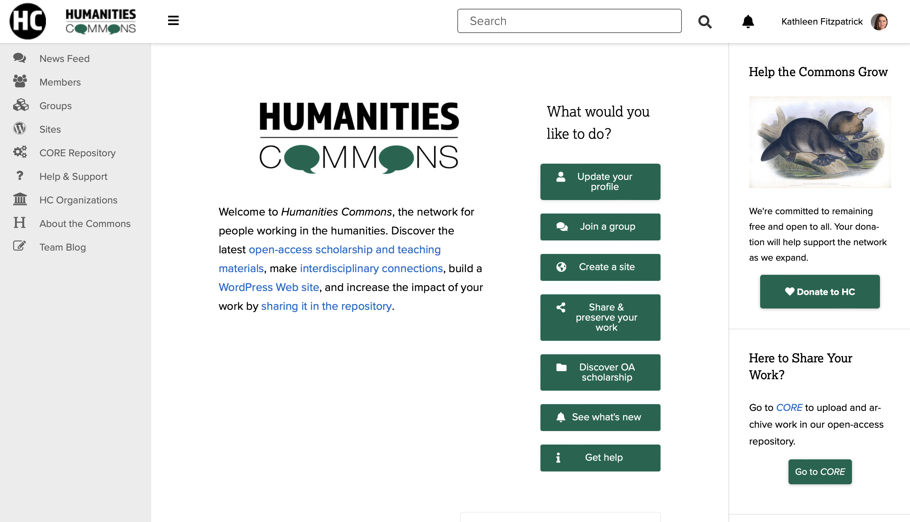
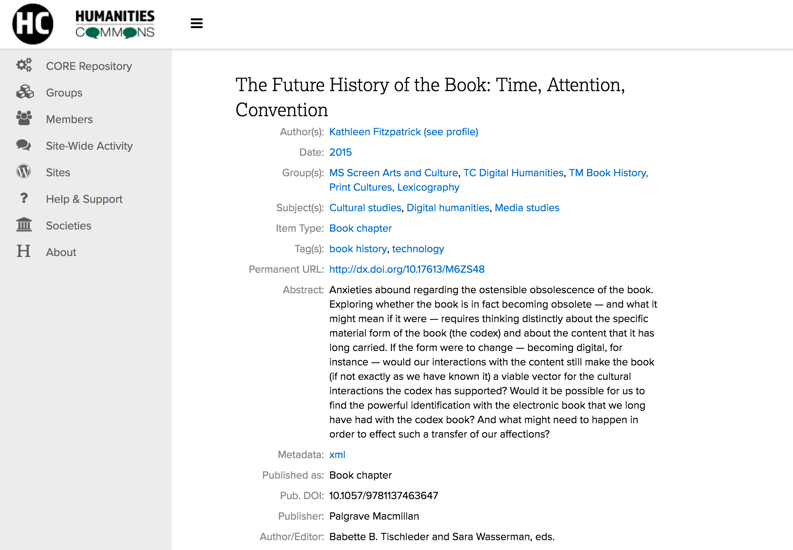
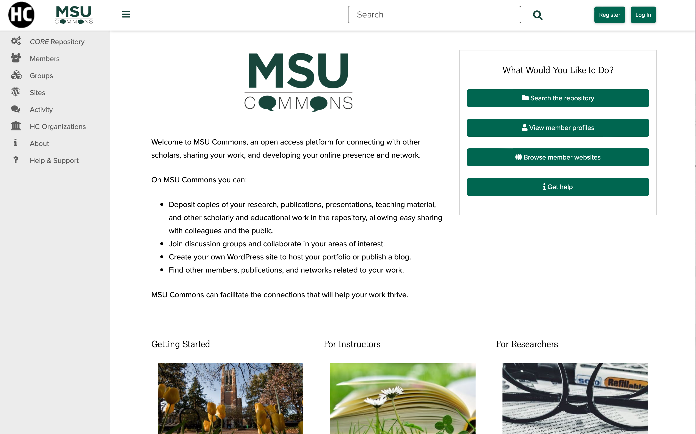
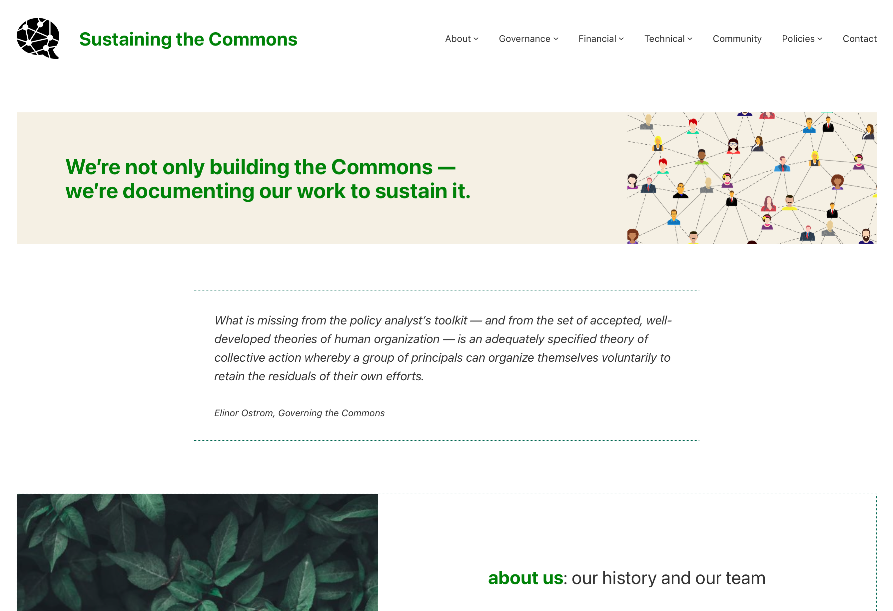
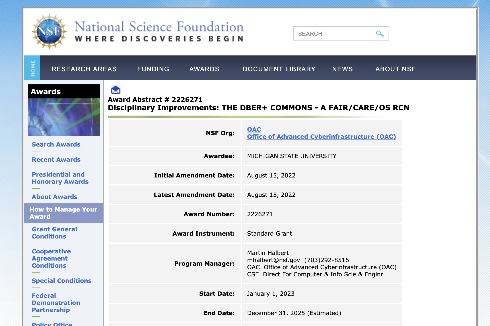
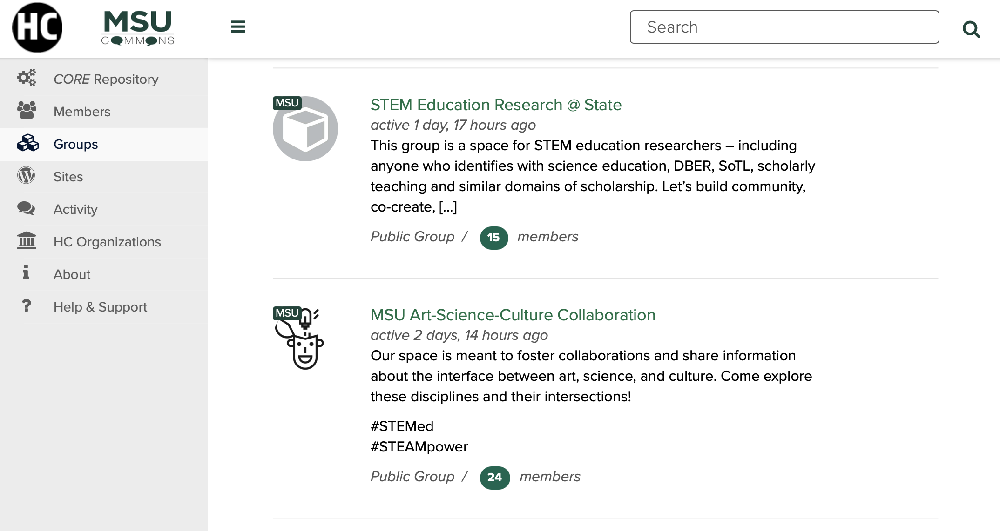

# Humanities Commons
---
## What We Have to Share
---
<smaller>Kathleen Fitzpatrick // @kfitz // kfitz@msu.edu</smaller> 

Note: Thank you so much. I'm really happy to have the opportunity to talk with you about some of the work we've been doing with Humanities Commons and about the expansion we have ahead.

Note: HC is an open-source, open-access, academy-owned, community-governed infrastructure supporting collaboration and communication among more than 31,000 researchers and practitioners across the humanities and around the world
- platform began as MLA Commons in 2013, developed by the MLA in order to provide space for member-to-member sharing and communication; built on CBOX and committed to open-source development

Note: in 2015, expanded functionality to include a Fedora/SOLR-based repository with a WP frontend, allowing members to deposit and share work and receive DOIs, etc

Note: launched Humanities Commons pilot to include other scholarly societies in 2016, as well as an open hub permitting anyone to create an account and use all of the network's features
- three things this pilot surfaced:
	- scholarly society budgets aren't sufficiently robust to be able to support the kind of shared infrastructure that might most benefit them
	- many (though not all) societies see a space like the Commons as a nice-to-have, rather than a core function -- and having it connected to an open hub makes them less likely to want to support it financially
	- reliance on grant funding rapidly leads to significant technical debt, as well as an inability to develop new functionality that users require

Note: completed the move to a new fiscal host, Michigan State University, in 2020, and began work developing the first institutional node on the network, MSU Commons
- received two significant investments of multi-year support from the NEH and Mellon, allowing us to staff up, to remediate our technical debt, and to develop a forward-looking roadmap toward a sustainable future

Note: part of sustainability includes shifting our thinking to focus on institutions of higher education and the ways they might be encouraged to support open-source, academy-owned alternatives to the commercial data capture platforms on which they currently rely
	- the Commons can provide a campus-wide blogging platform, a rich scholarly profile system, and a connected repository
	- and it can do so in a space that allows scholars to connect with others in their fields, thus making the potential for uptake greater
- but bringing the Commons to institutions requires us to serve the entirety of the campus, and so we're now thinking beyond the humanities

Note: recently awarded a multi-year grant through the National Science Foundation's new FAIROS RCN program (findable accessible interoperable reusable open science) to modernize our repository platform and create new integrations with key services and tools such as GitHub, as part of establishing DBER+ Commons, a new node on the network intended to support discipline-based education researchers across STEM fields
- there are several components of this project that are not technical in nature, however, but instead focus on improving the standards and practices through which open science is conducted

<!-- .element height="45%" width="45%" --> 
<smaller>https://datascience.codata.org/articles/10.5334/dsj-2020-043/</smaller>

Note: the most important to note is that we have added "CARE" to "FAIR" 
	- CARE is a set of principles developed for Indigenous data governance
	- Adding CARE to FAIR makes it incumbent on us to ensure that data shared and stored through the Commons are not just findable, accessible, interoperable, and reusable, but are also used for the Collective benefit of those participating in the research, that the communities in which the data are gathered have the Authority to control their use, that the researchers recognize their Responsibility to those communities, and that the relationships, the data, and the platform are all developed with Ethics in mind

Note: DBER+ Commons is an unusual project, not least in that innovations in scholarly communication are typically imagined to originate in STEM fields and from there gradually make their way into the humanities
- we are instead sharing the lessons learned in the humanities -- about the centrality of community-building, about the need for ethical privacy and data reuse policies, and about the significance of strong community governance -- in developing this new platform for scientific communication
- I'm going to stop there, and will look forward to discussing as we go forward!

## thank you
---
<smaller>Kathleen Fitzpatrick // @kfitz // kfitz@msu.edu</smaller>

Note: Many thanks.
