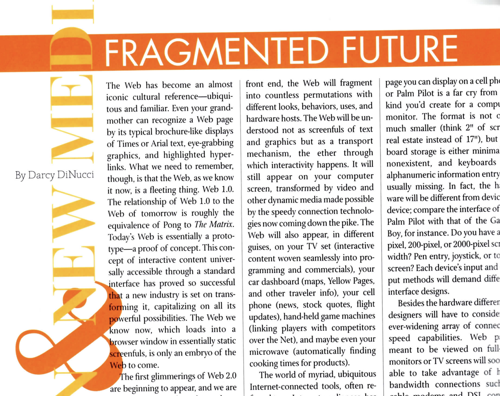
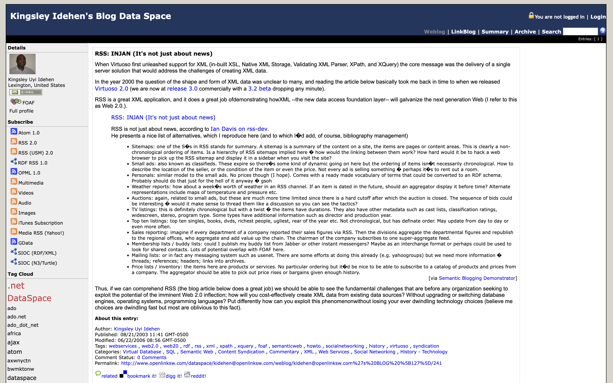
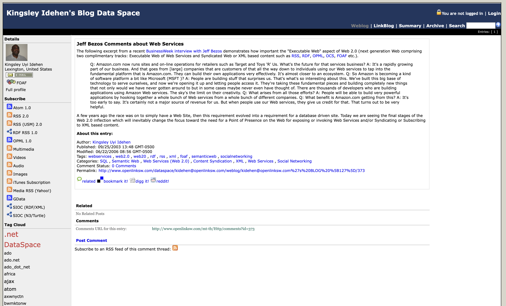
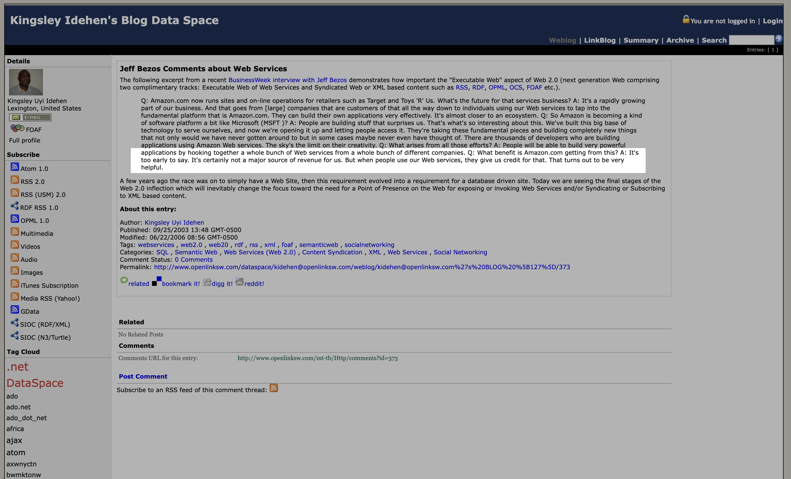
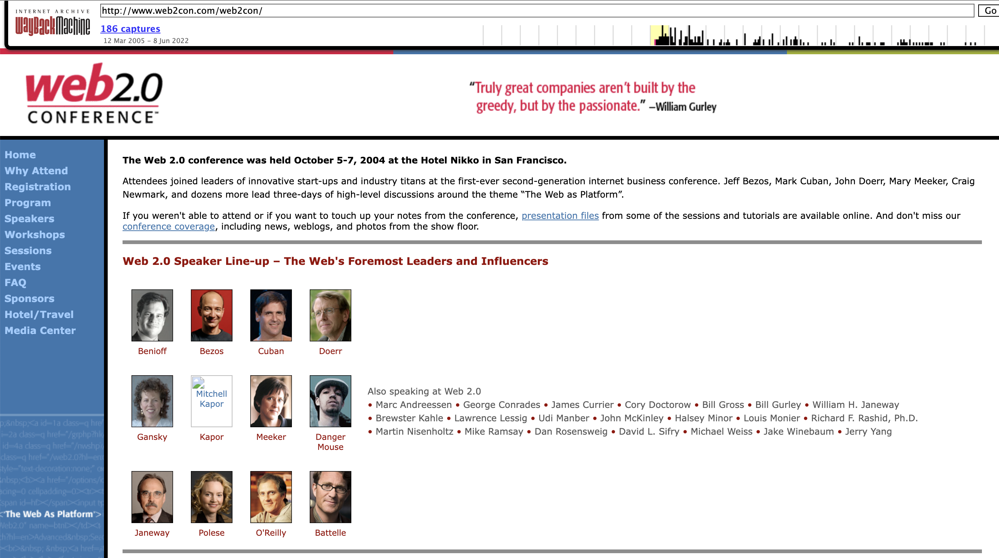
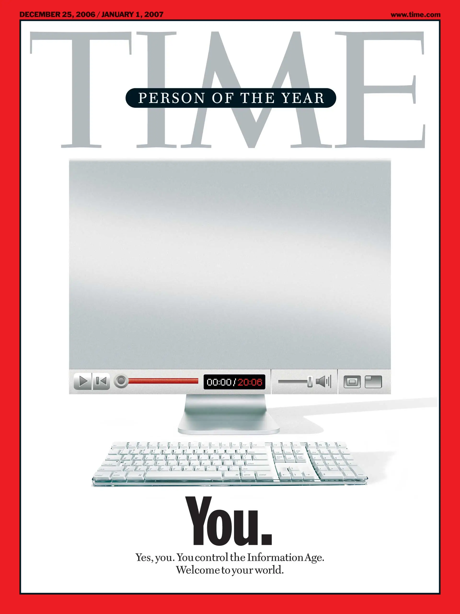
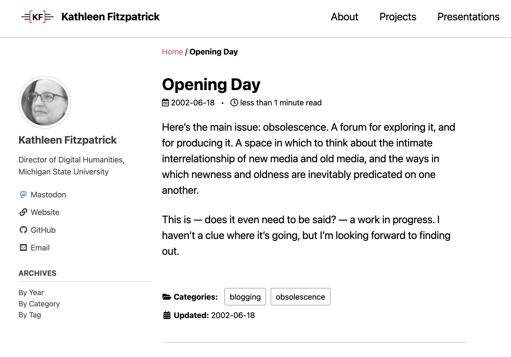
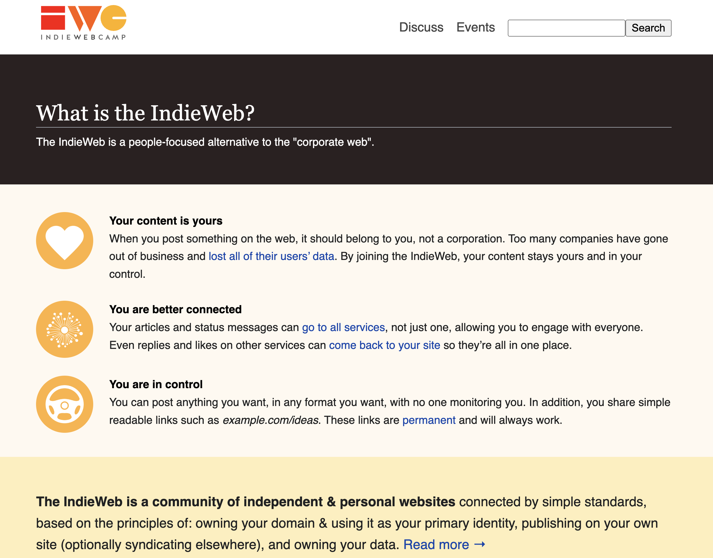

## We Have Never  Been Social:
### Web 2.0 and What Went Wrong
---
<smaller>Kathleen Fitzpatrick // @kfitz@hcommons.social  
Reclaim Open // 6 June 2023</smaller>

Note: Thank you so much -- I'm delighted to be here and to get to talk with all of you today about something that's been bothering me for the better part of fifteen years:

## what happened to blogging?

Note: What happened to blogging? This is a question that lots of folks have asked, and there are lots of obvious answers circulating out there, but it's a question that I take seriously, and personally. Because blogging made my career. And I mean that literally: insofar as I have anything like a public presence today, it was created by blogging. Everything I have written, every project I've worked on, every job I've held, to one extent or another I owe to my blog. And so I take what's become of it in the years since pretty hard, and I want to spend some time digging into what went wrong, and to think with all of you about whether, and how, the particular magic that blogs created might be recoverable.

# 2003

Note: I'm going to begin this inquest by jumping 20 years backward, to 2003. I was an assistant professor of English and Media Studies at a small liberal arts college on the eastern edge of the west coast, right where the sprawl of LA county runs into the desert. I'd been out of grad school for five years, and I was struggling to get my first book published, feeling the deadline of my 2004 tenure review bearing down on me. Spoiler alert: I did receive tenure, as it looked at the time of my review as though I'd found a home for that book, though it ended up being declined at the eleventh hour because the press's marketing guys couldn't figure out how to sell it. It finally did come out from another press in 2006, thankfully, but it ultimately had a far smaller impact on my career than did the writing I had been doing online in the interim.

Just to paint the scene a bit: in 2003, LiveJournal and Blogger had each been around for about four years, and of course GeoCities for another five beyond that. These were a somewhat messy and anarchic set of tools and spaces that allowed users to build out forms of self-representation and community connection, bringing the ethos that had long been found in discussion spaces like USENET, IRC, and a range of MUDs and MOOs to the graphical windows of the web. LiveJournal and Blogger were also the leading edges of the transformation of the world-wide web from a relatively static service, presenting pages that lived on servers requiring both access and a certain degree of expertise in order to manage on the back end. Instead, these new applications embodied the principles of the "read-write web," which allowed users to interact with and add to web content via the front end.

# "web 2.0"

Note: That "read-write web" was one feature of the complex of web-based applications that was in the early years of the 21st century turning the browser from a means of presenting static web pages into something far more dynamic. That more dynamic thing is part of what many of us originally understood the term "web 2.0" to mean. Credit for coining the term is usually given to Tim O'Reilly, who in 2004 hosted the first "Web 2.0 Summit" intended to explore what the web was becoming as it took flight from the ashes of the dot-com bust. Wikipedia, however, attributes the first use of the term "web 2.0" to Darcy DiNucci, in a 1999 article entitled "Fragmented Future." 

Note: In this article, DiNucci describes the first-generation web as "essentially a prototype -- a proof of concept" for "interactive content universally accessible through a standard interface," but given that "it loads into a browser window in essentially static screenfuls," it was clear even then that it was "only an embryo of the Web to come." DiNucci went on to describe the many screens and devices that might interact with what she called "web 2.0" in the future (including your microwave, which might automatically seek out correct cooking times online), noting quite presciently the particular challenges that web publishing would face in encountering such a wide range of screen sizes and resolutions. What DiNucci did not include in this fragmented future was what would happen when the web browser did more than retrieve and display content, but rather allowed for the creation of that content in the first place. 

Note: It took another few years before Kingsley Idehen, in 2003, wrote a blog post thinking about XML-based applications such as RSS and their potential for "the next generation web," saying "I refer to this as Web 2.0." 

Note: That this post was followed a month later by another quoting Jeff Bezos on the "executable Web" and the rapidly expanding "Amazon web services" that were supporting a wide range of database-driven online retail sites points exactly to the problem of "web 2.0": the channeling of interactive creativity into business. (And if you need something to break your heart just a little bit this morning, try this on for size:

Note: That tiny text reads "Q: What benefit is Amazon.com getting from this? A: It's too early to say. It's certainly not a major source of revenue for us. But when people use our Web services, they give us credit for that. This turns out to be very helpful.")

Note: Sigh. In any case. By the time Tim O'Reilly and John Battelle took the stage for the opening keynote at that first Web 2.0 Summit, they were ready to outline a vision for the future of "the web as platform," starring a lot of folks looking to build "truly great companies" on top of it. And it's thanks to those folks, and their interest in platformization, 

<!-- .element height="70%" width="70%" -->

Note: that we'd find ourselves just two short years later honored as *Time* Magazine's Person of the Year, being told that we control the Information Age! The unbridled enthusiasm of the cover carries over into the story by Lev Grossman, though it's possible to see in the story an early hint of the forking paths that Web 2.0 presented. On the one hand, Grossman notes that the explosive growth in active, creative participation in online spaces was "a story about community and collaboration on a scale never seen before." On the other hand, the extent to which we -- you and I -- really control the world being built is uncertain, as Grossman hints at the importance of those building the platforms on which all this engagement was taking place, making it possible for "millions of minds that would otherwise have drowned in obscurity \[to] get backhauled into the global intellectual economy."

I've gotten a bit ahead of the story I want to tell today, which is in large part about those forking paths, which point to community and collaboration in one direction and to the global intellectual economy in the other, and the fundamental failures that meant we were always destined to find ourselves lost in the latter even while we sought the former. So let's back up again, back to

# 2003

Note: 2003. As I noted, LiveJournal and Blogger had been actively feeding the read/write web for a few years, as had several other early blogging packages. Around that time, Matt Mullenweg and Mike Little decided to take the software they'd been using, b2/cafelog, which was about to be discontinued, and build something on top of it, releasing the first version of what they decided to call "WordPress" on May 27, 2003.

# "blog"

Note: As for me, I first heard the word "blog" in a workshop at UCLA during the summer of 2001, when Jenny Bay, then an early career scholar of digital rhetoric, presented some early research questions she was exploring about the development of forms of online communication being popularized by folks like Jason Kottke. I remember being a bit puzzled at first, not just about how you'd go about building a website on which you could post regular updates about things you found of interest, but also, to be frank, about why you'd do so. I didn't see the appeal, at least not at first. 

But the idea got stuck somewhere in the back of my head, and a year later, in June 2002, it resurfaced. I had just finished revising the manuscript for that first book, and I knew that it was probably going to be a year or two before anyone would be able to read it.

# ahahahhahahahaahahahahahaahahha

Note: It turned out to be five years, which I don't know what I'd have done if I'd have known that at the time. But even given the deeply naive view of the scholarly publishing process that I was still clinging to at the time, I was antsy. I had Things to Say. And I was tired of waiting for my stuff to find its way to an audience. And one afternoon I was procrastinating by searching online for some old friends from grad school and I ran into this website that one of them had! It was one of those blog things! And it was funny, and smart, and people were reading it. And I knew they were reading it because they were responding to posts in the comments. And I thought, "oh man, that's *it*."

Note: So I figured out how to get an account with a web hosting service, and how to install Movable Type, and started blogging. My original site looked like this. I named it "Planned Obsolescence" as a bit of an inside joke -- the title of the ill-fated book I'd just finished writing was *The Anxiety of Obsolescence*, and the blog format felt like it provided a vehicle for, if not fame and fortune, at least a kind of obsolescence that I could control.

Note: Here's what my very first post looks like today. Since 2002 it's been migrated from Movable Type to ExpressionEngine to WordPress, from whoever my first hosting provider was to DreamHost to Reclaim, from plannedobsolescence.net to kfitz.info, and most recently from WordPress on Reclaim to a Jekyll-based static site hosted on GitHub. And yet, despite all of the web's evanescence, and despite my certainty that I was working in a form that was productive of obsolescence, this content remains -- remains accessible, remains available, remains alive.

When I started blogging, what I thought I was after was the instant gratification of publishing, the ability to push my words out to the world. All of the other thousands of words I'd produced were either stuck on my hard drive waiting for a press to agree to consider them, or languishing in journals that I wasn't sure anyone would ever read. The whole exercise of scholarly publishing as we knew it felt a whole lot like shouting down a well. But this! This blog thing would allow me to take charge of my own process, to push stuff out when I was ready.

# conversation

Note: It turns out, though, that what I really wanted, deep down underneath the sense of being stifled, was the possibility of response. When you shout down the traditional publishing well, the only answer you really get is your own voice echoing back; the possibility that someone will read your article and cite it in their own, and then have that reply pushed through the publishing process is so slow as to have lost all traces of the conversational. The early world of blogging, however, was all about conversation. I'd post something, and someone would read it and leave a comment! Or, they'd read it and write a post in response, and link to mine in the process. There was an entire web of conversations taking place in the blogoverse, and through that web I found my way into a cluster of early literary and media studies bloggers, all of whom were writing and thinking together, lifting one another's ideas up and making them better along the way.

# community

Note: This cluster of bloggers formed a community, one that I wasn't even really aware I needed back in my remote small liberal arts college bubble. That bubble was an awfully comfortable one, and yet I had no real collaborators inside it. Connecting online with folks who were pursuing questions related to my own produced a kind of engagement that was hard to sustain alone. And blogging turned out to be enormously productive for me: not only did the relationships built in that community evolve into several of the closest friendships I have today, but the writing I did on the blog led to every single idea I've had since, and every bit of recognition that my work has received.

Blogging in 2003 was the bomb, is what I'm trying to say.

# but

Note: But. Alongside the creative ferment being produced by blogs in 2003, there were a few other developments happening. 2003 saw the launch of Friendster and MySpace. And then -- fairly quietly, at first -- this thing called FaceMash. These platforms billed themselves, to different extents, as ways to engage with your social networks online, which doesn't sound all *that* different from what the blog network I participated in did. Except, of course, that these were *platforms*, in which the accumulation of connections and competition for influence rather than the building of relationships became the point. By the time FaceMash turned into Facebook and started moving beyond Harvard's gates, "social networks" had become spaces for the accumulation of both social capital and venture capital. They were about YOU YOU YOU, and not at all about who we were together.

# twitter

Note: Twitter was in this sense just another nail in the coffin, but I hold fast to the conviction that Twitter is what ultimately did blogging as I knew it in. Not just because it was so much quicker to spit out 140 characters than it was to write even a moderately considered blog post, and not just because that heightened sense of immediate gratification was coupled with knowing *exactly how many people* were following you, and thus (at least theoretically) how much of an "impact" your post about what your dog ate for breakfast was going to have, but also because one of its real benefits -- following people who posted links to cool stuff, including to your moderately considered blog post -- resulted in stealing the conversation away from blogs themselves. If someone had a response to the blog post you linked to on Twitter, they responded *on Twitter*, and that conversation rarely had a chance to develop in the ways it had in the comments, or in linked posts from other blogs. And worse, the fact that that conversation was taking place might not even be something that the original post author was aware of, or got to participate in.

Note: Of course, folks wrote WordPress plugins that attempted to repair that conversational leak, by aggregating tweets and republishing them as comments on the post to which they responded, not least the folks affiliated with the IndieWeb community, who argued for personally-owned alternatives to corporate platforms, ensuring that content you produce remained under your own control, published and connected where and when you wanted. While I'm a huge supporter of IndieWeb and its goals, I worry that focusing on *ownership per se* misses a part of what went wrong. The problem is not just that that platforms into which we poured our time and energy, our creativity, our representations of ourselves and our relationships with others -- it's not just that these platforms were corporate-owned. It's not just that those corporations had VCs to whom they had to provide quantitative proof of success. And it's not just that our relationships thus got caught up in the Silicon Valley cash nexus -- though all of that is demonstrably bad, too.

FROM HERE: 
- what's so antisocial about social media (mostly a radical misunderstanding of sociality itself)
- a model of sociality that is about the individuated self and its accumulated connections, rather than about multi-directional relationship building through ongoing conversation
- turns conversation into a performance of conversation, and self-representation into a performance of self
- and via the algorithm, does so inside a black box that we cannot control
- here Martin Eve on the failures of "distributed digital governance systems of the blockchain" etc
- It's not just a matter of centralization/decentralization; it's about ensuring that the social is not subjugated to the technical

---

on failures of sociality, see Eve, *Paper Thin*, in which he describes the distributed digital governance systems of the blockchain, NFTs, and more as evidence that their developers and adherents "would like to build... a technical system of law enforcement that eradicates all sociality from the implementation of, say, property ownership" (170). Similarly, the platformization of social networks attempted to supplant real sociality with algorithmic connections, resulting in similar disasters. This "subjugation of the social to the technical" (172) is characteristic...

which is to say that it's not just a problem of centralization/decentralization!

take a look at Jessa Lingel, *The Gentrification of the Internet* (U California, 2021): note especially p. 15, when she indicates that there was never a "golden age" on the internet; we moved from an era in which there was wide-open creativity, to be sure, but few had the access and knowledge necessary, to an era of deep corporatization, when the vast majority could access the internet mostly because it was advantageous to its corporate developers for them to do so

see also Penny C.S. Andrews, "The Platformization of Open," in *Reassembling Scholarly Communications,* Eve and Gray, eds.: it's not just about corporate platforms, but also about software as a service