## Generous Thinking
---
### Sustainability, Solidarity, and the Common Good
---
##### Kathleen Fitzpatrick // @kfitz // kfitz@msu.edu

Note: I want to start today by thanking Krisellen for inviting me to talk with you and Joann for all the work involved in getting me here. I'm delighted to have the opportunity to share this work with you. 

Note: Much of the talk ahead grows out of the work I did in my recent book, _Generous Thinking: A Radical Approach to Saving the University_. The book overall makes the argument that rebuilding a relationship of trust between the university and the public that it ostensibly serves is going to require regrounding our institutions and the work that we do in them in a mode of what I refer to as “generous thinking,” focusing our practices and our modes of communicating around building community and solidarity both on campus and across the campus borders.

## radical approach

Note: The 'radical approach' part of the book's subtitle grows out of my increasing sense that this necessary change is a HUGE one, that it can’t be made incrementally, that instead it requires — as Chris Newfield notes in the conclusion of _The Great Mistake_ — a paradigm shift, because there is no route, no approach, no tool that can take us from where we are today to where we need to be. As Tressie McMillan Cottom has noted of the crisis that she has seen growing in higher education today,

> This is not a problem for technological innovation or a market product. This requires politics.  
> &nbsp; &nbsp; &nbsp; &nbsp; &nbsp; &nbsp; &nbsp; &nbsp; &nbsp; &nbsp; &nbsp; &nbsp; &nbsp; --Tressie McMillan Cottom

Note: "This is not a problem for technological innovation or a market product. This requires politics." The problem, after all, begins with politics: the American public university that not too long ago served as a highly accessible engine of social mobility, making a rich liberal-arts based education broadly available, has been utterly undone. We are facing today not just the drastic reduction in that institution's affordability but an increasing threat to its very public orientation, as rampant privatization not only shifts the burden of paying for higher education from the state to individual students and families, but also turns the work of the institution from the creation of a shared social good -- a broadly educated public -- to the production of market-oriented individual benefit.

Note: And all the while, we are also facing what Inside Higher Ed recently reported as "a larger than typical decline in confidence in an American institution in a relatively short time period." And this falling confidence cannot be simply dismissed as evidence of an increasingly entrenched anti-intellectualism in American life -- though of course, without doubt, that too -- but rather must be understood as evidence that, as I argue in the last chapter of _Generous Thinking_, higher education has for the last several decades been operating simultaneously under two conflicting paradigms -- on the one hand, an older paradigm, largely operative within the academic community, in which the university serves as a producer and disseminator of knowledge; and on the other hand, a more recent one, in which the university serves as a producer and disseminator of market-oriented credentials. The crisis in higher education today stems both from the incommensurability of these two paradigms and from the fact that _both of them are failing_, if in different ways.

## Thomas Kuhn

Note: As Thomas Kuhn noted in _The Structure of Scientific Revolutions_, the failure of a scientific paradigm, as it becomes beset by anomalies for which the paradigm cannot account, throws the community that relies on that paradigm into crisis. And the resolution of that crisis requires the discovery of a new model entirely, one that can reorder the work done by the community and draw it out of what he describes as the "period of pronounced professional insecurity" that appears when normal science ceases to function normally. This crisis can only be resolved in Kuhn's model by what he famously called a paradigm shift, the cataclysmic transformation from one way of understanding how science operates to another. And my argument is that we are desperately in need of such a paradigm shift if higher education as we want it to be is to survive.

Note: _Generous Thinking_ explores this problem from a number of different angles, asking all of us who care about the future of higher education -- faculty, staff, administrators, students, parents, policymakers, trustees, and more -- to reorient our thinking about the work of the university from the creation of individual benefit, grounded in all of the competition that structures every aspect of life in contemporary institutions of higher education, to instead focus on the university's role in building community.

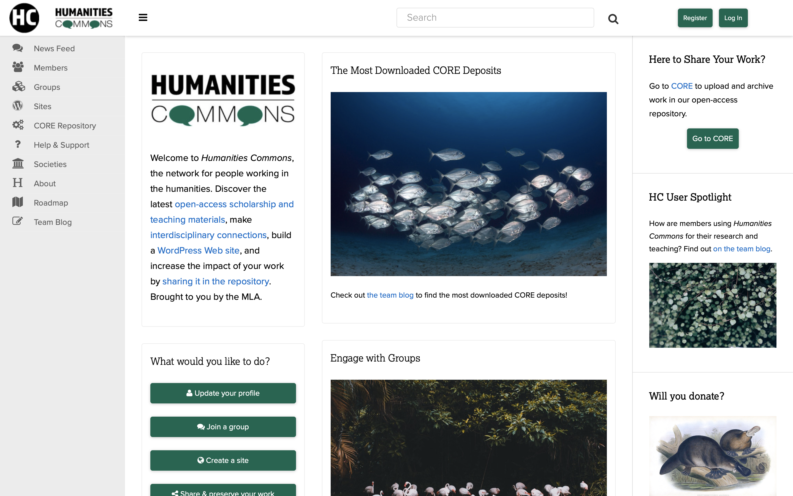

Note: So some of my thoughts here today grow out of this aspect of _Generous Thinking_, but some stem more pragmatically from my work over the last several years on _Humanities Commons_, which is a non-profit, community-developed and governed network serving humanities scholars and organizations.

# public

Note: Humanities Commons attempts to instantiate several of the arguments of _Generous Thinking_: first, that higher education, along with the individual scholars and instructors engaged in it, will benefit from all of us doing more of our work in public, where the publics that we need to support our institutions can begin to see the significance of what we do; and second, that institutions of higher education must do everything they can to resist and reverse the privatization that has overtaken them, restoring service to the public good not just to their mission statements but to the heart of their actual missions. Only this return to a fully public orientation -- even among those universities that we call "private" -- can allow us to build the kind of community that can sustain them.

## community-supported infrastructure

Note: And part of resisting privatization, for both scholars and their institutions, involves turning away from some of the externally developed and deployed systems on which we have become dependent, and instead reserving our investments, and our labor, for systems and platforms and infrastructures whose missions genuinely align with our own, whose values mirror our own, and to whose governance we can contribute. We need collectively to turn our attention to developing the shared, publicly oriented systems that we can count on to support us as we develop new modes of open knowledge sharing, modes that might help higher education return to its mission of public service. But developing this form of community-supported infrastructure will require some careful thinking about the relationships required to build and maintain it, and the work that will be necessary to make it sustainable.

Note: The stories I'm about to tell are ones with which all of you are much too familiar, and in many cases with which you are far more familiar than I am. I hope you'll forgive this; my usual audiences are scholars and administrators who don't always have a clear sense of why community-supported infrastructure might matter, and the examples I'm about to cite make that importance clear. So, bear with me. 

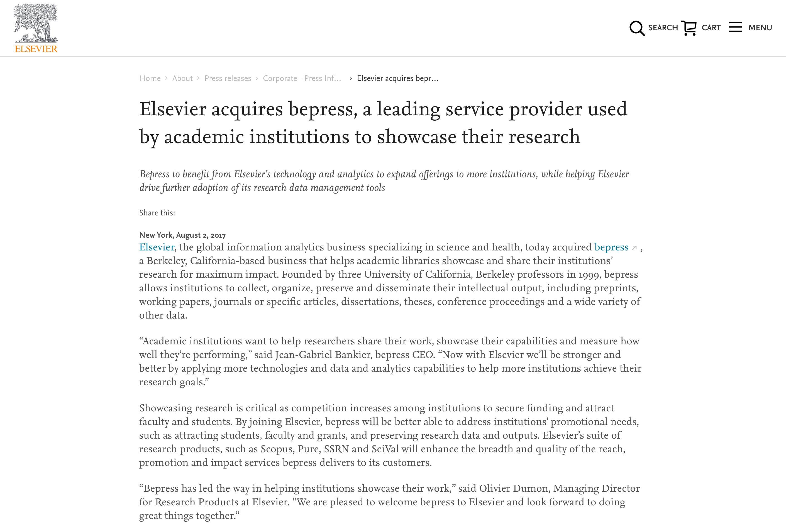

Note: Though the issues that I'm discussing of course long predate this particular moment, they came into stark visibility in August 2017, when bepress announced that it had been purchased by the RELX Group, the multi-national parent company of publishing behemoth Elsevier. Bepress had of course been founded in 1999 by two members of the faculty of UC Berkeley's law school in order to provide open-access publishing and repository services to institutions of higher education. Bepress thus grew out of the academy, and was widely seen as operating with the academy's values at its heart.

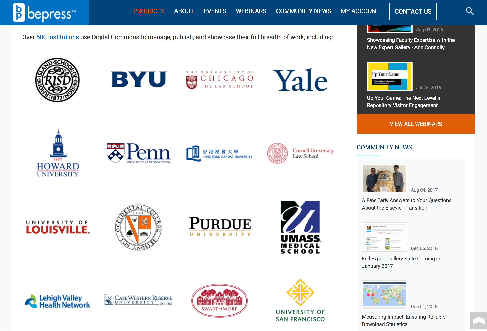

Note: As the bepress website notes, over 500 institutions have purchased bepress services in order to disseminate and preserve the work being done on their campuses in openly-accessible ways. And in one fell swoop, these 500 institutions discovered that they were now effectively paying Elsevier for the ability to provide an open alternative to the increasingly monopolistic scholarly communication channels owned by corporate publishing behemoths such as Elsevier.

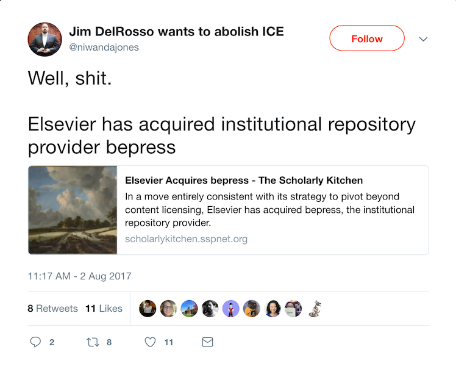

Note: What had served for years as a key piece of scholarly infrastructure -- built and run by academics, for the academic community -- appeared to have been turned on that community. It's not as though anyone had been unaware that bepress was a commercial service all along, but they were one of the good guys, and the costs of outsourcing infrastructural needs to them had been balanced against the often impossible task of maintaining locally hosted repository and publishing systems. Bepress provided what many saw as best-of-breed functionality at a reasonable price, and it supported libraries' desire to connect the gathering and preservation of research materials with the ability to make them openly available to the world.

Note: But the acquisition of bepress by RELX not only put libraries in the position of unintentionally supporting a growing corporate control not just of scholarly publishing but of the entirety of the research workflow, from discovery through production to communication; it also left those libraries anxious about their fundamental ability to control the infrastructures on which they rely in promoting greater public access to scholarship produced on their campuses. As a result, serious conversations have since focused on means of supporting open-source, academy-owned and -controlled infrastructure.

Note: This is not an impossible move, by any stretch, but it's harder than it might sound. Long-standing open-access, open-infrastructure projects like arXiv might suggest some possible areas of concern.

Note: By every reasonable measure, arXiv has been exemplary -- in its uptake, in its independence, and in the ways that it has helped to transform the fields that it serves. But in some crucial ways, arXiv has experienced what can only be called "catastrophic success" -- a crucial, paradigm-shifting project whose growing annual operating costs and mounting infrastructural requirements have demanded increasingly creative mechanisms for the platform's support.

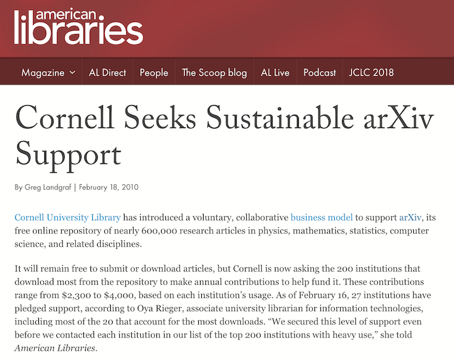

Note: So in 2010, the arXiv team at Cornell began the challenging process of building a coalition of libraries willing to work together to support the resource. But our institutions, as we unfortunately know, are largely unaccustomed to this work of cross-institutional collaboration. For one thing, they're far more prone to understand such resources as terrain for competition, and for another, the community-building required becomes yet another form of labor added on top of maintaining the resources themselves.

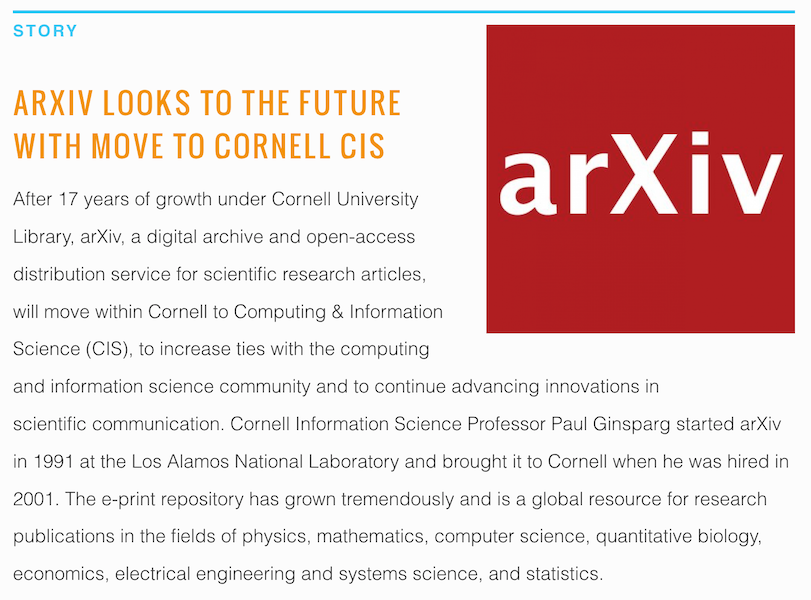

Note: I do not know the extent to which such difficulties may have played a role in arXiv's recent move from the Library to Cornell Computing and Information Science. It's entirely likely that the move is a matter of infrastructural pragmatics. But even so, the challenges of maintaining the kind of cross-institutional coalition necessary to sustain such a crucial resource remain.

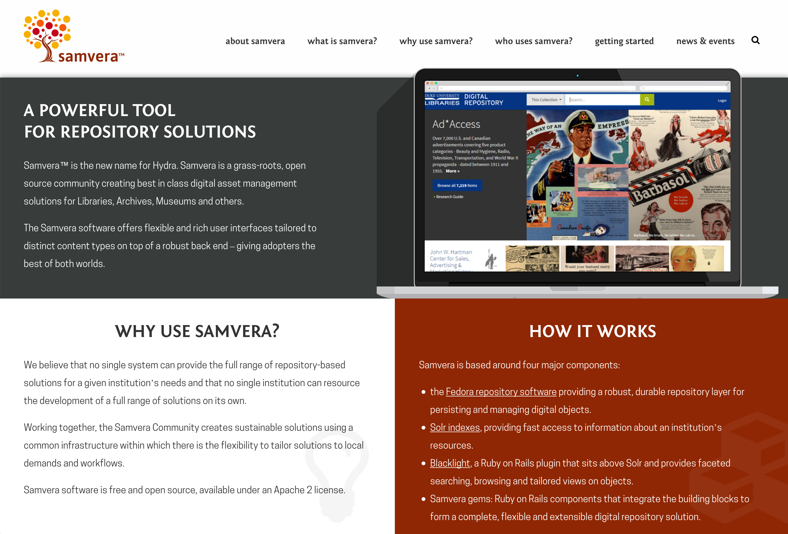

Note: Another example, with a different narrative, might be found in the Samvera project. Recognizing that no single institution could possibly develop the full suite of systems on which institutional repositories rely, developers at a number of institutions have come together to create a collective solution. As the proverb and their website have it, if you want to go far, go together.

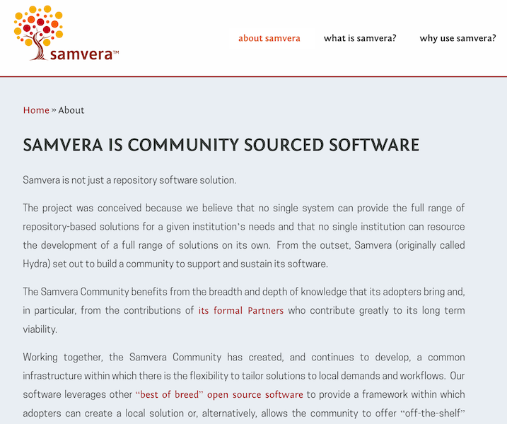

Note: But this distributed developer community, like all such communities, has faced some challenges in coordination, challenges that have caused it, as the proverb also reminds us, to go more slowly than it might. Ensuring the ongoing commitment not just of the individual developers involved in the project but of the institutions for which the developers actually work is not a simple matter.

# sustainability

Note: The foundation of the challenges that arXiv and Samvera have faced is the same challenge faced by any number of other projects and programs and initiatives: sustainability. This is an issue I've been thinking a fair bit about of late, as my colleagues and I have been working to ensure that Humanities Commons might be able to thrive well into the future. And those attempts have in turn been encouraged by the funders and other organizations that have supported the network's development to this point; they too would like to see the network thrive, but they cannot support it indefinitely. We need, they reasonably suggest, a plan for demonstrating that the network will, at some point in the future, be able to support itself.

Note: Sustainability of this sort is tied up in revenue models, in business plans, in cost recovery. Sustainability is for a non-profit entity forever tied to kinds of economic concerns that are very often divergent from, if not at odds with, the non-profit's primary mission. As a result, these non-profits remain forever precarious; one small miscalculation can make the difference between survival and collapse.

Note: But sustainability broadly understood extends to domains beyond the economic. There is of course environmental sustainability, in which we attempt to ensure that more resources aren't consumed -- or more waste produced -- than can be developed or managed in the near term. 

Note: There's technological sustainability, in which we attempt to ensure that projects conform to commonly accepted standards that will enable those projects' future stability and growth.

Note: All of these forms of sustainability are important, to varying degrees, to providing for the future of non-profit and open-source projects. But there's another form that gets a good bit less attention, and that I increasingly think precedes economic or environmental or technical sustainability: social sustainability. The social aspect points not just to the determination of a group of people to support a particular project, but to the determination of those people to support their groupness; not just to their commitment to the thing they're doing together, but to their commitment to the concept of "together" in the first place. Ensuring that these commitments are sustained is, I increasingly think, a necessary precondition for the other kinds of sustainability that we're hoping to work toward.

# community

Note: This notion -- of the role of "community" in community-supported software, and of the best ways of building and sustaining it -- raises the key question of what it is we mean when we talk about community. As Miranda Joseph argues in _Against the Romance of Community_, the concept is often invoked as a placeholder for something that exists outside the dominant economic and institutional structures of contemporary life, a set of ostensibly organic felt relationships that harken back to a mythical premodern moment in which people lived and worked in direct connection with one another, without the mediating forces of modern capitalism.

# "community"

Note: "Community" is in this sense, in Benedict Anderson's sense, an imagined relationship, and even an imaginary one, as its invocation is designed to yoke together bodies whose existence as a group is largely constructed. It's a concept often used both idealistically and as a form of discipline, a claim of unity that smooths over and thus suppresses internal difference and disagreement. And, as Joseph points out, the notion of community is often deployed as if the relationships that it describes could provide an antidote to or an escape from the problems created by contemporary political and economic life. But this suggestion serves to distract us from the supplementary role that community in fact actually serves with respect to capitalism, filling its gaps and smoothing over its flaws in ways that permit it to function without real opposition. So we call upon the community to support projects that the dominant institutions of the mainstream economy will not. And this is how we end up with social network–based fundraising campaigns to support people facing major health crises, rather than demanding universal health care, and elementary school bake sales rather than full funding for education. "Community" becomes, in this sense, an alibi for the creeping privatization of what should be social responsibilities.

Note: So it's important to be careful in issuing calls to build community: such calls, issued uncritically, not only run the risk of enabling the institutions that structure contemporary life to absolve themselves of responsibility for public care, but they also risk essentializing a highly complex and intersectional set of social relations, treating those relations as if they were a simple, single thing. At the same time, though, there are some important uses for the notion of community that remain, uses that might benefit from an analogy to Gayatri Spivak's "strategic essentialism." In these uses we might simultaneously recognize that our calls to community are flawed, in fact impossible, but nonetheless useful as organizing tools. 

# solidarity

Note: We might thus begin to think of the call to community not as an invocation of organic unity but instead as a form of coalition-building, of a developing solidarity. Solidarity itself is a challenged concept, of course; there are important questions to be asked about solidarity with whom, and for whom. 

Note: Women of color, for instance, have pointed out the extent to which white feminist appeals to solidarity reinforce white supremacy, demanding that black women put the issue of race aside in favor of a gender-based unity that overwhelmingly serves white women's interests, leading author Mikki Kendall to establish the Twitter hashtag #SolidarityIsForWhiteWomen. So I don't want to make it sound as though "solidarity" can serve as an unproblematic substitute for "community."

Note: But I remain convinced that there are stronger forms of solidarity to be found, forms that do not demand that individuals seeking redress for institutionalized injustices drop their own issues and get in line, but that instead recognize that the issues of those individuals are all of our issues too, and that we must stand together in support of needs that may not necessarily seem to be our own. And this is the form of solidarity that I'm seeking, a form that I am convinced is a necessary prerequisite for successful, sustainable development of non-profit, open-source, community-owned networks and platforms.

Note: What's the connection? For me, sustainability and solidarity connect through the work of Elinor Ostrom. Ostrom was not just, as the UBS Nobel Perspectives website has it, the first female Nobel laureate in economics; she remains to date the _only_ female laureate in the field. Her work focused on common-pool resource management; she argued fiercely against the conventional wisdom that the so-called tragedy of the commons was an inevitability, insisting that community-based systems and structures for ensuring those resources' sustainability were possible, provided the right modes of self-organization and self-governance were in place.

## common-pool resources

Note: It's important first to focus in a bit on what is meant by the notion of common-pool resources. Resources are generally understood by economists to fall into one of four categories, based on whether they are excludable -- whether individuals can be prevented from using them -- and whether they are rivalrous -- whether one individual's use precludes another's. Public goods are those resources that are both nonexcludable and nonrivalrous, meaning that no one can be prevented from using them and that no one's use reduces its availability for use by others. By contrast, private goods are both excludable and rivalrous; they can be restricted for use by paying customers, and their consumption by one customer can diminish its availability to another. These private goods are market-based products, typically produced and distributed for profit. Club goods are those that are excludable but nonrivalrous, those that are restricted to paying customers but not diminished by any one customer's use. And finally, goods that are nonexcludable but rivalrous are often described as common-pool resources: it is these goods to which the "tragedy of the commons" -- the overuse of shared natural resources -- can apply.

## the "free rider" problem

Note: At the root of the tragedy of the commons lies the "free-rider problem," which derives from the assumption that when individuals cannot be prevented from using commonly-held resources, but also cannot be compelled to contribute to them, some number of individuals will avail themselves of the resources without contributing to their support. As the number of free riders grows, the resources become prone to overuse and eventually become unsustainable. The only means imagined to help prevent the tragedy of the commons, before Ostrom, was external regulation, whether through privatization or nationalization.

## _Governing the Commons_

Note: But as Ostrom argued in her 1990 book _Governing the Commons: The Evolution of Institutions for Collective Action_, this model -- like other such models as the prisoner's dilemma -- was based on a particular, and particularly pessimistic, view of human possibility, one that could not escape from its own metaphor.

> What makes these models so dangerous -- when they are used metaphorically as the foundation for policy -- is that the constraints that are assumed to be fixed for the purpose of analysis are taken on faith as being fixed in empirical settings, unless external authorities change them.... I would rather address the question of how to enhance the capabilities of those involved to change the constraining rules of the game to lead to outcomes other than remorseless tragedies. &nbsp; -- Elinor Ostrom

Note: READ SLIDE; Ostrom's work thus explored ways of organizing collective action that might ensure the sustainability of commonly-held resources. And while Ostrom focused on natural resources, such as fisheries, the problems she described, and the potential solutions she explored, have some important things in common with institutions of higher education and the non-profit, community-developed, academy-owned software projects -- like arXiv, like Samvera, like Humanities Commons -- on which they should be able to rely.

Note: There are lots of potential examples of free and open digital scholarly platforms and projects like these, all of which face a common problem: there is often sufficient support available for building and implementing such systems, but there aren't funding programs designed to ensure that they can be maintained. And as a result, the tools and platforms accrue technical debt that becomes increasingly difficult to manage, rapidly making the projects appear unsustainable and thus leaving them in real danger of obsolescence.

Note: Some argue that the best means of ensuring the sustainability of such projects is economic: eliminating the free-rider problem by enclosing the commons, requiring individuals or institutions to pay in order to access them. But this privatization is, in many cases, the problem that community-developed projects were developed to evade. So as with Ostrom's fishing communities, it's incumbent on us to find the right modes of self-organization and self-governance that can keep the projects open and thriving.

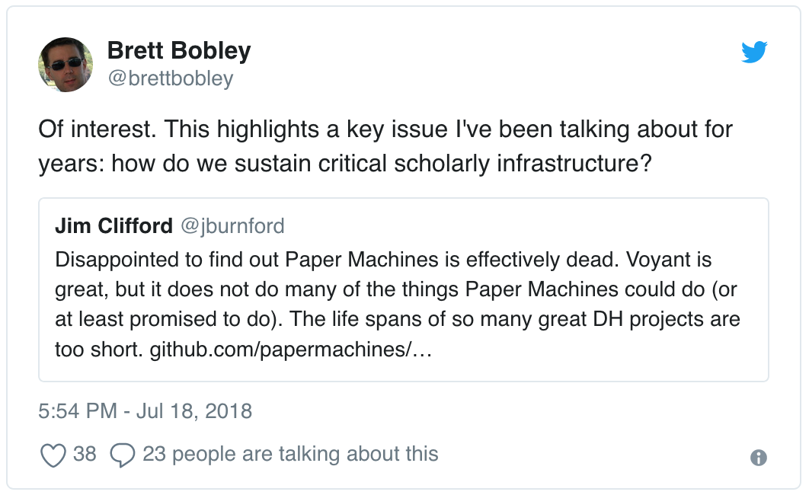

Note: So last summer, Brett Bobley tweeted a question about ways of sustaining such projects. Numerous discussions and threads resulted from that question that are worth reading, but one that caught my attention in particular stems from this reply by Hugh Cayless -- 

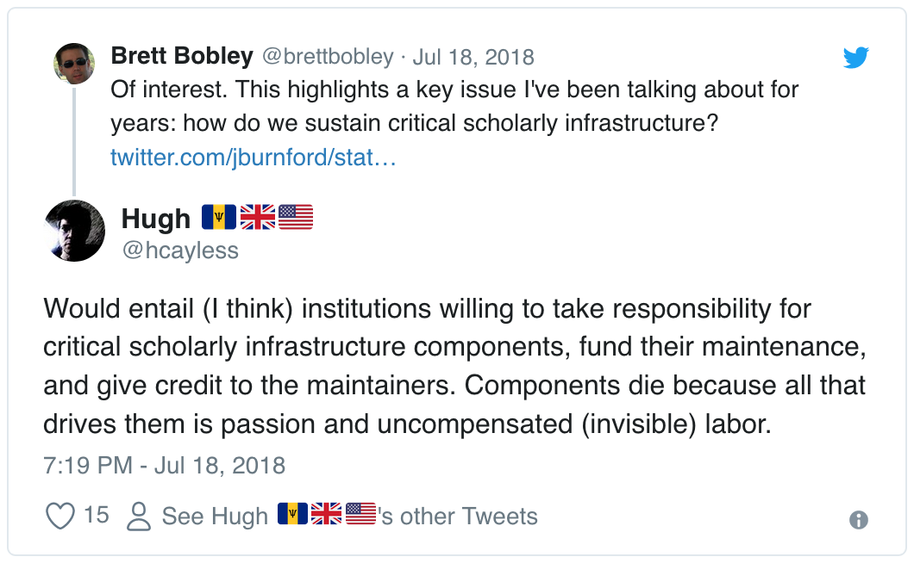

Note: -- noting the institutional responsibility for maintaining such projects, about which I absolutely agree, especially when he moves beyond the economic into issues of labor and credit. However, as I argue in _Generous Thinking_, individual institutions cannot manage such responsibilities on their own. Cross-institutional collaborations are required in order to keep open-source software projects sustainable, and those collaborations demand that the staff participating in them not only be credited and paid appropriately for their labor but -- most challengingly -- that they be supported in dedicating some portion of their labor to the collective good, rather than strictly to local requirements.

Note: Which is to say that individual institutions of higher education must understand themselves as part of a community of such institutions, and they need accordingly to act in solidarity with that community. And this is why I increasingly want to argue that sustainability in open-source development has solidarity as a prerequisite, a recognition that the interests of the group require commitment from its members to that group, at times over and above their own individual interests. What I'm interested in thinking about is how we foster that commitment: how, in fact, we understand that commitment itself as a crucial form of social sustainability.

# collaboration

Note: But getting institutions to stop competing with one another and start recognizing that they have more to gain from collaboration than they stand to lose in the rankings is no easy task. The privatization that has gradually overtaken them since the Reagan era has resulted in a fundamentally market-oriented, competition-based approach to everything the institution does. Making the argument that this approach must be set aside, is a huge part of what I've tried to do in _Generous Thinking_, and it's a huge part of what we're trying to instantiate in Humanities Commons.

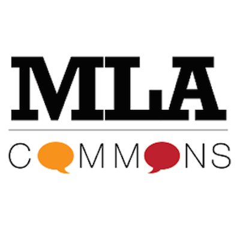

Note: A bit of background, for those of you who may not be fully familiar with the project. The MLA is the largest scholarly society in the humanities, representing around 25,000 members across North America and around the world, members who teach and study a very wide range of languages, literatures, and cultures. (The MLA, full disclosure, is also my former employer.) With support from the Andrew W. Mellon Foundation, we launched a social network called MLA Commons in 2013 to provide members with a platform for communication and collaboration, both in order to extend year-round the kinds of conversations that take place at annual meetings and to provide means for members to share their scholarly work with one another. Within about 30 seconds of launching the platform, however, we began to hear from our members about their desire to connect with colleagues in other areas in the humanities, so we started looking for ways to support those connections across fields. 

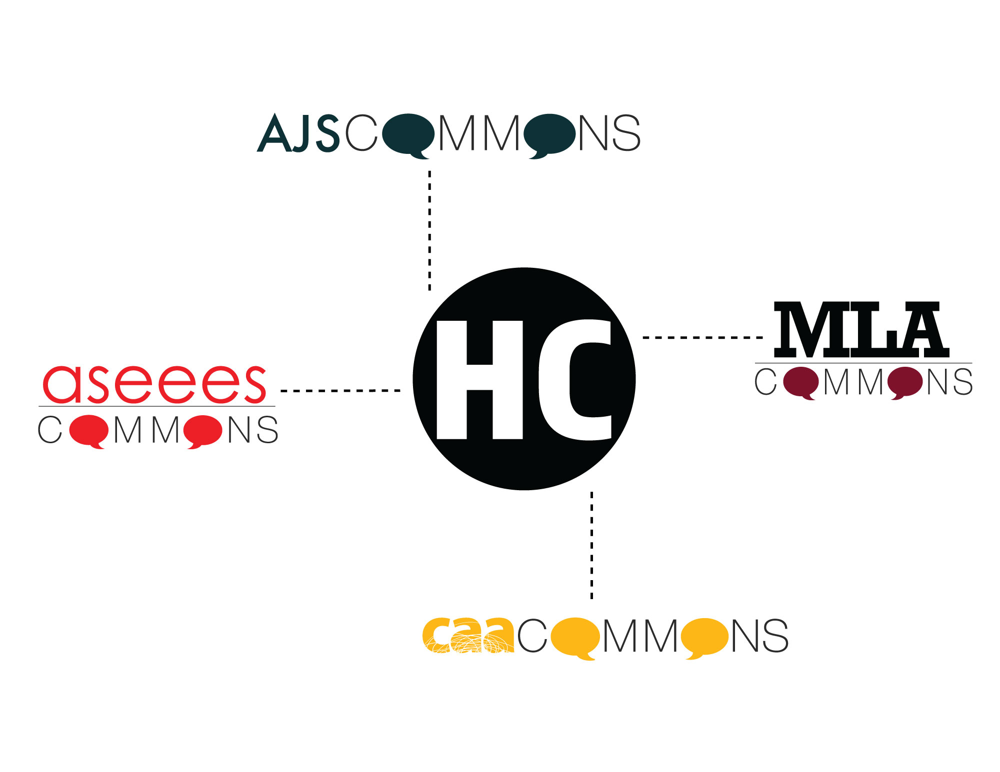

Note: With further support from the Mellon Foundation, we first undertook a planning process and developed a pilot project designed to connect multiple proprietary Commons instances, each serving the membership of a scholarly society. Humanities Commons went live in December 2016, linking MLA Commons with Commons spaces developed for the members of the Association for Jewish Studies, the Association for Slavic, East European, and Eurasian Studies, and the College Art Association. But beyond working with these partners, we wanted to provide a space where any researcher or practitioner in the humanities could create an account and share their work, and so we made the decision to open the network's hub to anyone who wants to join -- across the disciplines, around the world, regardless of institutional affiliation or organizational membership.

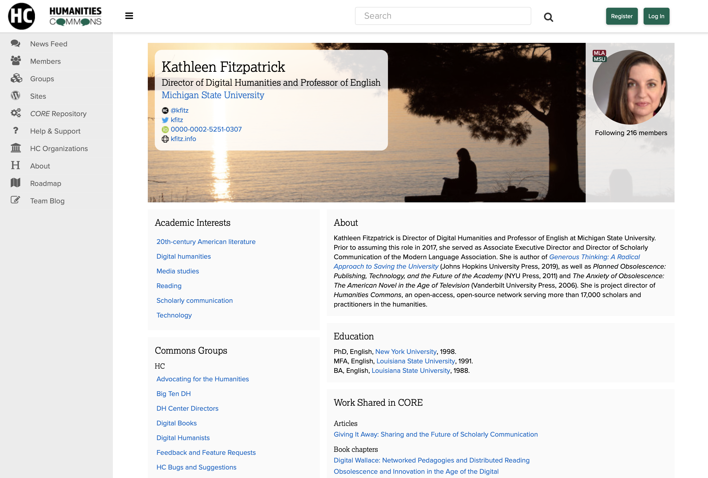

Note: All Humanities Commons members can take advantage of all of the network's features. They can create rich professional profiles, participate in group discussions, create websites, and they can deposit and share their work in the network's open-access repository. This fusion of a social network with a library-quality repository (adhering to commonly accepted metadata standards, employing digital object identifiers, and so on) means that not only is stuff being put into the repository, and not only can that stuff be found there, but it's also being actively used, as there's a community there with which it can be shared.

Note: But while fully opening the Humanities Commons hub to free participation by any interested scholar or practitioner has significantly driven the platform's adoption and use -- a little over two years later, we have over 17,000 members -- it has created real challenges for our sustainability. Partner organizations have tended to see the value in paying to support the network's services as lying in a benefit that they can provide to their members. It's understandable, as they need to provide such benefits in order to keep their members paying dues. But this model transforms Humanities Commons from a common-pool resource into a club good, one whose benefits are exclusive to those who pay. And some early interviews seem to suggest that many of the organizations who might have paid for the network if it were an exclusive service see the openness of the hub as diminishing the network's value to them, rather than recognizing that the network effects of a larger, more open community will ultimately serve their long-term interests.

Note: So we've been working to develop a model that will encourage organizations and institutions to invest in the network, to support it in an ongoing way, to recognize that not only do they belong to the network, but that the network belongs to them, and its future depends on them. Making that case requires not just a workable revenue model but, far more importantly, a compelling governance model, one that gives member organizations and institutions, as well as individual members, both a voice in the network's future and a stake in its outcomes. As Ostrom argues, a path to sustainability for a common-pool resource like Humanities Commons requires us to ensure that building the network's community and enabling it to become self-governing is a precondition for its success.

## sustainability and solidarity

Note: So the future of Humanities Commons, like the future of a host of open-source software and community-supported infrastructure projects, requires its participants to act in the interest of the collective, even where those interests do not immediately appear to be local. This form of solidarity is where real sustainability for academy-owned infrastructure -- and for the academy itself -- lies. My arguments to this end, probably needless to say, have a tough road ahead of them.

## the university

Note: I'm asking the university as an institution to undergo a fairly radical transformation, fully aligning its internal reward structures with the public mission it claims to espouse. And this is where the need for a paradigm shift -- for politics -- arises.

<small>http://dx.doi.org/10.17613/M6W950N35</small>

Note: This is the conclusion reached by a study entitled "How significant are the public dimensions of faculty work in review, promotion, and tenure documents?" The answer? Not very. The study demonstrates the extent to which, as the authors note, "institutions that want to live up to their public mission need to work toward systemic change in how faculty work is assessed and incentivized." We've no doubt all got stories to tell that would support this conclusion, stories that illustrate the ways that the kinds of collaborative work that might best support the university's need for a more open, publicly oriented future goes un- or under-rewarded.

## the anecdote

Note: Here's mine: Right around the time I began sketching the outline for this book, I attended a day-long workshop on new models for open scholarly communication, for which the provost of a large state research university had been invited to give a keynote address.  And the keynote was quite powerful: the provost described his campus’s efforts to embrace a renewed mission of public service, and he emphasized the role that broad public access to the faculty’s work might play in transforming the environment in which the university operates today. The university’s singular purpose is the public good, he said, but we are seen as being self-interested. Can opening our work up to the world help change the public discourse about us? It was an inspiring talk, both rich in its analysis of how the university found its way into the economic and social problems it now faces and hopeful in thinking about new possibilities for renewed public commitment. Or, I should say, it was inspiring right up until the moment when the relationship between scholarly publishing and tenure and promotion was raised.

# prestige

Note: And then it was as though someone had dimmed the lights: we heard about the importance of maintaining prestige within the faculty through modes of assessment that ensure that faculty members are publishing in the highest-quality venues, conventionally understood. Frustrated by that shift, I asked the provost during the question-and-answer period what the possibilities might be for a very important, highly visible research university that understands its primary mission to be service to the public good to remove the tenure and promotion logjam in the transformation of scholarly communication by convening the entire academic campus, from the provost through the deans, chairs, and faculty, in a collective project of revising—really, reimagining—all of its personnel processes and the standards on which they rely in light of a primary emphasis on the public good? What would become possible if all of those policies worked to ensure that what was considered excellence in research and teaching had its basis in the university’s core service mission? The provost’s response was, more or less, that any institution that took on such a project would immediately lose competitiveness within its institutional cohort.

# honest

Note: To say that this response was disappointing would be an understatement, but it was if nothing else honest. It made absolutely clear where, for most research universities, the rubber meets the road, and why lots of talk about openness, impact, public service, and generosity falls apart at the point at which it crosses paths with the more entrenched if unspoken principles around which our institutions are actually arranged today. The inability of institutions of higher education to transform their internal structures and processes in order to fully align with their stated mission and values may mean that the institutions have not in fact fully embraced that mission or those values. Or perhaps it’s that there is a shadow mission—competition—that excludes the possibility of that full alignment.

## the worst of it

Note: The worst of it, and the single fact that _Generous Thinking_ is most driven by, is that the provost was correct. As currently structured, the entire system of higher education is engineered—from individual institutions to accrediting agencies, funding bodies, and the higher education press—to promote a certain kind of competitiveness that relies on a certain kind of prestige. Any institution that seeks to transform the rules or the goals of the competition without dramatically altering its relationship to the system as a whole is likely to suffer for it. What Chris Newfield has described as the mandate to “compete all the time” forecloses a whole range of opportunities for our institutions, making it impossible for them to take any other approach.

# generosity

Note: What I am arguing, both directly in _Generous Thinking_ and indirectly through Humanities Commons, is that the real threat to institutions of higher education today is not _other institutions of higher education_, not our place in the rankings that order us. Rather, it is the creeping forces of privatization that continue to undermine our public mission. If we are to reclaim that mission, to reclaim control of the work produced in and by the university, we're going to have to do it as a sector, acting not just in solidarity with but with generosity toward both the other institutions to which we are inevitably connected and toward the public that we all jointly serve. If we are going to develop and sustain community-supported infrastructure, we have to genuinely become, and act as, a community. None of this will be easy -- but the alternatives, which we have all seen building over the last several years, will be far worse.

## thank you
---
##### Kathleen Fitzpatrick // @kfitz // kfitz@msu.edu

Note: And with that cheery note, I'm going to say thanks, and open things up for discussion.
