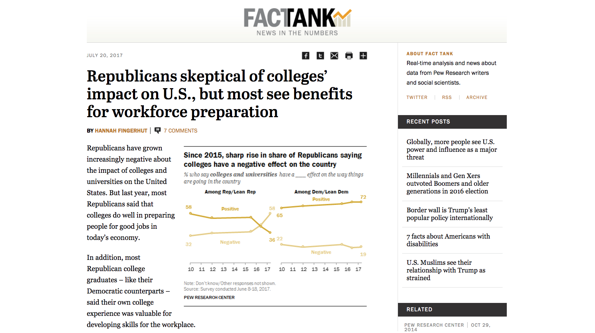

## Generous Thinking
---
### and External Partnerships
---

##### Kathleen Fitzpatrick // @kfitz // kfitz@msu.edu

Note: I want to start by Anne for chauffeuring me around for the last two days and for making this tour of Virginia Tech possible. I'm going to start with a very brief overview of the concepts I'm working with in Generous Thinking, and then I hope that we can open this up into discussion about the kinds of work you're doing here.

##### http://www.pewresearch.org/fact-tank

Note: - The problem: the Pew Research Center has recently reported a “larger than normal” decline in public opinion regarding higher education in the United States.
- This decline in public opinion is of a piece with contemporary rejections of many forms of expertise, as documented by Tom Nichols in _The Death of Expertise_: not just an assumption that one opinion is as good as any other, but an active refusal of anything that presents itself as expert knowledge
- And worse, it’s resulting in slashed public university budgets and a range of other political attacks on institutions of higher education
- The result is that these universities, which were founded to serve the people of their states, or regions, or communities, are decreasingly able to do so

Note: - My argument is that the future of the university, and of the work we do within it, depends on our ability to rebuild caring, trusting relationships with the publics by which our institutions are surrounded, and that the process of doing so asks us to think differently about how we wield our expertise in those relationships
- In the book, I advocate for bringing what I call “generous thinking” to bear in all of the ways that we work, both with one another and with the publics we engage

# generosity

Note: - “Generous thinking” is, as I define it, a set of regular practices like meditating or exercise, something that’s never quite complete but to which we return again and again
- So generosity in this sense is not about giving, or about volunteerism, but instead about a willingness to listen, taking “yes, and” rather than “no, but” as the starting place for our responses
- It's in large part about listening to the communities of which the university is a part, finding out more about their values and needs and how we might be able to work together to solve some of our common problems
- And in the process it means enabling the publics around us to believe that the university really belongs to them

# partnerships

Note: - So it means working in real partnership with the communities that we're engaged with, finding ways to work together on problems that none of us can solve alone
- But partnerships can be difficult in lots of ways: there are partners who have the potential to bring resources to the university but then want to control the ways those resources are used; there are partners whose changing interests can shift the university away from its core mission

- What kinds of partners does the university currently work with, and what kinds of partners *should* it work with?
- What kinds of problems could be approached through new kinds of partnerships that can't be tackled without them?
- What challenges have surfaced in your experiences of external partnerships, and how might those challenges be addressed?

Note: So this is where I'd like to open discussion. I've listed a few questions here, but you may have questions or issues of your own you'd like to discuss. What I'm going to ask you to do is take five minutes or so to talk with your neighbors, and think together about what you'd like to share with the larger group.

## thank you
---
##### Kathleen Fitzpatrick // @kfitz // kfitz@msu.edu
	
