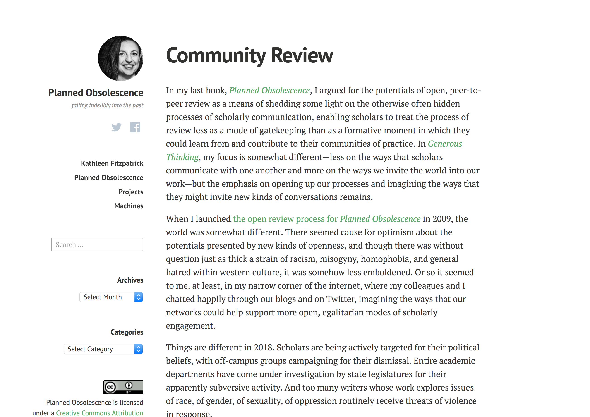
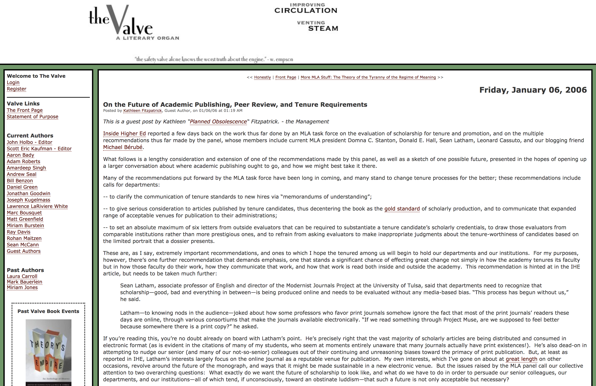
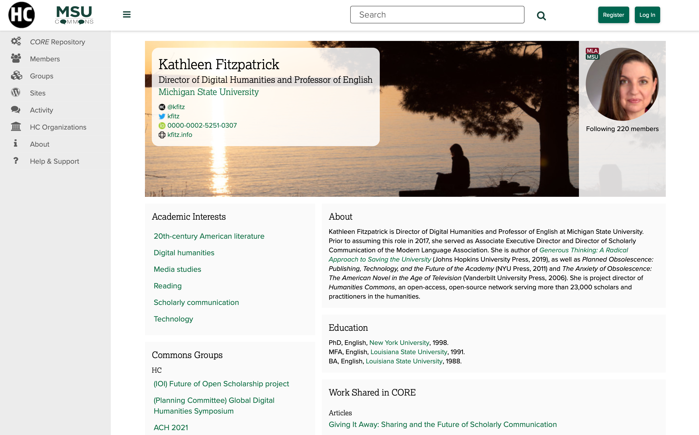

## Writing in Public
---
##### Kathleen Fitzpatrick // @kfitz // kfitz@msu.edu

Note: Happy to be here! Planning to focus today on ways your work might benefit from having a public online presence, and why, starting with my own story.

## assistant professor

Note: Start the story in 2002, during my assistant professorship. Doing the thing I was supposed to be doing: finishing my book. One thing that went wrong (at least for a time) and one thing that went unexpectedly right.

Note: One sentence overview of book.

## the press

Note: Waiting for press review, peer review, ed board, and nothing, for way longer than you'd think. I was feeling stifled: years of work were stuck on my hard disk, and it seemed entirely possible that no one else might ever read it. 

## the blog

Note: And then I stumbled across the blog of a friend from grad school; it was funny and erudite, and it had an audience in active discussion with him. And I thought, wow, that’s it. Started Planned Obsolescence as an exercise in immediate gratification.

Note: So I started a blog out of the baldest desire to get someone somewhere to read something I wrote. I still keep it up somewhat sporadically these days. In the early days, though, I blogged almost daily (no Twitter, no FB). Blogs were the thing. Though it didn't look so much like this.

Note: This is what it looked like back in 2002, back when I was just getting started, when I thought I was writing somewhat incognito. What it allowed me to do:

1. Write more frequently
2. Get faster responses
3. Build a community

## conversations

Note: Some of what that produced looked a lot like conversations with friends. Wordherders, etc. The blog wound up helping me build a small community of other scholars working online, a community that was crucial to helping alleviate the isolation I'd been feeling. The connections I forged there helped my writing develop.

## citations

Note: But the formal academic marker of conversation is citation. First actual citations from blog.

## scholarship

Note: So the informal looped back around to the formal: started getting asked to do actual academically-recognized things based on things I'd done on the blog.

<small>The Valve</small>

Note: And that led to a lot of thinking out loud about the future of scholarly communication, including a guest post on The Valve, then a widely-read group blog in literary studies. And that in turn led to two projects...

<small>MediaCommons: mediacommons.futureofthebook.org</small>

Note: The first was MediaCommons, an early attempt to create a network connecting scholars in a field, allowing them to write and discuss their work with one another

Note: And the second was my second book, Planned Obsolescence, which explores a potential future for scholarly communication -- in fact, that project started by asking what might happen if scholarly publishing looked more like blogs than like journals

<small>Planned Obsolescence open review</small>

Note: So in 2009 I decided (with my press's blessing) to post the draft of the book online for open review. I get asked a lot what made me take the risk of releasing something unfinished into the world where anyone could have said anything about it. The truth is that I ignored those risks with privileged abandon. What I knew from my blog was that there were a lot of folks out there, in many different fields and kinds of jobs, whose thoughts I wanted to hear, and who I trusted to help me make the book better. And happily, it worked.

## 2009

Note: Okay, that was 2009, not 2018. The last few years have made the risks of working in the open impossible to ignore. And yet my experiences leave me convinced that there is a community, real or potential, interested in the kinds of work I care about, willing to engage with and support that work’s development. And -- perhaps most importantly today -- willing to work on building and sustaining the connections that make up the community itself.

## conversation

Note: But the enormously important part of this was the conversation the process generated, both for helping me think through the revision process and for helping to develop an audience for the book

<small>http://generousthinking.hcommons.org</small>

Note: So I did it again, with my newest book, which happens to have a chapter in it about Working in Public, if you want to see more of the argument; staged review process focusing on my community and now moving outward

<small>Humanities Commons: hcommons.org</small>

Note: This process was hosted at Humanities Commons, which is an open-access, open-source, not-for-profit network for scholars and practitioners across the humanities. Info about HC; ways of consolidating professional presence online. HC has 30,000 users worldwide, but is hosted here at MSU...

<small>MSU Commons: commons.msu.edu</small>
Note: and has its own MSU instance, with all of the features that HC includes, such as

<small>https://commons.msu.edu/members/kfitz/</small>
Note: highly configurable profiles, as well as the ability to participate in group discussions, to create free WordPress sites, to deposit and share work in the repository, and more.

## your story

Note: That's my story. Key things about writing in public are the ability to create community, to engage in discussion, and to tell the story of my work in an ongoing way. So in the time we have left together, I'm hoping we can think together about your story, and the ways you might want to tell it

## sharing publications

Note: It might be most important to you to get your formal publications into broader circulation

## developing new ideas

Note: Or you might want a space in which you can work through new ideas, get feedback on them

## collaboration

Note: You might want to do that idea development in concert with others, drawing them into your work

## community engagement

Note: Or you might want to reach out to off-campus communities and engage them in collective projects 

## how do you want to work?

Note: The key is figuring out who you're trying to reach and how you might best reach them. So how do you want to work? Maybe we can start by taking a few minutes to talk about the ways you can and can't imagine writing in public, the ways it would be useful to you and the ways it wouldn't.