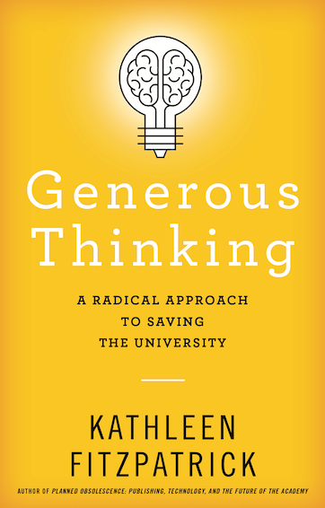
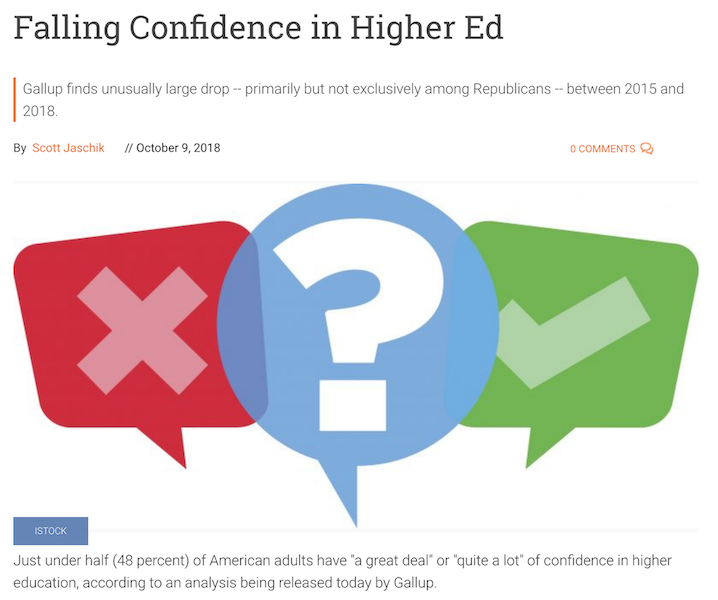
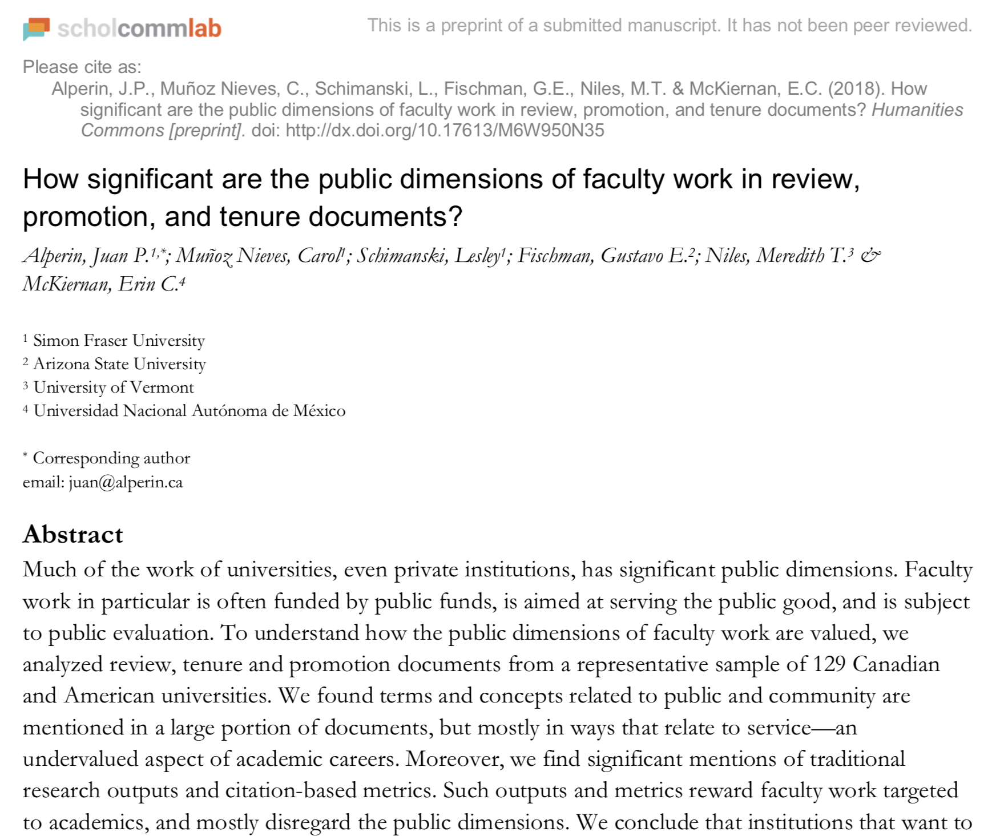
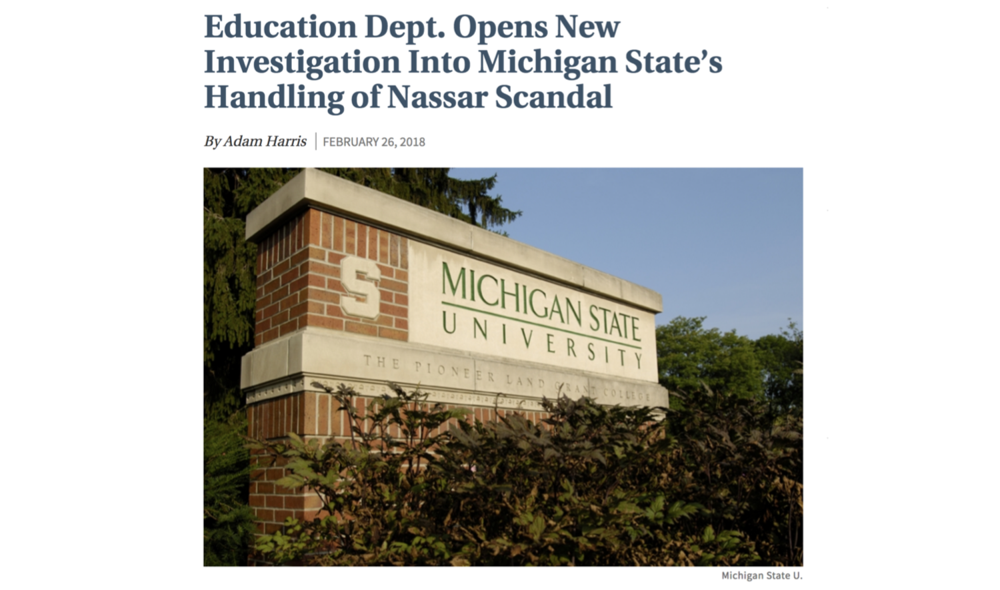

## Generous Thinking
---
### A Radical Approach to Saving the University
---
##### Kathleen Fitzpatrick // @kfitz // kfitz@msu.edu

Note: thanks to Todd; delighted to be here; introductions?

Note: I'm going to start with a brief overview of the book and its goals, and then turn us toward some discussion. The primary goal, as the book's subtitle suggests, is saving the university, and the overall argument is that the survival of institutions of higher education -- and perhaps especially _public_ institutions of higher education, but other kinds of institutions as well -- is going to require us to change our approach to the work we do within them, and the ways we use that work to connect the campus to the publics that it serves.

## radical approach

Note: The 'radical approach' part of the subtitle grows out of my increasing sense that the necessary change is a HUGE one, that it can't be made incrementally, that instead it requires -- as Chris Newfield notes in the conclusion of _The Great Mistake_ -- a paradigm shift, because there is no route, no approach, no tool that can take us from where we are today to where we need to be. As Tressie McMillan Cottom has noted of the crisis that she has seen growing in higher education today,

> "This is not a problem for technological innovation or a market product. This requires politics."    --Tressie McMillan Cottom, _Lower Ed_

Note: "This is not a problem for technological innovation or a market product. This requires politics." The problem, after all, begins with politics: the American public university that not too long ago was committed to serving as a highly accessible engine of social mobility, making a rich liberal-arts based education broadly available, has been utterly undone. We are facing today not just the drastic reduction in that institution's affordability but an increasing threat to its very public orientation, as rampant privatization not only shifts the burden of paying for higher education from the state to individual students and families, but also turns the work of the institution from the creation of a shared social good -- a broadly educated public -- to the production of market-oriented individual benefit.

Note: And all the while, we are also facing what Inside Higher Ed has described as "a larger than typical decline in confidence in an American institution in a relatively short time period." And this falling confidence cannot be simply dismissed as evidence of an increasingly entrenched anti-intellectualism in American life -- though of course, without doubt, that's there too. Rather, I see this decline as a result of the fact that higher education has for the last several decades been operating simultaneously within two conflicting paradigms -- on the one hand, an older paradigm, largely operative within the academic community, in which the university serves as a producer and disseminator of knowledge; and on the other hand, a more recent, more culturally widespread one, in which the university serves as a producer and disseminator of market-oriented credentials. We find ourselves in a situation today, however, in which both of those paradigms are failing, if in different ways, and if our institutions are to survive we must find a new way of articulating and living out the value of the university in the contemporary world.

## generous thinking

Note: The book overall makes the argument that rebuilding a relationship of trust between the public university and the public that it ostensibly serves is going to require regrounding the university in a mode of what I refer to as "generous thinking," focusing its research and pedagogical practices around building community and solidarity both on campus and across the campus borders. It's going to require concerted effort to make clear that the real good of higher education is and must be understood as social rather than individual.

## listening

Note: So the book asks us to think about how we work with one another on campus, and how we connect our campuses to the publics around us. It begins by understanding generosity as a mode of engagement grounded in listening to one another, and to the publics with whom we work, attempting to understand their concerns as deeply as possible before leaping forward to our critiques and solutions.

## reading together

Note: The book goes on to explore ways that our critical reading practices might be opened up to foster greater engagement between scholars and other readers, creating means for those readers to see more of the ways that scholars work and the reasons for those methods, as well as for scholars to learn more about why general interest readers read the ways they do, building key bridges between two communities that too often seem to speak past one another.

## working in public

Note: I also spend time thinking about ways (and reasons) that scholars might do more of their work in public, publishing in openly accessible venues and in more publicly accessible registers, and developing more community-engaged projects, in order to bring the university's resources to bear in helping work through community concerns. And this is where some digital tools and technologies will undoubtedly have something to contribute to helping us connect and communicate with those communities.

## the university

Note: But if we are going to make the kinds changes I argue for in the ways that scholars work, both on campus and off, the university as an institution must undergo a fairly radical transformation, becoming the kind of institution that supports rather than dismisses (or in fact actively punishes) collaboration and public engagement. And this is where the need for a paradigm shift -- for politics -- arises.

<small>http://dx.doi.org/10.17613/M6W950N35</small>

Note: This is the conclusion reached by a study entitled "How significant are the public dimensions of faculty work in review, promotion, and tenure documents?" The answer? Not very. The study demonstrates the extent to which, as the authors note, "institutions that want to live up to their public mission need to work toward systemic change in how faculty work is assessed and incentivized." We've no doubt all got stories to tell that would support this conclusion, stories that illustrate the ways that the kinds of public-facing, community-oriented work that might best support the university's need for a closer relationship with the public goes un- or under-rewarded by the university.

## the anecdote

Note: I tell my version of this story at the beginning of chapter 4, but a quick recap: Right around the time I began sketching the outline for this book, I attended a day-long workshop on new models for university press publishing, for which the provost of a large state research university had been invited to give a keynote address. The talk came during a day of intensive discussions amongst the workshop's participants and university press and university library leaders, all of whom had a real stake in the future of the institution's role in disseminating scholarly work as openly as possible. And the keynote was quite powerful: the provost described his campus's efforts to embrace a renewed mission of public service, and he emphasized the role that broad public access to the faculty's work might play in transforming the environment in which the university operates today. The university's singular purpose is the public good, he said, but we are seen as being self-interested. Can opening our work up to the world help change the public discourse about us? It was an inspiring talk, both rich in its analysis of how the university found its way into the economic and social problems it now faces and hopeful in thinking about new possibilities for renewed public commitment. Or, I should say, it was inspiring right up until the moment when the relationship between scholarly publishing and tenure and promotion was raised.

## prestige

Note: And then it was as though someone had dimmed the lights: we heard about the importance of maintaining prestige within the faculty through modes of assessment that ensure that faculty members are publishing in the highest-ranked venues, conventionally understood. Frustrated by that shift, I asked the provost during the question-and-answer period what the possibilities might be for a very important, highly visible research university that understands its primary mission to be service to the public good to remove the tenure and promotion logjam in the transformation of scholarly communication by convening the entire academic campus, from the provost through the deans, chairs, and faculty, in a collective project of revising -- really, reimagining -- all of its personnel processes and the standards on which they rely in light of a primary emphasis on the public good? What would become possible if all of those policies worked to ensure that what was considered excellence in research and teaching had its basis in the university's core service mission? The provost's response was, more or less, that any institution that took on such a project would immediately lose competitiveness within its institutional cohort.

## honest

Note: To say that this response was disappointing would be an understatement, but it was if nothing else honest. It made absolutely clear where, for most research universities, the rubber meets the road, and why lots of talk about openness, impact, public service, and generosity falls apart at the point at which it crosses paths with the more entrenched if unspoken principles around which our institutions are actually arranged today. The inability of institutions of higher education to transform their internal structures and processes in order to fully align with their stated mission and values may mean that the institutions have not in fact fully embraced that mission or those values. Or perhaps it's that there is a shadow mission—competition—that excludes the possibility of that full alignment.

## the worst of it

Note: The worst of it, and the single fact that _Generous Thinking_ is most driven by, is that the provost was correct. As currently structured, the entire system of higher education is engineered -- from individual institutions to accrediting agencies, funding bodies, and the higher education press -- to promote a certain kind of competitiveness that relies on a certain kind of prestige. Any institution that seeks to transform the rules or the goals of the competition without dramatically altering its relationship to the system as a whole is likely to suffer for it. What Chris Newfield has described as the mandate to "compete all the time" forecloses a whole range of opportunities for our institutions, making it impossible for them to take any other approach.

## paradigm

Note: That competition is the dominant paradigm under which universities operate today, a paradigm instituted and enforced by those universities' growing privatization. It is competition for faculty, for students, for funding, and above all for rankings, that replaces the public good with the quest for prestige, that turns our institutions from priding themselves on the communities they invite in to bragging about how many they turn away.

<small>http://chronicle.com</small>

Note: And it is that same concern for reputation that leads so many institutions to protect themselves instead of protecting the publics, the communities, the individuals that they are meant to serve. It is little wonder that universities are held in such low regard by so much of the voting public today: it is not just the rampant anti-intellectualism of contemporary American culture, but also the degree to which our institutions have repeatedly betrayed the trust that the public has placed in them.

# us

Note: In us. If we are going to turn this situation around, if we are going to convince the voting public that universities are deserving of public reinvestment, we have to effect a ground-up transformation in our institutions and the ways they work. That transformation cannot begin with new analytics, or new technologies, that derive from the neoliberal paradigm that is responsible for the damage in the first place. It cannot begin with new means of demonstrating the individual, competitive benefits that higher education can confer. It's got to start, instead, with new ways of thinking about who this "us" is, or can be.

## community

Note: These new ways of thinking about "us" have to take root both on campus and off, enabling us to understand ourselves both as a community and in a community. We need -- as I urged that provost -- to radically rethink our means of assessment, the relentless spread of metrics through which we are required to demonstrate success, and instead consider what measures might actually begin to reflect the deep values we bring to our work. And we need to contemplate what a higher education whose benefits were genuinely social rather than individual, public rather than private, might look like, and how focusing our work around those social benefits might help us find new means of building solidarity with the publics that our universities are intended to serve.

## liberal arts

Note: And all of that work is where the liberal arts come in, in demonstrating the generosity that underlies our critical thinking, and in using that generosity to foster and sustain more engaged, more articulated, more actualized publics. I've obviously got a lot more to say about this -- a whole book's worth -- but for the moment I'll leave things by saying that all of us -- faculty, staff, students, administrators, parents, trustees, and beyond -- have more to gain from abandoning competition, from working together, from understanding ourselves and our institutions as intimately connected, than we have to lose in the rankings.

## the workshop part

Note: So this is where I'd like to turn us toward discussion and some more hands-on consideration of what all this might mean locally. What I'm going to ask is for you to take five minutes to talk with the person next to you about the questions or ideas that you'd like to get out on the table. Take this time to work through those thoughts together and come to a question or idea that you'd like to bring back for all of us to wrestle with.

## thank you
---
##### Kathleen Fitzpatrick // @kfitz // kfitz@msu.edu

